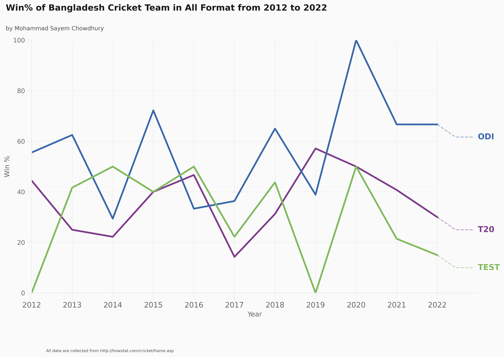

```python
%%html
<style>
    body {
        font-size: 14px;
        font-family: Montserrat;

    }
        h1, h2, h3, h4, h5, h6 {
        font-family: Montserrat;
    }
</style>
```


# <h1 style="text-align:center;font-family:Montserrat;">Bangladesh Cricket Team Win% Analysis</h1>

<a></a>

## Table of Contents

* [Introduction](#section-one)
* [Data Collection](#section-two)
* [Data Preparation](#section-three)
* [Data Processing](#section-four)
* [Data Analysis and Visualization](#section-five)
* [Conclusion](#section-six)
* [References](#section-seven)

<a id="section-one"></a>
## Introduction

The Bangladesh Cricket Team is a national cricket team representing Bangladesh in international cricket. It is a full member of the International Cricket Council (ICC) with Test, One Day International (ODI) and Twenty20 International (T20I) status. The team is one of the up-and-coming teams in the world of cricket and has made significant progress in recent years.

Some of the key players in the Bangladesh Cricket Team include Mashrafe Mortaza, Shakib Al Hasan, Tamim Iqbal, and Mushfiqur Rahim. Mortaza is the team's captain in all three formats and is a skilled fast bowler. Hasan is a talented all-rounder and is consistently ranked as one of the top all-rounders in the world. Iqbal is a top-order batsman known for his aggressive style of play, while Rahim is a reliable wicketkeeper-batsman.

Overall, the Bangladesh Cricket Team has a strong mix of experienced players and talented young cricketers who are looking to make their mark on the international stage. The team is known for its fighting spirit and never-say-die attitude, which has helped it secure some memorable victories against top-ranked teams. Despite facing challenges and setbacks, the Bangladesh Cricket Team continues to work hard and strive for improvement, making it a team to watch out for in the world of cricket.


Here is the List of Columns:
- No. of Match: This column refers to the number of matches played by a team.

- Date: This column refers to the date on which the match was played.

- Opponent: This column refers to the team that the team was playing against.

- Tournament Name: This column refers to the name of the tournament or series in which the match was played.

- Stadium: This column refers to the name of the stadium where the match was played.

- Host: This column refers to the country or region where the match was played.

- Result: This column refers to the outcome of the match (e.g., win, loss, or draw) for the team.

- Winner: This column refers to the team that won the match.

- Margin: This column refers to the margin by which the winning team won the match (e.g., by runs, wickets, or points).

- Match Type: This column refers to the type of the match. (e.g., World Cup, Series, Asia Cup)

- H/A: This column refers to whether the team was playing at home (H) or away (A).

- W: This column refers to the number of wins recorded by the team.

- D: This column refers to the number of draws recorded by the team.

- L: This column refers to the number of losses recorded by the team.

- W-L%: This column refers to the win-loss percentage of the team.

- Year: This column refers to the year in which the match was played.

- Month: This column refers to the month in which the match was played.

- Day: This column refers to the day of the month on which the match was played.

An analysis of the Bangladesh Cricket Team using the provided columns would provide valuable insights into the team's performance and progress over time. By examining the number of matches played, the dates, opponents, tournaments, and venues of the matches, we can see how the team has fared in different competitions and against different opponents.

We can also see the team's overall win-loss record and win-loss percentage, as well as the margins by which it has won or lost matches. This information can help us understand the team's strengths and weaknesses and identify any patterns or trends in its performance. Additionally, by analyzing the match type, home/away status, and the year, month, and day of the matches, we can get a better understanding of the team's schedule and the conditions under which it has played.

Overall, an analysis of the Bangladesh Cricket Team using the provided columns would provide a comprehensive and detailed overview of the team's performance, helping us to understand its strengths, weaknesses, and potential areas for improvement. It would also allow us to track the team's progress over time and see how it compares to other teams in the world of cricket.


### Import all necessary library for analysis


```python
import numpy as np
import pandas as pd
import warnings
from graph import line_graph,bar_graph,line_graph_month,line_graph_cup,line_graph_ten_years
warnings.filterwarnings('ignore')

```

<a id="section-two"></a>

## Data Collection

### Crawling Data by Pandas from howstat.com website

#### All Stadium


```python
stadium = pd.read_html("http://howstat.com/cricket/Statistics/Grounds/GroundList.asp")[3]
stadium = stadium[1:283]
stadium.head()
```


<div>
<style scoped>
    .dataframe tbody tr th:only-of-type {
        vertical-align: middle;
    }

    .dataframe tbody tr th {
        vertical-align: top;
    }

    .dataframe thead th {
        text-align: right;
    }
</style>
<table border="1" class="dataframe">
  <thead>
    <tr style="text-align: right;">
      <th></th>
      <th>0</th>
      <th>1</th>
      <th>2</th>
      <th>3</th>
      <th>4</th>
      <th>5</th>
    </tr>
  </thead>
  <tbody>
    <tr>
      <th>1</th>
      <td>Adelaide Oval</td>
      <td>Adelaide</td>
      <td>Australia</td>
      <td>81 Tests</td>
      <td>86 ODIs</td>
      <td>12 T20s</td>
    </tr>
    <tr>
      <th>2</th>
      <td>Affies Park</td>
      <td>Windhoek</td>
      <td>Namibia</td>
      <td>NaN</td>
      <td>1 ODI</td>
      <td>NaN</td>
    </tr>
    <tr>
      <th>3</th>
      <td>Aga Khan Sports Club Ground</td>
      <td>Nairobi</td>
      <td>Kenya</td>
      <td>NaN</td>
      <td>4 ODIs</td>
      <td>NaN</td>
    </tr>
    <tr>
      <th>4</th>
      <td>Al Amerat Cricket Ground Ministry Turf 1</td>
      <td>Al Amarat</td>
      <td>Oman</td>
      <td>NaN</td>
      <td>18 ODIs</td>
      <td>77 T20s</td>
    </tr>
    <tr>
      <th>5</th>
      <td>Al Amerat Cricket Ground Ministry Turf 2</td>
      <td>Al Amerat</td>
      <td>Oman</td>
      <td>NaN</td>
      <td>5 ODIs</td>
      <td>22 T20s</td>
    </tr>
  </tbody>
</table>
</div>


```python
stadium.to_csv('csv/stadium_raw.csv')
```

#### T20


```python
t20_df=pd.read_html("http://www.howstat.com/cricket/Statistics/Matches/MatchListCountry_T20.asp?A=BAN&B=XXX&C=XXX")[5]
t20_df = t20_df[1:145]
t20_df.head()
```


<div>
<style scoped>
    .dataframe tbody tr th:only-of-type {
        vertical-align: middle;
    }

    .dataframe tbody tr th {
        vertical-align: top;
    }

    .dataframe thead th {
        text-align: right;
    }
</style>
<table border="1" class="dataframe">
  <thead>
    <tr style="text-align: right;">
      <th></th>
      <th>0</th>
      <th>1</th>
      <th>2</th>
      <th>3</th>
      <th>4</th>
    </tr>
  </thead>
  <tbody>
    <tr>
      <th>1</th>
      <td>1.0</td>
      <td>28/11/2006</td>
      <td>Zimbabwe</td>
      <td>Sheikh Abu Naser Stadium</td>
      <td>Bangladesh won by 43 runs</td>
    </tr>
    <tr>
      <th>2</th>
      <td>2.0</td>
      <td>01/09/2007</td>
      <td>Kenya</td>
      <td>Gymkhana Club Ground</td>
      <td>Bangladesh won by 5 wickets</td>
    </tr>
    <tr>
      <th>3</th>
      <td>3.0</td>
      <td>02/09/2007</td>
      <td>Pakistan</td>
      <td>Gymkhana Club Ground</td>
      <td>Pakistan won by 30 runs</td>
    </tr>
    <tr>
      <th>4</th>
      <td>4.0</td>
      <td>13/09/2007</td>
      <td>West Indies</td>
      <td>Wanderers Stadium</td>
      <td>Bangladesh won by 6 wickets</td>
    </tr>
    <tr>
      <th>5</th>
      <td>5.0</td>
      <td>15/09/2007</td>
      <td>South Africa</td>
      <td>Newlands</td>
      <td>South Africa won by 7 wickets</td>
    </tr>
  </tbody>
</table>
</div>


#### ODI


```python
odi_df=pd.read_html("http://howstat.com/cricket/Statistics/Matches/MatchListCountry_ODI.asp?A=BAN")[5]
odi_df = odi_df[1:404]
odi_df.tail()

```


<div>
<style scoped>
    .dataframe tbody tr th:only-of-type {
        vertical-align: middle;
    }

    .dataframe tbody tr th {
        vertical-align: top;
    }

    .dataframe thead th {
        text-align: right;
    }
</style>
<table border="1" class="dataframe">
  <thead>
    <tr style="text-align: right;">
      <th></th>
      <th>0</th>
      <th>1</th>
      <th>2</th>
      <th>3</th>
      <th>4</th>
    </tr>
  </thead>
  <tbody>
    <tr>
      <th>399</th>
      <td>399.0</td>
      <td>07/08/2022</td>
      <td>2022 Zimbabwe v. Bangladesh</td>
      <td>Harare Sports Club</td>
      <td>Zimbabwe won by 5 wickets</td>
    </tr>
    <tr>
      <th>400</th>
      <td>400.0</td>
      <td>10/08/2022</td>
      <td>2022 Zimbabwe v. Bangladesh</td>
      <td>Harare Sports Club</td>
      <td>Bangladesh won by 105 runs</td>
    </tr>
    <tr>
      <th>401</th>
      <td>401.0</td>
      <td>04/12/2022</td>
      <td>2022-2023 Bangladesh v. India</td>
      <td>Shere Bangla National Stadium</td>
      <td>Bangladesh won by 1 wicket</td>
    </tr>
    <tr>
      <th>402</th>
      <td>402.0</td>
      <td>07/12/2022</td>
      <td>2022-2023 Bangladesh v. India</td>
      <td>Shere Bangla National Stadium</td>
      <td>Bangladesh won by 5 runs</td>
    </tr>
    <tr>
      <th>403</th>
      <td>403.0</td>
      <td>10/12/2022</td>
      <td>2022-2023 Bangladesh v. India</td>
      <td>Zahur Ahmed Chowdhury Stadium</td>
      <td>India won by 227 runs</td>
    </tr>
  </tbody>
</table>
</div>


There is two matches of world cup 2015 and 2019 missing in this datasets whcih was abandoned. <br>
A match can be "abandoned" or "cancelled" if weather or other conditions prevent any play from occurring at all. If the bowler of the first over of play has not started his/her runup when the officials decide to abandon play then the result is termed 'abandoned without a ball being bowled'. Such a game is not included in official statistical records (https://en.wikipedia.org/)

#### TEST


```python
test_df=pd.read_html("http://howstat.com/cricket/Statistics/Matches/MatchListCountry.asp?A=BAN")[5]
test_df = test_df[1:137]
test_df.tail()
```


<div>
<style scoped>
    .dataframe tbody tr th:only-of-type {
        vertical-align: middle;
    }

    .dataframe tbody tr th {
        vertical-align: top;
    }

    .dataframe thead th {
        text-align: right;
    }
</style>
<table border="1" class="dataframe">
  <thead>
    <tr style="text-align: right;">
      <th></th>
      <th>0</th>
      <th>1</th>
      <th>2</th>
      <th>3</th>
      <th>4</th>
    </tr>
  </thead>
  <tbody>
    <tr>
      <th>132</th>
      <td>132.0</td>
      <td>23/05/2022</td>
      <td>2021-2022 Bangladesh v. Sri Lanka</td>
      <td>Shere Bangla National Stadium</td>
      <td>Sri Lanka won by 10 wickets</td>
    </tr>
    <tr>
      <th>133</th>
      <td>133.0</td>
      <td>16/06/2022</td>
      <td>2022 West Indies v. Bangladesh</td>
      <td>Sir Vivian Richards Stadium</td>
      <td>West Indies won by 7 wickets</td>
    </tr>
    <tr>
      <th>134</th>
      <td>134.0</td>
      <td>24/06/2022</td>
      <td>2022 West Indies v. Bangladesh</td>
      <td>Daren Sammy National Cricket Stadium</td>
      <td>West Indies won by 10 wickets</td>
    </tr>
    <tr>
      <th>135</th>
      <td>135.0</td>
      <td>14/12/2022</td>
      <td>2022-2023 Bangladesh v. India</td>
      <td>Zahur Ahmed Chowdhury Stadium</td>
      <td>India won by 188 runs</td>
    </tr>
    <tr>
      <th>136</th>
      <td>136.0</td>
      <td>22/12/2022</td>
      <td>2022-2023 Bangladesh v. India</td>
      <td>Shere Bangla National Stadium</td>
      <td>India won by 3 wickets</td>
    </tr>
  </tbody>
</table>
</div>


<a id="section-three"></a>

## Data Preparation

Rename columns and chnage the date format


```python
t20_df = t20_df.rename(columns={0:"No. of Match",
                                1:"Date",
                                2:"Opponent",
                               3:"Stadium",
                               4:"Result"})
t20_df["No. of Match"] = t20_df["No. of Match"].astype(int)
t20_df["Date"] = pd.to_datetime(t20_df["Date"],infer_datetime_format=True, format='%d/%m/%Y')
t20_df.head()
```


<div>
<style scoped>
    .dataframe tbody tr th:only-of-type {
        vertical-align: middle;
    }

    .dataframe tbody tr th {
        vertical-align: top;
    }

    .dataframe thead th {
        text-align: right;
    }
</style>
<table border="1" class="dataframe">
  <thead>
    <tr style="text-align: right;">
      <th></th>
      <th>No. of Match</th>
      <th>Date</th>
      <th>Opponent</th>
      <th>Stadium</th>
      <th>Result</th>
    </tr>
  </thead>
  <tbody>
    <tr>
      <th>1</th>
      <td>1</td>
      <td>2006-11-28</td>
      <td>Zimbabwe</td>
      <td>Sheikh Abu Naser Stadium</td>
      <td>Bangladesh won by 43 runs</td>
    </tr>
    <tr>
      <th>2</th>
      <td>2</td>
      <td>2007-09-01</td>
      <td>Kenya</td>
      <td>Gymkhana Club Ground</td>
      <td>Bangladesh won by 5 wickets</td>
    </tr>
    <tr>
      <th>3</th>
      <td>3</td>
      <td>2007-09-02</td>
      <td>Pakistan</td>
      <td>Gymkhana Club Ground</td>
      <td>Pakistan won by 30 runs</td>
    </tr>
    <tr>
      <th>4</th>
      <td>4</td>
      <td>2007-09-13</td>
      <td>West Indies</td>
      <td>Wanderers Stadium</td>
      <td>Bangladesh won by 6 wickets</td>
    </tr>
    <tr>
      <th>5</th>
      <td>5</td>
      <td>2007-09-15</td>
      <td>South Africa</td>
      <td>Newlands</td>
      <td>South Africa won by 7 wickets</td>
    </tr>
  </tbody>
</table>
</div>


Types of dataframe


```python
t20_df.dtypes
```


    No. of Match             int32
    Date            datetime64[ns]
    Opponent                object
    Stadium                 object
    Result                  object
    dtype: object


```python
odi_df = odi_df.rename(columns={0:"No. of Match",
                                1:"Date",
                                2:"Tournament Name",
                               3:"Stadium",
                               4:"Result"})
odi_df["No. of Match"] = odi_df["No. of Match"].astype(int)
odi_df["Date"] = pd.to_datetime(odi_df["Date"],infer_datetime_format=True, format='%d/%m/%Y')
odi_df.head()
```


<div>
<style scoped>
    .dataframe tbody tr th:only-of-type {
        vertical-align: middle;
    }

    .dataframe tbody tr th {
        vertical-align: top;
    }

    .dataframe thead th {
        text-align: right;
    }
</style>
<table border="1" class="dataframe">
  <thead>
    <tr style="text-align: right;">
      <th></th>
      <th>No. of Match</th>
      <th>Date</th>
      <th>Tournament Name</th>
      <th>Stadium</th>
      <th>Result</th>
    </tr>
  </thead>
  <tbody>
    <tr>
      <th>1</th>
      <td>1</td>
      <td>1986-03-31</td>
      <td>1985-1986 John Player Gold Leaf Trophy (v. Pak...</td>
      <td>Tyronne Fernando Stadium</td>
      <td>Pakistan won by 7 wickets</td>
    </tr>
    <tr>
      <th>2</th>
      <td>2</td>
      <td>1986-04-02</td>
      <td>1985-1986 John Player Gold Leaf Trophy (v. Sri...</td>
      <td>Asgiriya Stadium</td>
      <td>Sri Lanka won by 7 wickets</td>
    </tr>
    <tr>
      <th>3</th>
      <td>3</td>
      <td>1988-10-27</td>
      <td>1988-1989 Wills Asia Cup (v. India)</td>
      <td>MA Aziz Stadium</td>
      <td>India won by 9 wickets</td>
    </tr>
    <tr>
      <th>4</th>
      <td>4</td>
      <td>1988-10-29</td>
      <td>1988-1989 Wills Asia Cup (v. Pakistan)</td>
      <td>MA Aziz Stadium</td>
      <td>Pakistan won by 173 runs</td>
    </tr>
    <tr>
      <th>5</th>
      <td>5</td>
      <td>1988-11-02</td>
      <td>1988-1989 Wills Asia Cup (v. Sri Lanka)</td>
      <td>Bangabandhu National Stadium</td>
      <td>Sri Lanka won by 9 wickets</td>
    </tr>
  </tbody>
</table>
</div>


Types of dataframe


```python
odi_df.dtypes
```


    No. of Match                int32
    Date               datetime64[ns]
    Tournament Name            object
    Stadium                    object
    Result                     object
    dtype: object


```python
test_df = test_df.rename(columns={0:"No. of Match",
                                1:"Date",
                                2:"Tournament Name",
                               3:"Stadium",
                               4:"Result"})
test_df["No. of Match"] = test_df["No. of Match"].astype(int)
test_df["Date"] = pd.to_datetime(test_df["Date"],infer_datetime_format=True, format='%d/%m/%Y')
test_df.head()
```


<div>
<style scoped>
    .dataframe tbody tr th:only-of-type {
        vertical-align: middle;
    }

    .dataframe tbody tr th {
        vertical-align: top;
    }

    .dataframe thead th {
        text-align: right;
    }
</style>
<table border="1" class="dataframe">
  <thead>
    <tr style="text-align: right;">
      <th></th>
      <th>No. of Match</th>
      <th>Date</th>
      <th>Tournament Name</th>
      <th>Stadium</th>
      <th>Result</th>
    </tr>
  </thead>
  <tbody>
    <tr>
      <th>1</th>
      <td>1</td>
      <td>2000-11-10</td>
      <td>2000-2001 Bangladesh v. India</td>
      <td>Bangabandhu National Stadium</td>
      <td>India won by 9 wickets</td>
    </tr>
    <tr>
      <th>2</th>
      <td>2</td>
      <td>2001-04-19</td>
      <td>2000-2001 Zimbabwe v. Bangladesh</td>
      <td>Queens Sports Club</td>
      <td>Zimbabwe won by an innings and 32 runs</td>
    </tr>
    <tr>
      <th>3</th>
      <td>3</td>
      <td>2001-04-26</td>
      <td>2000-2001 Zimbabwe v. Bangladesh</td>
      <td>Harare Sports Club</td>
      <td>Zimbabwe won by 8 wickets</td>
    </tr>
    <tr>
      <th>4</th>
      <td>4</td>
      <td>2001-08-29</td>
      <td>2001-2002 Asian Championship (v. Pakistan)</td>
      <td>Multan Cricket Stadium</td>
      <td>Pakistan won by an innings and 264 runs</td>
    </tr>
    <tr>
      <th>5</th>
      <td>5</td>
      <td>2001-09-06</td>
      <td>2001-2002 Asian Championship (v. Sri Lanka)</td>
      <td>Sinhalese Sports Club Ground</td>
      <td>Sri Lanka won by an innings and 137 runs</td>
    </tr>
  </tbody>
</table>
</div>


```python
test_df.dtypes
```


    No. of Match                int32
    Date               datetime64[ns]
    Tournament Name            object
    Stadium                    object
    Result                     object
    dtype: object


```python
stadium = stadium.drop([1,3,4,5],axis=1)
stadium = stadium.rename(columns={0:"Stadium",
                                2:"Host"})
stadium.head()
```


<div>
<style scoped>
    .dataframe tbody tr th:only-of-type {
        vertical-align: middle;
    }

    .dataframe tbody tr th {
        vertical-align: top;
    }

    .dataframe thead th {
        text-align: right;
    }
</style>
<table border="1" class="dataframe">
  <thead>
    <tr style="text-align: right;">
      <th></th>
      <th>Stadium</th>
      <th>Host</th>
    </tr>
  </thead>
  <tbody>
    <tr>
      <th>1</th>
      <td>Adelaide Oval</td>
      <td>Australia</td>
    </tr>
    <tr>
      <th>2</th>
      <td>Affies Park</td>
      <td>Namibia</td>
    </tr>
    <tr>
      <th>3</th>
      <td>Aga Khan Sports Club Ground</td>
      <td>Kenya</td>
    </tr>
    <tr>
      <th>4</th>
      <td>Al Amerat Cricket Ground Ministry Turf 1</td>
      <td>Oman</td>
    </tr>
    <tr>
      <th>5</th>
      <td>Al Amerat Cricket Ground Ministry Turf 2</td>
      <td>Oman</td>
    </tr>
  </tbody>
</table>
</div>


```python
stadium.dtypes
```


    Stadium    object
    Host       object
    dtype: object


```python
stadium.to_csv('csv/stadium_clean.csv')
```

Merge Data with <b>Stadium</b> datasets and sort the data with <b>Date</b> column. Also, add a new column named <b>No. of Match</b>


```python
t20_df = pd.merge(t20_df, stadium, how='inner', on='Stadium',suffixes=('', '_'))
t20_df= t20_df.sort_values(by='Date', ascending=True)
t20_df["No. of Match"] = range(len(t20_df["No. of Match"]))

t20_df = t20_df.reset_index()
t20_df = t20_df.drop("index",axis=1)
t20_df.head()
```


<div>
<style scoped>
    .dataframe tbody tr th:only-of-type {
        vertical-align: middle;
    }

    .dataframe tbody tr th {
        vertical-align: top;
    }

    .dataframe thead th {
        text-align: right;
    }
</style>
<table border="1" class="dataframe">
  <thead>
    <tr style="text-align: right;">
      <th></th>
      <th>No. of Match</th>
      <th>Date</th>
      <th>Opponent</th>
      <th>Stadium</th>
      <th>Result</th>
      <th>Host</th>
    </tr>
  </thead>
  <tbody>
    <tr>
      <th>0</th>
      <td>0</td>
      <td>2006-11-28</td>
      <td>Zimbabwe</td>
      <td>Sheikh Abu Naser Stadium</td>
      <td>Bangladesh won by 43 runs</td>
      <td>Bangladesh</td>
    </tr>
    <tr>
      <th>1</th>
      <td>1</td>
      <td>2007-09-01</td>
      <td>Kenya</td>
      <td>Gymkhana Club Ground</td>
      <td>Bangladesh won by 5 wickets</td>
      <td>Kenya</td>
    </tr>
    <tr>
      <th>2</th>
      <td>2</td>
      <td>2007-09-02</td>
      <td>Pakistan</td>
      <td>Gymkhana Club Ground</td>
      <td>Pakistan won by 30 runs</td>
      <td>Kenya</td>
    </tr>
    <tr>
      <th>3</th>
      <td>3</td>
      <td>2007-09-13</td>
      <td>West Indies</td>
      <td>Wanderers Stadium</td>
      <td>Bangladesh won by 6 wickets</td>
      <td>South Africa</td>
    </tr>
    <tr>
      <th>4</th>
      <td>4</td>
      <td>2007-09-15</td>
      <td>South Africa</td>
      <td>Newlands</td>
      <td>South Africa won by 7 wickets</td>
      <td>South Africa</td>
    </tr>
  </tbody>
</table>
</div>


```python
odi_df = pd.merge(odi_df, stadium, how='inner', on='Stadium',suffixes=('', '_'))
odi_df= odi_df.sort_values(by='Date', ascending=True)
odi_df["No. of Match"] = range(len(odi_df["No. of Match"]))
odi_df = odi_df.reset_index()
odi_df = odi_df.drop("index",axis=1)
odi_df.head()
```


<div>
<style scoped>
    .dataframe tbody tr th:only-of-type {
        vertical-align: middle;
    }

    .dataframe tbody tr th {
        vertical-align: top;
    }

    .dataframe thead th {
        text-align: right;
    }
</style>
<table border="1" class="dataframe">
  <thead>
    <tr style="text-align: right;">
      <th></th>
      <th>No. of Match</th>
      <th>Date</th>
      <th>Tournament Name</th>
      <th>Stadium</th>
      <th>Result</th>
      <th>Host</th>
    </tr>
  </thead>
  <tbody>
    <tr>
      <th>0</th>
      <td>0</td>
      <td>1986-03-31</td>
      <td>1985-1986 John Player Gold Leaf Trophy (v. Pak...</td>
      <td>Tyronne Fernando Stadium</td>
      <td>Pakistan won by 7 wickets</td>
      <td>Sri Lanka</td>
    </tr>
    <tr>
      <th>1</th>
      <td>1</td>
      <td>1986-04-02</td>
      <td>1985-1986 John Player Gold Leaf Trophy (v. Sri...</td>
      <td>Asgiriya Stadium</td>
      <td>Sri Lanka won by 7 wickets</td>
      <td>Sri Lanka</td>
    </tr>
    <tr>
      <th>2</th>
      <td>2</td>
      <td>1988-10-27</td>
      <td>1988-1989 Wills Asia Cup (v. India)</td>
      <td>MA Aziz Stadium</td>
      <td>India won by 9 wickets</td>
      <td>Bangladesh</td>
    </tr>
    <tr>
      <th>3</th>
      <td>3</td>
      <td>1988-10-29</td>
      <td>1988-1989 Wills Asia Cup (v. Pakistan)</td>
      <td>MA Aziz Stadium</td>
      <td>Pakistan won by 173 runs</td>
      <td>Bangladesh</td>
    </tr>
    <tr>
      <th>4</th>
      <td>4</td>
      <td>1988-11-02</td>
      <td>1988-1989 Wills Asia Cup (v. Sri Lanka)</td>
      <td>Bangabandhu National Stadium</td>
      <td>Sri Lanka won by 9 wickets</td>
      <td>Bangladesh</td>
    </tr>
  </tbody>
</table>
</div>


```python
test_df = pd.merge(test_df, stadium, how='inner', on='Stadium',suffixes=('', '_'))
test_df= test_df.sort_values(by='Date', ascending=True)
test_df["No. of Match"] = range(len(test_df["No. of Match"]))
test_df = test_df.reset_index()
test_df = test_df.drop("index",axis=1)
test_df.head()
```


<div>
<style scoped>
    .dataframe tbody tr th:only-of-type {
        vertical-align: middle;
    }

    .dataframe tbody tr th {
        vertical-align: top;
    }

    .dataframe thead th {
        text-align: right;
    }
</style>
<table border="1" class="dataframe">
  <thead>
    <tr style="text-align: right;">
      <th></th>
      <th>No. of Match</th>
      <th>Date</th>
      <th>Tournament Name</th>
      <th>Stadium</th>
      <th>Result</th>
      <th>Host</th>
    </tr>
  </thead>
  <tbody>
    <tr>
      <th>0</th>
      <td>0</td>
      <td>2000-11-10</td>
      <td>2000-2001 Bangladesh v. India</td>
      <td>Bangabandhu National Stadium</td>
      <td>India won by 9 wickets</td>
      <td>Bangladesh</td>
    </tr>
    <tr>
      <th>1</th>
      <td>1</td>
      <td>2001-04-19</td>
      <td>2000-2001 Zimbabwe v. Bangladesh</td>
      <td>Queens Sports Club</td>
      <td>Zimbabwe won by an innings and 32 runs</td>
      <td>Zimbabwe</td>
    </tr>
    <tr>
      <th>2</th>
      <td>2</td>
      <td>2001-04-26</td>
      <td>2000-2001 Zimbabwe v. Bangladesh</td>
      <td>Harare Sports Club</td>
      <td>Zimbabwe won by 8 wickets</td>
      <td>Zimbabwe</td>
    </tr>
    <tr>
      <th>3</th>
      <td>3</td>
      <td>2001-08-29</td>
      <td>2001-2002 Asian Championship (v. Pakistan)</td>
      <td>Multan Cricket Stadium</td>
      <td>Pakistan won by an innings and 264 runs</td>
      <td>Pakistan</td>
    </tr>
    <tr>
      <th>4</th>
      <td>4</td>
      <td>2001-09-06</td>
      <td>2001-2002 Asian Championship (v. Sri Lanka)</td>
      <td>Sinhalese Sports Club Ground</td>
      <td>Sri Lanka won by an innings and 137 runs</td>
      <td>Sri Lanka</td>
    </tr>
  </tbody>
</table>
</div>


Is it a cup match or series?<br>
We can find this by applying regex to the "Tournament Name" and can make a column named as <b>Match Type</b> <br>
- 1989-1990 Austral-Asia Cup (v. New Zealand)
- 1997-1998 Pepsi Asia Cup (v. India)
- 1999 ICC World Cup (v. New Zealand)
- 2000-2001 ICC Knock-Out (v. England)
- 2017 ICC Champions Trophy (v. England)<br>
The regex is simple is there any word with ICC or Asia Cup then it's a cup match otherwise a series.


```python
cup = "\w+-?\s?Asia\sCup|\w+\sICC\s\w+\s?-?\w+"
odi_df["Match Type"] = "Series"
odi_df["Match Type"] = odi_df["Tournament Name"].str.findall(cup)
odi_df["Match Type"] = odi_df["Match Type"].explode()
odi_df.loc[odi_df["Match Type"].isnull(), 'Match Type'] = "Series"
```


```python
test_df.to_csv('csv/test_raw.csv',index=False)
t20_df.to_csv('csv/t20_raw.csv',index=False)
odi_df.to_csv('csv/odi_raw.csv',index=False)
```

<a id="section-four"></a>

## Data Processing


```python
t20_df = pd.read_csv('csv/t20_raw.csv')
t20_df["Date"] = pd.to_datetime(t20_df["Date"],infer_datetime_format=True, format='%d/%m/%Y')

odi_df = pd.read_csv('csv/odi_raw.csv')
odi_df["Date"] = pd.to_datetime(odi_df["Date"],infer_datetime_format=True, format='%d/%m/%Y')

test_df = pd.read_csv('csv/test_raw.csv')
test_df["Date"] = pd.to_datetime(test_df["Date"],infer_datetime_format=True, format='%d/%m/%Y')

stadium = pd.read_csv('csv/stadium_raw.csv')

```

So, in results columns we could find a pattern to find the <b>Winner</b> <br/>
eg. Bangladesh won by 43 runs. <br/>
    Team_Name won by runs/wickets. <br/>
To find the <b>Winner</b> we need to find the word before "won" with a space("/s") <br/>

Now, what about <b>Margin</b> ? <br/>
eg. by 43 runs. <br/>
    by <b>Margin</b> <br/>
To find the <b>Margin</b> we need to find the digit and word after "by" with a space("/s") <br/>


```python
winner = "(\w.*)\swon"
t20_df["Winner"] = t20_df["Result"].str.extract(winner)
t20_df["Winner"] = t20_df["Winner"].astype(str)

margin = "by\s([A-Za-z0-9].*)"
t20_df["Margin"] = t20_df["Result"].str.extract(margin)
t20_df.head()
```


<div>
<style scoped>
    .dataframe tbody tr th:only-of-type {
        vertical-align: middle;
    }

    .dataframe tbody tr th {
        vertical-align: top;
    }

    .dataframe thead th {
        text-align: right;
    }
</style>
<table border="1" class="dataframe">
  <thead>
    <tr style="text-align: right;">
      <th></th>
      <th>No. of Match</th>
      <th>Date</th>
      <th>Opponent</th>
      <th>Stadium</th>
      <th>Result</th>
      <th>Host</th>
      <th>Winner</th>
      <th>Margin</th>
    </tr>
  </thead>
  <tbody>
    <tr>
      <th>0</th>
      <td>0</td>
      <td>2006-11-28</td>
      <td>Zimbabwe</td>
      <td>Sheikh Abu Naser Stadium</td>
      <td>Bangladesh won by 43 runs</td>
      <td>Bangladesh</td>
      <td>Bangladesh</td>
      <td>43 runs</td>
    </tr>
    <tr>
      <th>1</th>
      <td>1</td>
      <td>2007-09-01</td>
      <td>Kenya</td>
      <td>Gymkhana Club Ground</td>
      <td>Bangladesh won by 5 wickets</td>
      <td>Kenya</td>
      <td>Bangladesh</td>
      <td>5 wickets</td>
    </tr>
    <tr>
      <th>2</th>
      <td>2</td>
      <td>2007-09-02</td>
      <td>Pakistan</td>
      <td>Gymkhana Club Ground</td>
      <td>Pakistan won by 30 runs</td>
      <td>Kenya</td>
      <td>Pakistan</td>
      <td>30 runs</td>
    </tr>
    <tr>
      <th>3</th>
      <td>3</td>
      <td>2007-09-13</td>
      <td>West Indies</td>
      <td>Wanderers Stadium</td>
      <td>Bangladesh won by 6 wickets</td>
      <td>South Africa</td>
      <td>Bangladesh</td>
      <td>6 wickets</td>
    </tr>
    <tr>
      <th>4</th>
      <td>4</td>
      <td>2007-09-15</td>
      <td>South Africa</td>
      <td>Newlands</td>
      <td>South Africa won by 7 wickets</td>
      <td>South Africa</td>
      <td>South Africa</td>
      <td>7 wickets</td>
    </tr>
  </tbody>
</table>
</div>


```python
winner = "(\w.*)\swon"
odi_df["Winner"] = odi_df["Result"].str.extract(winner)
odi_df["Winner"] = odi_df["Winner"].astype(str)

margin = "by\s([A-Za-z0-9].*)"
odi_df["Margin"] = odi_df["Result"].str.extract(margin)
odi_df.head()
```


<div>
<style scoped>
    .dataframe tbody tr th:only-of-type {
        vertical-align: middle;
    }

    .dataframe tbody tr th {
        vertical-align: top;
    }

    .dataframe thead th {
        text-align: right;
    }
</style>
<table border="1" class="dataframe">
  <thead>
    <tr style="text-align: right;">
      <th></th>
      <th>No. of Match</th>
      <th>Date</th>
      <th>Tournament Name</th>
      <th>Stadium</th>
      <th>Result</th>
      <th>Host</th>
      <th>Match Type</th>
      <th>Winner</th>
      <th>Margin</th>
    </tr>
  </thead>
  <tbody>
    <tr>
      <th>0</th>
      <td>0</td>
      <td>1986-03-31</td>
      <td>1985-1986 John Player Gold Leaf Trophy (v. Pak...</td>
      <td>Tyronne Fernando Stadium</td>
      <td>Pakistan won by 7 wickets</td>
      <td>Sri Lanka</td>
      <td>Series</td>
      <td>Pakistan</td>
      <td>7 wickets</td>
    </tr>
    <tr>
      <th>1</th>
      <td>1</td>
      <td>1986-04-02</td>
      <td>1985-1986 John Player Gold Leaf Trophy (v. Sri...</td>
      <td>Asgiriya Stadium</td>
      <td>Sri Lanka won by 7 wickets</td>
      <td>Sri Lanka</td>
      <td>Series</td>
      <td>Sri Lanka</td>
      <td>7 wickets</td>
    </tr>
    <tr>
      <th>2</th>
      <td>2</td>
      <td>1988-10-27</td>
      <td>1988-1989 Wills Asia Cup (v. India)</td>
      <td>MA Aziz Stadium</td>
      <td>India won by 9 wickets</td>
      <td>Bangladesh</td>
      <td>Wills Asia Cup</td>
      <td>India</td>
      <td>9 wickets</td>
    </tr>
    <tr>
      <th>3</th>
      <td>3</td>
      <td>1988-10-29</td>
      <td>1988-1989 Wills Asia Cup (v. Pakistan)</td>
      <td>MA Aziz Stadium</td>
      <td>Pakistan won by 173 runs</td>
      <td>Bangladesh</td>
      <td>Wills Asia Cup</td>
      <td>Pakistan</td>
      <td>173 runs</td>
    </tr>
    <tr>
      <th>4</th>
      <td>4</td>
      <td>1988-11-02</td>
      <td>1988-1989 Wills Asia Cup (v. Sri Lanka)</td>
      <td>Bangabandhu National Stadium</td>
      <td>Sri Lanka won by 9 wickets</td>
      <td>Bangladesh</td>
      <td>Wills Asia Cup</td>
      <td>Sri Lanka</td>
      <td>9 wickets</td>
    </tr>
  </tbody>
</table>
</div>


The name of cup chnages in recent years than previous so i tried to make them as one. <br>
Ex: ICC Knock-out as ICC Champions Trophy


```python
odi_df.loc[(odi_df["Match Type"]=='Wills Asia Cup')|(odi_df["Match Type"]=='Austral-Asia Cup')|(odi_df["Match Type"]=='Pepsi Asia Cup'), 'Match Type'] = "Asia Cup"
odi_df.loc[(odi_df["Match Type"]=='2001 ICC Knock-Out')|(odi_df["Match Type"]=='2007 ICC Champions Qualifying'), 'Match Type'] = "ICC Champions Trophy"

odi_df["Match Type"] = odi_df["Match Type"].str.replace(r"\d","",regex=True)
odi_df["Match Type"] = odi_df["Match Type"].str.strip()
```


```python
winner = "(\w.*)\swon"
test_df["Winner"] = test_df["Result"].str.extract(winner)
test_df["Winner"] = test_df["Winner"].astype(str)

margin = "by\s([A-Za-z0-9].*)"
test_df["Margin"] = test_df["Result"].str.extract(margin)
test_df.head()
```


<div>
<style scoped>
    .dataframe tbody tr th:only-of-type {
        vertical-align: middle;
    }

    .dataframe tbody tr th {
        vertical-align: top;
    }

    .dataframe thead th {
        text-align: right;
    }
</style>
<table border="1" class="dataframe">
  <thead>
    <tr style="text-align: right;">
      <th></th>
      <th>No. of Match</th>
      <th>Date</th>
      <th>Tournament Name</th>
      <th>Stadium</th>
      <th>Result</th>
      <th>Host</th>
      <th>Winner</th>
      <th>Margin</th>
    </tr>
  </thead>
  <tbody>
    <tr>
      <th>0</th>
      <td>0</td>
      <td>2000-11-10</td>
      <td>2000-2001 Bangladesh v. India</td>
      <td>Bangabandhu National Stadium</td>
      <td>India won by 9 wickets</td>
      <td>Bangladesh</td>
      <td>India</td>
      <td>9 wickets</td>
    </tr>
    <tr>
      <th>1</th>
      <td>1</td>
      <td>2001-04-19</td>
      <td>2000-2001 Zimbabwe v. Bangladesh</td>
      <td>Queens Sports Club</td>
      <td>Zimbabwe won by an innings and 32 runs</td>
      <td>Zimbabwe</td>
      <td>Zimbabwe</td>
      <td>an innings and 32 runs</td>
    </tr>
    <tr>
      <th>2</th>
      <td>2</td>
      <td>2001-04-26</td>
      <td>2000-2001 Zimbabwe v. Bangladesh</td>
      <td>Harare Sports Club</td>
      <td>Zimbabwe won by 8 wickets</td>
      <td>Zimbabwe</td>
      <td>Zimbabwe</td>
      <td>8 wickets</td>
    </tr>
    <tr>
      <th>3</th>
      <td>3</td>
      <td>2001-08-29</td>
      <td>2001-2002 Asian Championship (v. Pakistan)</td>
      <td>Multan Cricket Stadium</td>
      <td>Pakistan won by an innings and 264 runs</td>
      <td>Pakistan</td>
      <td>Pakistan</td>
      <td>an innings and 264 runs</td>
    </tr>
    <tr>
      <th>4</th>
      <td>4</td>
      <td>2001-09-06</td>
      <td>2001-2002 Asian Championship (v. Sri Lanka)</td>
      <td>Sinhalese Sports Club Ground</td>
      <td>Sri Lanka won by an innings and 137 runs</td>
      <td>Sri Lanka</td>
      <td>Sri Lanka</td>
      <td>an innings and 137 runs</td>
    </tr>
  </tbody>
</table>
</div>


In ODI data there is no column about Opponent. So, we need to find that from "Tournament Name".But there is 3 format in tournament name.<br>
e.g. 
- 1985-1986 John Player Gold Leaf Trophy (v. Pakistan)
- 1998-1999 Bangladesh v. Pakistan
- 2016-2017 Sri Lanka v. Bangladesh


```python
odi_df["Tournament Name"] = odi_df["Tournament Name"].str.strip()

first_pattern = "\(v\.\s(\w.*)\)"
odi_df["Opponent"]= odi_df["Tournament Name"].str.extract(first_pattern) 

second_pattern = "\d?\s(\w.*)\sv\."
odi_df.loc[odi_df["Opponent"].isnull(), 'Opponent'] = odi_df["Tournament Name"].str.findall(second_pattern)
odi_df["Opponent"] = odi_df["Opponent"].explode()

third_pattern = "\sv\.\s(\w.*)"
odi_df.loc[odi_df["Opponent"]=="Bangladesh", 'Opponent']= odi_df["Tournament Name"].str.findall(third_pattern)
odi_df["Opponent"] = odi_df["Opponent"].explode()

odi_df.head()
```


<div>
<style scoped>
    .dataframe tbody tr th:only-of-type {
        vertical-align: middle;
    }

    .dataframe tbody tr th {
        vertical-align: top;
    }

    .dataframe thead th {
        text-align: right;
    }
</style>
<table border="1" class="dataframe">
  <thead>
    <tr style="text-align: right;">
      <th></th>
      <th>No. of Match</th>
      <th>Date</th>
      <th>Tournament Name</th>
      <th>Stadium</th>
      <th>Result</th>
      <th>Host</th>
      <th>Match Type</th>
      <th>Winner</th>
      <th>Margin</th>
      <th>Opponent</th>
    </tr>
  </thead>
  <tbody>
    <tr>
      <th>0</th>
      <td>0</td>
      <td>1986-03-31</td>
      <td>1985-1986 John Player Gold Leaf Trophy (v. Pak...</td>
      <td>Tyronne Fernando Stadium</td>
      <td>Pakistan won by 7 wickets</td>
      <td>Sri Lanka</td>
      <td>Series</td>
      <td>Pakistan</td>
      <td>7 wickets</td>
      <td>Pakistan</td>
    </tr>
    <tr>
      <th>1</th>
      <td>1</td>
      <td>1986-04-02</td>
      <td>1985-1986 John Player Gold Leaf Trophy (v. Sri...</td>
      <td>Asgiriya Stadium</td>
      <td>Sri Lanka won by 7 wickets</td>
      <td>Sri Lanka</td>
      <td>Series</td>
      <td>Sri Lanka</td>
      <td>7 wickets</td>
      <td>Sri Lanka</td>
    </tr>
    <tr>
      <th>2</th>
      <td>2</td>
      <td>1988-10-27</td>
      <td>1988-1989 Wills Asia Cup (v. India)</td>
      <td>MA Aziz Stadium</td>
      <td>India won by 9 wickets</td>
      <td>Bangladesh</td>
      <td>Asia Cup</td>
      <td>India</td>
      <td>9 wickets</td>
      <td>India</td>
    </tr>
    <tr>
      <th>3</th>
      <td>3</td>
      <td>1988-10-29</td>
      <td>1988-1989 Wills Asia Cup (v. Pakistan)</td>
      <td>MA Aziz Stadium</td>
      <td>Pakistan won by 173 runs</td>
      <td>Bangladesh</td>
      <td>Asia Cup</td>
      <td>Pakistan</td>
      <td>173 runs</td>
      <td>Pakistan</td>
    </tr>
    <tr>
      <th>4</th>
      <td>4</td>
      <td>1988-11-02</td>
      <td>1988-1989 Wills Asia Cup (v. Sri Lanka)</td>
      <td>Bangabandhu National Stadium</td>
      <td>Sri Lanka won by 9 wickets</td>
      <td>Bangladesh</td>
      <td>Asia Cup</td>
      <td>Sri Lanka</td>
      <td>9 wickets</td>
      <td>Sri Lanka</td>
    </tr>
  </tbody>
</table>
</div>


```python
test_df["Tournament Name"] = test_df["Tournament Name"].str.strip()

first_pattern = "\(v\.\s(\w.*)\)"
test_df["Opponent"]= test_df["Tournament Name"].str.extract(first_pattern) 

second_pattern = "\d?\s(\w.*)\sv\."
test_df.loc[test_df["Opponent"].isnull(), 'Opponent'] = test_df["Tournament Name"].str.findall(second_pattern)
test_df["Opponent"] = test_df["Opponent"].explode()

third_pattern = "\sv\.\s(\w.*)"
test_df.loc[test_df["Opponent"]=="Bangladesh", 'Opponent']= test_df["Tournament Name"].str.findall(third_pattern)
test_df["Opponent"] = test_df["Opponent"].explode()

test_df.head()
```


<div>
<style scoped>
    .dataframe tbody tr th:only-of-type {
        vertical-align: middle;
    }

    .dataframe tbody tr th {
        vertical-align: top;
    }

    .dataframe thead th {
        text-align: right;
    }
</style>
<table border="1" class="dataframe">
  <thead>
    <tr style="text-align: right;">
      <th></th>
      <th>No. of Match</th>
      <th>Date</th>
      <th>Tournament Name</th>
      <th>Stadium</th>
      <th>Result</th>
      <th>Host</th>
      <th>Winner</th>
      <th>Margin</th>
      <th>Opponent</th>
    </tr>
  </thead>
  <tbody>
    <tr>
      <th>0</th>
      <td>0</td>
      <td>2000-11-10</td>
      <td>2000-2001 Bangladesh v. India</td>
      <td>Bangabandhu National Stadium</td>
      <td>India won by 9 wickets</td>
      <td>Bangladesh</td>
      <td>India</td>
      <td>9 wickets</td>
      <td>India</td>
    </tr>
    <tr>
      <th>1</th>
      <td>1</td>
      <td>2001-04-19</td>
      <td>2000-2001 Zimbabwe v. Bangladesh</td>
      <td>Queens Sports Club</td>
      <td>Zimbabwe won by an innings and 32 runs</td>
      <td>Zimbabwe</td>
      <td>Zimbabwe</td>
      <td>an innings and 32 runs</td>
      <td>Zimbabwe</td>
    </tr>
    <tr>
      <th>2</th>
      <td>2</td>
      <td>2001-04-26</td>
      <td>2000-2001 Zimbabwe v. Bangladesh</td>
      <td>Harare Sports Club</td>
      <td>Zimbabwe won by 8 wickets</td>
      <td>Zimbabwe</td>
      <td>Zimbabwe</td>
      <td>8 wickets</td>
      <td>Zimbabwe</td>
    </tr>
    <tr>
      <th>3</th>
      <td>3</td>
      <td>2001-08-29</td>
      <td>2001-2002 Asian Championship (v. Pakistan)</td>
      <td>Multan Cricket Stadium</td>
      <td>Pakistan won by an innings and 264 runs</td>
      <td>Pakistan</td>
      <td>Pakistan</td>
      <td>an innings and 264 runs</td>
      <td>Pakistan</td>
    </tr>
    <tr>
      <th>4</th>
      <td>4</td>
      <td>2001-09-06</td>
      <td>2001-2002 Asian Championship (v. Sri Lanka)</td>
      <td>Sinhalese Sports Club Ground</td>
      <td>Sri Lanka won by an innings and 137 runs</td>
      <td>Sri Lanka</td>
      <td>Sri Lanka</td>
      <td>an innings and 137 runs</td>
      <td>Sri Lanka</td>
    </tr>
  </tbody>
</table>
</div>


If Bangladesh host the game then it's <b>Home</b> game otherwise it's <b>Away</b> game.


```python
t20_df.loc[t20_df["Host"] =="Bangladesh", 'H/A'] = 'Home'
t20_df.loc[t20_df["Host"] !="Bangladesh", 'H/A'] = 'Away'
```


```python
odi_df.loc[odi_df["Host"] =="Bangladesh", 'H/A'] = 'Home'
odi_df.loc[odi_df["Host"] !="Bangladesh", 'H/A'] = 'Away'
```


```python
test_df.loc[test_df["Host"] =="Bangladesh", 'H/A'] = 'Home'
test_df.loc[test_df["Host"] !="Bangladesh", 'H/A'] = 'Away'
```

If Bangladesh is the winner of the game then the 'W' column is 1 otherwise the 'L' column is 1 <br>
Also, if there is "No Result" of the game then both "W" and "L" column is 0 <br>
Fill all the "NaN" value to 0


```python
t20_df.loc[t20_df["Winner"] =="Bangladesh", 'W'] = 1
t20_df.loc[t20_df["Winner"] !="Bangladesh", 'L'] = 1

t20_df.loc[t20_df["Result"] =="No Result", 'W'] = 0
t20_df.loc[t20_df["Result"] =="No Result", 'L'] = 0

t20_df = t20_df.fillna(0)
t20_df.head()

```


<div>
<style scoped>
    .dataframe tbody tr th:only-of-type {
        vertical-align: middle;
    }

    .dataframe tbody tr th {
        vertical-align: top;
    }

    .dataframe thead th {
        text-align: right;
    }
</style>
<table border="1" class="dataframe">
  <thead>
    <tr style="text-align: right;">
      <th></th>
      <th>No. of Match</th>
      <th>Date</th>
      <th>Opponent</th>
      <th>Stadium</th>
      <th>Result</th>
      <th>Host</th>
      <th>Winner</th>
      <th>Margin</th>
      <th>H/A</th>
      <th>W</th>
      <th>L</th>
    </tr>
  </thead>
  <tbody>
    <tr>
      <th>0</th>
      <td>0</td>
      <td>2006-11-28</td>
      <td>Zimbabwe</td>
      <td>Sheikh Abu Naser Stadium</td>
      <td>Bangladesh won by 43 runs</td>
      <td>Bangladesh</td>
      <td>Bangladesh</td>
      <td>43 runs</td>
      <td>Home</td>
      <td>1.0</td>
      <td>0.0</td>
    </tr>
    <tr>
      <th>1</th>
      <td>1</td>
      <td>2007-09-01</td>
      <td>Kenya</td>
      <td>Gymkhana Club Ground</td>
      <td>Bangladesh won by 5 wickets</td>
      <td>Kenya</td>
      <td>Bangladesh</td>
      <td>5 wickets</td>
      <td>Away</td>
      <td>1.0</td>
      <td>0.0</td>
    </tr>
    <tr>
      <th>2</th>
      <td>2</td>
      <td>2007-09-02</td>
      <td>Pakistan</td>
      <td>Gymkhana Club Ground</td>
      <td>Pakistan won by 30 runs</td>
      <td>Kenya</td>
      <td>Pakistan</td>
      <td>30 runs</td>
      <td>Away</td>
      <td>0.0</td>
      <td>1.0</td>
    </tr>
    <tr>
      <th>3</th>
      <td>3</td>
      <td>2007-09-13</td>
      <td>West Indies</td>
      <td>Wanderers Stadium</td>
      <td>Bangladesh won by 6 wickets</td>
      <td>South Africa</td>
      <td>Bangladesh</td>
      <td>6 wickets</td>
      <td>Away</td>
      <td>1.0</td>
      <td>0.0</td>
    </tr>
    <tr>
      <th>4</th>
      <td>4</td>
      <td>2007-09-15</td>
      <td>South Africa</td>
      <td>Newlands</td>
      <td>South Africa won by 7 wickets</td>
      <td>South Africa</td>
      <td>South Africa</td>
      <td>7 wickets</td>
      <td>Away</td>
      <td>0.0</td>
      <td>1.0</td>
    </tr>
  </tbody>
</table>
</div>


```python
odi_df.loc[odi_df["Winner"] =="Bangladesh", 'W'] = 1
odi_df.loc[odi_df["Winner"] !="Bangladesh", 'L'] = 1

odi_df.loc[odi_df["Result"] =="No Result", 'W'] = 0
odi_df.loc[odi_df["Result"] =="No Result", 'L'] = 0
odi_df = odi_df.fillna(0)
odi_df.head()
```


<div>
<style scoped>
    .dataframe tbody tr th:only-of-type {
        vertical-align: middle;
    }

    .dataframe tbody tr th {
        vertical-align: top;
    }

    .dataframe thead th {
        text-align: right;
    }
</style>
<table border="1" class="dataframe">
  <thead>
    <tr style="text-align: right;">
      <th></th>
      <th>No. of Match</th>
      <th>Date</th>
      <th>Tournament Name</th>
      <th>Stadium</th>
      <th>Result</th>
      <th>Host</th>
      <th>Match Type</th>
      <th>Winner</th>
      <th>Margin</th>
      <th>Opponent</th>
      <th>H/A</th>
      <th>W</th>
      <th>L</th>
    </tr>
  </thead>
  <tbody>
    <tr>
      <th>0</th>
      <td>0</td>
      <td>1986-03-31</td>
      <td>1985-1986 John Player Gold Leaf Trophy (v. Pak...</td>
      <td>Tyronne Fernando Stadium</td>
      <td>Pakistan won by 7 wickets</td>
      <td>Sri Lanka</td>
      <td>Series</td>
      <td>Pakistan</td>
      <td>7 wickets</td>
      <td>Pakistan</td>
      <td>Away</td>
      <td>0.0</td>
      <td>1.0</td>
    </tr>
    <tr>
      <th>1</th>
      <td>1</td>
      <td>1986-04-02</td>
      <td>1985-1986 John Player Gold Leaf Trophy (v. Sri...</td>
      <td>Asgiriya Stadium</td>
      <td>Sri Lanka won by 7 wickets</td>
      <td>Sri Lanka</td>
      <td>Series</td>
      <td>Sri Lanka</td>
      <td>7 wickets</td>
      <td>Sri Lanka</td>
      <td>Away</td>
      <td>0.0</td>
      <td>1.0</td>
    </tr>
    <tr>
      <th>2</th>
      <td>2</td>
      <td>1988-10-27</td>
      <td>1988-1989 Wills Asia Cup (v. India)</td>
      <td>MA Aziz Stadium</td>
      <td>India won by 9 wickets</td>
      <td>Bangladesh</td>
      <td>Asia Cup</td>
      <td>India</td>
      <td>9 wickets</td>
      <td>India</td>
      <td>Home</td>
      <td>0.0</td>
      <td>1.0</td>
    </tr>
    <tr>
      <th>3</th>
      <td>3</td>
      <td>1988-10-29</td>
      <td>1988-1989 Wills Asia Cup (v. Pakistan)</td>
      <td>MA Aziz Stadium</td>
      <td>Pakistan won by 173 runs</td>
      <td>Bangladesh</td>
      <td>Asia Cup</td>
      <td>Pakistan</td>
      <td>173 runs</td>
      <td>Pakistan</td>
      <td>Home</td>
      <td>0.0</td>
      <td>1.0</td>
    </tr>
    <tr>
      <th>4</th>
      <td>4</td>
      <td>1988-11-02</td>
      <td>1988-1989 Wills Asia Cup (v. Sri Lanka)</td>
      <td>Bangabandhu National Stadium</td>
      <td>Sri Lanka won by 9 wickets</td>
      <td>Bangladesh</td>
      <td>Asia Cup</td>
      <td>Sri Lanka</td>
      <td>9 wickets</td>
      <td>Sri Lanka</td>
      <td>Home</td>
      <td>0.0</td>
      <td>1.0</td>
    </tr>
  </tbody>
</table>
</div>


```python
test_df.loc[test_df["Winner"] =="Bangladesh", 'W'] = 1
test_df.loc[test_df["Result"] =="Match Drawn", 'D'] = 1
test_df.loc[(test_df["Winner"] !="Bangladesh") & (test_df["Winner"]!= "nan"), 'L'] = 1

test_df.loc[test_df["Result"] =="No Result", 'W'] = 0
test_df.loc[test_df["Result"] =="No Result", 'L'] = 0
test_df.loc[test_df["Result"] =="No Result", 'D'] = 0

test_df = test_df.fillna(0)
test_df.head()
```


<div>
<style scoped>
    .dataframe tbody tr th:only-of-type {
        vertical-align: middle;
    }

    .dataframe tbody tr th {
        vertical-align: top;
    }

    .dataframe thead th {
        text-align: right;
    }
</style>
<table border="1" class="dataframe">
  <thead>
    <tr style="text-align: right;">
      <th></th>
      <th>No. of Match</th>
      <th>Date</th>
      <th>Tournament Name</th>
      <th>Stadium</th>
      <th>Result</th>
      <th>Host</th>
      <th>Winner</th>
      <th>Margin</th>
      <th>Opponent</th>
      <th>H/A</th>
      <th>W</th>
      <th>D</th>
      <th>L</th>
    </tr>
  </thead>
  <tbody>
    <tr>
      <th>0</th>
      <td>0</td>
      <td>2000-11-10</td>
      <td>2000-2001 Bangladesh v. India</td>
      <td>Bangabandhu National Stadium</td>
      <td>India won by 9 wickets</td>
      <td>Bangladesh</td>
      <td>India</td>
      <td>9 wickets</td>
      <td>India</td>
      <td>Home</td>
      <td>0.0</td>
      <td>0.0</td>
      <td>1.0</td>
    </tr>
    <tr>
      <th>1</th>
      <td>1</td>
      <td>2001-04-19</td>
      <td>2000-2001 Zimbabwe v. Bangladesh</td>
      <td>Queens Sports Club</td>
      <td>Zimbabwe won by an innings and 32 runs</td>
      <td>Zimbabwe</td>
      <td>Zimbabwe</td>
      <td>an innings and 32 runs</td>
      <td>Zimbabwe</td>
      <td>Away</td>
      <td>0.0</td>
      <td>0.0</td>
      <td>1.0</td>
    </tr>
    <tr>
      <th>2</th>
      <td>2</td>
      <td>2001-04-26</td>
      <td>2000-2001 Zimbabwe v. Bangladesh</td>
      <td>Harare Sports Club</td>
      <td>Zimbabwe won by 8 wickets</td>
      <td>Zimbabwe</td>
      <td>Zimbabwe</td>
      <td>8 wickets</td>
      <td>Zimbabwe</td>
      <td>Away</td>
      <td>0.0</td>
      <td>0.0</td>
      <td>1.0</td>
    </tr>
    <tr>
      <th>3</th>
      <td>3</td>
      <td>2001-08-29</td>
      <td>2001-2002 Asian Championship (v. Pakistan)</td>
      <td>Multan Cricket Stadium</td>
      <td>Pakistan won by an innings and 264 runs</td>
      <td>Pakistan</td>
      <td>Pakistan</td>
      <td>an innings and 264 runs</td>
      <td>Pakistan</td>
      <td>Away</td>
      <td>0.0</td>
      <td>0.0</td>
      <td>1.0</td>
    </tr>
    <tr>
      <th>4</th>
      <td>4</td>
      <td>2001-09-06</td>
      <td>2001-2002 Asian Championship (v. Sri Lanka)</td>
      <td>Sinhalese Sports Club Ground</td>
      <td>Sri Lanka won by an innings and 137 runs</td>
      <td>Sri Lanka</td>
      <td>Sri Lanka</td>
      <td>an innings and 137 runs</td>
      <td>Sri Lanka</td>
      <td>Away</td>
      <td>0.0</td>
      <td>0.0</td>
      <td>1.0</td>
    </tr>
  </tbody>
</table>
</div>


&emsp;For find the win-lost ratio of T20 and ODI:<br>
    $$WinLostRatio{} = \displaystyle \frac{W}{(W+L)}*100_{}$$
&emsp;&emsp;


```python
t20_df["W-L%"] = (t20_df["W"]/(t20_df["W"]+t20_df["L"]))*100
```


```python
odi_df["W-L%"] = (odi_df["W"]/(odi_df["W"]+odi_df["L"]))*100
```

&emsp;For find the win-lost ratio of Test:<br>
    $$WinLostRatio{} = \displaystyle \frac{W+0.5*D}{(W+L+D)}*100_{}$$
&emsp;&emsp;


```python
test_df["W-L%"] = (test_df["W"]+ 0.5 * test_df["D"]/(test_df["W"]+test_df["L"]+test_df["D"]))*100
```

Place the "Host" column besides the "Stadium" column and "Opponent" column in besides "Date" column to make the dataframe more readable


```python
host = t20_df['Host']
t20_df = t20_df.drop(columns=['Host'])
t20_df.insert(loc=4, column='Host', value=host)

t20_df
```


<div>
<style scoped>
    .dataframe tbody tr th:only-of-type {
        vertical-align: middle;
    }

    .dataframe tbody tr th {
        vertical-align: top;
    }

    .dataframe thead th {
        text-align: right;
    }
</style>
<table border="1" class="dataframe">
  <thead>
    <tr style="text-align: right;">
      <th></th>
      <th>No. of Match</th>
      <th>Date</th>
      <th>Opponent</th>
      <th>Stadium</th>
      <th>Host</th>
      <th>Result</th>
      <th>Winner</th>
      <th>Margin</th>
      <th>H/A</th>
      <th>W</th>
      <th>L</th>
      <th>W-L%</th>
    </tr>
  </thead>
  <tbody>
    <tr>
      <th>0</th>
      <td>0</td>
      <td>2006-11-28</td>
      <td>Zimbabwe</td>
      <td>Sheikh Abu Naser Stadium</td>
      <td>Bangladesh</td>
      <td>Bangladesh won by 43 runs</td>
      <td>Bangladesh</td>
      <td>43 runs</td>
      <td>Home</td>
      <td>1.0</td>
      <td>0.0</td>
      <td>100.0</td>
    </tr>
    <tr>
      <th>1</th>
      <td>1</td>
      <td>2007-09-01</td>
      <td>Kenya</td>
      <td>Gymkhana Club Ground</td>
      <td>Kenya</td>
      <td>Bangladesh won by 5 wickets</td>
      <td>Bangladesh</td>
      <td>5 wickets</td>
      <td>Away</td>
      <td>1.0</td>
      <td>0.0</td>
      <td>100.0</td>
    </tr>
    <tr>
      <th>2</th>
      <td>2</td>
      <td>2007-09-02</td>
      <td>Pakistan</td>
      <td>Gymkhana Club Ground</td>
      <td>Kenya</td>
      <td>Pakistan won by 30 runs</td>
      <td>Pakistan</td>
      <td>30 runs</td>
      <td>Away</td>
      <td>0.0</td>
      <td>1.0</td>
      <td>0.0</td>
    </tr>
    <tr>
      <th>3</th>
      <td>3</td>
      <td>2007-09-13</td>
      <td>West Indies</td>
      <td>Wanderers Stadium</td>
      <td>South Africa</td>
      <td>Bangladesh won by 6 wickets</td>
      <td>Bangladesh</td>
      <td>6 wickets</td>
      <td>Away</td>
      <td>1.0</td>
      <td>0.0</td>
      <td>100.0</td>
    </tr>
    <tr>
      <th>4</th>
      <td>4</td>
      <td>2007-09-15</td>
      <td>South Africa</td>
      <td>Newlands</td>
      <td>South Africa</td>
      <td>South Africa won by 7 wickets</td>
      <td>South Africa</td>
      <td>7 wickets</td>
      <td>Away</td>
      <td>0.0</td>
      <td>1.0</td>
      <td>0.0</td>
    </tr>
    <tr>
      <th>...</th>
      <td>...</td>
      <td>...</td>
      <td>...</td>
      <td>...</td>
      <td>...</td>
      <td>...</td>
      <td>...</td>
      <td>...</td>
      <td>...</td>
      <td>...</td>
      <td>...</td>
      <td>...</td>
    </tr>
    <tr>
      <th>139</th>
      <td>139</td>
      <td>2022-10-24</td>
      <td>Netherlands</td>
      <td>Bellerive Oval</td>
      <td>Australia</td>
      <td>Bangladesh won by 9 runs</td>
      <td>Bangladesh</td>
      <td>9 runs</td>
      <td>Away</td>
      <td>1.0</td>
      <td>0.0</td>
      <td>100.0</td>
    </tr>
    <tr>
      <th>140</th>
      <td>140</td>
      <td>2022-10-27</td>
      <td>South Africa</td>
      <td>Sydney Cricket Ground</td>
      <td>Australia</td>
      <td>South Africa won by 104 runs</td>
      <td>South Africa</td>
      <td>104 runs</td>
      <td>Away</td>
      <td>0.0</td>
      <td>1.0</td>
      <td>0.0</td>
    </tr>
    <tr>
      <th>141</th>
      <td>141</td>
      <td>2022-10-30</td>
      <td>Zimbabwe</td>
      <td>Brisbane Cricket Ground</td>
      <td>Australia</td>
      <td>Bangladesh won by 3 runs</td>
      <td>Bangladesh</td>
      <td>3 runs</td>
      <td>Away</td>
      <td>1.0</td>
      <td>0.0</td>
      <td>100.0</td>
    </tr>
    <tr>
      <th>142</th>
      <td>142</td>
      <td>2022-11-02</td>
      <td>India</td>
      <td>Adelaide Oval</td>
      <td>Australia</td>
      <td>India won by 5 runs</td>
      <td>India</td>
      <td>5 runs</td>
      <td>Away</td>
      <td>0.0</td>
      <td>1.0</td>
      <td>0.0</td>
    </tr>
    <tr>
      <th>143</th>
      <td>143</td>
      <td>2022-11-06</td>
      <td>Pakistan</td>
      <td>Adelaide Oval</td>
      <td>Australia</td>
      <td>Pakistan won by 5 wickets</td>
      <td>Pakistan</td>
      <td>5 wickets</td>
      <td>Away</td>
      <td>0.0</td>
      <td>1.0</td>
      <td>0.0</td>
    </tr>
  </tbody>
</table>
<p>144 rows × 12 columns</p>
</div>


```python
host = odi_df['Host']
opponent = odi_df['Opponent']

odi_df = odi_df.drop(columns=['Host'])
odi_df.insert(loc=4, column='Host', value=host)

opponent = odi_df['Opponent']
odi_df = odi_df.drop(columns=['Opponent'])
odi_df.insert(loc=2, column='Opponent', value=opponent)
odi_df
```


<div>
<style scoped>
    .dataframe tbody tr th:only-of-type {
        vertical-align: middle;
    }

    .dataframe tbody tr th {
        vertical-align: top;
    }

    .dataframe thead th {
        text-align: right;
    }
</style>
<table border="1" class="dataframe">
  <thead>
    <tr style="text-align: right;">
      <th></th>
      <th>No. of Match</th>
      <th>Date</th>
      <th>Opponent</th>
      <th>Tournament Name</th>
      <th>Stadium</th>
      <th>Host</th>
      <th>Result</th>
      <th>Match Type</th>
      <th>Winner</th>
      <th>Margin</th>
      <th>H/A</th>
      <th>W</th>
      <th>L</th>
      <th>W-L%</th>
    </tr>
  </thead>
  <tbody>
    <tr>
      <th>0</th>
      <td>0</td>
      <td>1986-03-31</td>
      <td>Pakistan</td>
      <td>1985-1986 John Player Gold Leaf Trophy (v. Pak...</td>
      <td>Tyronne Fernando Stadium</td>
      <td>Sri Lanka</td>
      <td>Pakistan won by 7 wickets</td>
      <td>Series</td>
      <td>Pakistan</td>
      <td>7 wickets</td>
      <td>Away</td>
      <td>0.0</td>
      <td>1.0</td>
      <td>0.0</td>
    </tr>
    <tr>
      <th>1</th>
      <td>1</td>
      <td>1986-04-02</td>
      <td>Sri Lanka</td>
      <td>1985-1986 John Player Gold Leaf Trophy (v. Sri...</td>
      <td>Asgiriya Stadium</td>
      <td>Sri Lanka</td>
      <td>Sri Lanka won by 7 wickets</td>
      <td>Series</td>
      <td>Sri Lanka</td>
      <td>7 wickets</td>
      <td>Away</td>
      <td>0.0</td>
      <td>1.0</td>
      <td>0.0</td>
    </tr>
    <tr>
      <th>2</th>
      <td>2</td>
      <td>1988-10-27</td>
      <td>India</td>
      <td>1988-1989 Wills Asia Cup (v. India)</td>
      <td>MA Aziz Stadium</td>
      <td>Bangladesh</td>
      <td>India won by 9 wickets</td>
      <td>Asia Cup</td>
      <td>India</td>
      <td>9 wickets</td>
      <td>Home</td>
      <td>0.0</td>
      <td>1.0</td>
      <td>0.0</td>
    </tr>
    <tr>
      <th>3</th>
      <td>3</td>
      <td>1988-10-29</td>
      <td>Pakistan</td>
      <td>1988-1989 Wills Asia Cup (v. Pakistan)</td>
      <td>MA Aziz Stadium</td>
      <td>Bangladesh</td>
      <td>Pakistan won by 173 runs</td>
      <td>Asia Cup</td>
      <td>Pakistan</td>
      <td>173 runs</td>
      <td>Home</td>
      <td>0.0</td>
      <td>1.0</td>
      <td>0.0</td>
    </tr>
    <tr>
      <th>4</th>
      <td>4</td>
      <td>1988-11-02</td>
      <td>Sri Lanka</td>
      <td>1988-1989 Wills Asia Cup (v. Sri Lanka)</td>
      <td>Bangabandhu National Stadium</td>
      <td>Bangladesh</td>
      <td>Sri Lanka won by 9 wickets</td>
      <td>Asia Cup</td>
      <td>Sri Lanka</td>
      <td>9 wickets</td>
      <td>Home</td>
      <td>0.0</td>
      <td>1.0</td>
      <td>0.0</td>
    </tr>
    <tr>
      <th>...</th>
      <td>...</td>
      <td>...</td>
      <td>...</td>
      <td>...</td>
      <td>...</td>
      <td>...</td>
      <td>...</td>
      <td>...</td>
      <td>...</td>
      <td>...</td>
      <td>...</td>
      <td>...</td>
      <td>...</td>
      <td>...</td>
    </tr>
    <tr>
      <th>398</th>
      <td>398</td>
      <td>2022-08-07</td>
      <td>Zimbabwe</td>
      <td>2022 Zimbabwe v. Bangladesh</td>
      <td>Harare Sports Club</td>
      <td>Zimbabwe</td>
      <td>Zimbabwe won by 5 wickets</td>
      <td>Series</td>
      <td>Zimbabwe</td>
      <td>5 wickets</td>
      <td>Away</td>
      <td>0.0</td>
      <td>1.0</td>
      <td>0.0</td>
    </tr>
    <tr>
      <th>399</th>
      <td>399</td>
      <td>2022-08-10</td>
      <td>Zimbabwe</td>
      <td>2022 Zimbabwe v. Bangladesh</td>
      <td>Harare Sports Club</td>
      <td>Zimbabwe</td>
      <td>Bangladesh won by 105 runs</td>
      <td>Series</td>
      <td>Bangladesh</td>
      <td>105 runs</td>
      <td>Away</td>
      <td>1.0</td>
      <td>0.0</td>
      <td>100.0</td>
    </tr>
    <tr>
      <th>400</th>
      <td>400</td>
      <td>2022-12-04</td>
      <td>India</td>
      <td>2022-2023 Bangladesh v. India</td>
      <td>Shere Bangla National Stadium</td>
      <td>Bangladesh</td>
      <td>Bangladesh won by 1 wicket</td>
      <td>Series</td>
      <td>Bangladesh</td>
      <td>1 wicket</td>
      <td>Home</td>
      <td>1.0</td>
      <td>0.0</td>
      <td>100.0</td>
    </tr>
    <tr>
      <th>401</th>
      <td>401</td>
      <td>2022-12-07</td>
      <td>India</td>
      <td>2022-2023 Bangladesh v. India</td>
      <td>Shere Bangla National Stadium</td>
      <td>Bangladesh</td>
      <td>Bangladesh won by 5 runs</td>
      <td>Series</td>
      <td>Bangladesh</td>
      <td>5 runs</td>
      <td>Home</td>
      <td>1.0</td>
      <td>0.0</td>
      <td>100.0</td>
    </tr>
    <tr>
      <th>402</th>
      <td>402</td>
      <td>2022-12-10</td>
      <td>India</td>
      <td>2022-2023 Bangladesh v. India</td>
      <td>Zahur Ahmed Chowdhury Stadium</td>
      <td>Bangladesh</td>
      <td>India won by 227 runs</td>
      <td>Series</td>
      <td>India</td>
      <td>227 runs</td>
      <td>Home</td>
      <td>0.0</td>
      <td>1.0</td>
      <td>0.0</td>
    </tr>
  </tbody>
</table>
<p>403 rows × 14 columns</p>
</div>


```python
host = test_df['Host']
opponent = test_df['Opponent']

test_df = test_df.drop(columns=['Host'])
test_df.insert(loc=4, column='Host', value=host)

opponent = test_df['Opponent']
test_df = test_df.drop(columns=['Opponent'])
test_df.insert(loc=2, column='Opponent', value=opponent)
test_df = test_df.fillna(0)
test_df
```


<div>
<style scoped>
    .dataframe tbody tr th:only-of-type {
        vertical-align: middle;
    }

    .dataframe tbody tr th {
        vertical-align: top;
    }

    .dataframe thead th {
        text-align: right;
    }
</style>
<table border="1" class="dataframe">
  <thead>
    <tr style="text-align: right;">
      <th></th>
      <th>No. of Match</th>
      <th>Date</th>
      <th>Opponent</th>
      <th>Tournament Name</th>
      <th>Stadium</th>
      <th>Host</th>
      <th>Result</th>
      <th>Winner</th>
      <th>Margin</th>
      <th>H/A</th>
      <th>W</th>
      <th>D</th>
      <th>L</th>
      <th>W-L%</th>
    </tr>
  </thead>
  <tbody>
    <tr>
      <th>0</th>
      <td>0</td>
      <td>2000-11-10</td>
      <td>India</td>
      <td>2000-2001 Bangladesh v. India</td>
      <td>Bangabandhu National Stadium</td>
      <td>Bangladesh</td>
      <td>India won by 9 wickets</td>
      <td>India</td>
      <td>9 wickets</td>
      <td>Home</td>
      <td>0.0</td>
      <td>0.0</td>
      <td>1.0</td>
      <td>0.0</td>
    </tr>
    <tr>
      <th>1</th>
      <td>1</td>
      <td>2001-04-19</td>
      <td>Zimbabwe</td>
      <td>2000-2001 Zimbabwe v. Bangladesh</td>
      <td>Queens Sports Club</td>
      <td>Zimbabwe</td>
      <td>Zimbabwe won by an innings and 32 runs</td>
      <td>Zimbabwe</td>
      <td>an innings and 32 runs</td>
      <td>Away</td>
      <td>0.0</td>
      <td>0.0</td>
      <td>1.0</td>
      <td>0.0</td>
    </tr>
    <tr>
      <th>2</th>
      <td>2</td>
      <td>2001-04-26</td>
      <td>Zimbabwe</td>
      <td>2000-2001 Zimbabwe v. Bangladesh</td>
      <td>Harare Sports Club</td>
      <td>Zimbabwe</td>
      <td>Zimbabwe won by 8 wickets</td>
      <td>Zimbabwe</td>
      <td>8 wickets</td>
      <td>Away</td>
      <td>0.0</td>
      <td>0.0</td>
      <td>1.0</td>
      <td>0.0</td>
    </tr>
    <tr>
      <th>3</th>
      <td>3</td>
      <td>2001-08-29</td>
      <td>Pakistan</td>
      <td>2001-2002 Asian Championship (v. Pakistan)</td>
      <td>Multan Cricket Stadium</td>
      <td>Pakistan</td>
      <td>Pakistan won by an innings and 264 runs</td>
      <td>Pakistan</td>
      <td>an innings and 264 runs</td>
      <td>Away</td>
      <td>0.0</td>
      <td>0.0</td>
      <td>1.0</td>
      <td>0.0</td>
    </tr>
    <tr>
      <th>4</th>
      <td>4</td>
      <td>2001-09-06</td>
      <td>Sri Lanka</td>
      <td>2001-2002 Asian Championship (v. Sri Lanka)</td>
      <td>Sinhalese Sports Club Ground</td>
      <td>Sri Lanka</td>
      <td>Sri Lanka won by an innings and 137 runs</td>
      <td>Sri Lanka</td>
      <td>an innings and 137 runs</td>
      <td>Away</td>
      <td>0.0</td>
      <td>0.0</td>
      <td>1.0</td>
      <td>0.0</td>
    </tr>
    <tr>
      <th>...</th>
      <td>...</td>
      <td>...</td>
      <td>...</td>
      <td>...</td>
      <td>...</td>
      <td>...</td>
      <td>...</td>
      <td>...</td>
      <td>...</td>
      <td>...</td>
      <td>...</td>
      <td>...</td>
      <td>...</td>
      <td>...</td>
    </tr>
    <tr>
      <th>131</th>
      <td>131</td>
      <td>2022-05-23</td>
      <td>Sri Lanka</td>
      <td>2021-2022 Bangladesh v. Sri Lanka</td>
      <td>Shere Bangla National Stadium</td>
      <td>Bangladesh</td>
      <td>Sri Lanka won by 10 wickets</td>
      <td>Sri Lanka</td>
      <td>10 wickets</td>
      <td>Home</td>
      <td>0.0</td>
      <td>0.0</td>
      <td>1.0</td>
      <td>0.0</td>
    </tr>
    <tr>
      <th>132</th>
      <td>132</td>
      <td>2022-06-16</td>
      <td>West Indies</td>
      <td>2022 West Indies v. Bangladesh</td>
      <td>Sir Vivian Richards Stadium</td>
      <td>West Indies</td>
      <td>West Indies won by 7 wickets</td>
      <td>West Indies</td>
      <td>7 wickets</td>
      <td>Away</td>
      <td>0.0</td>
      <td>0.0</td>
      <td>1.0</td>
      <td>0.0</td>
    </tr>
    <tr>
      <th>133</th>
      <td>133</td>
      <td>2022-06-24</td>
      <td>West Indies</td>
      <td>2022 West Indies v. Bangladesh</td>
      <td>Daren Sammy National Cricket Stadium</td>
      <td>West Indies</td>
      <td>West Indies won by 10 wickets</td>
      <td>West Indies</td>
      <td>10 wickets</td>
      <td>Away</td>
      <td>0.0</td>
      <td>0.0</td>
      <td>1.0</td>
      <td>0.0</td>
    </tr>
    <tr>
      <th>134</th>
      <td>134</td>
      <td>2022-12-14</td>
      <td>India</td>
      <td>2022-2023 Bangladesh v. India</td>
      <td>Zahur Ahmed Chowdhury Stadium</td>
      <td>Bangladesh</td>
      <td>India won by 188 runs</td>
      <td>India</td>
      <td>188 runs</td>
      <td>Home</td>
      <td>0.0</td>
      <td>0.0</td>
      <td>1.0</td>
      <td>0.0</td>
    </tr>
    <tr>
      <th>135</th>
      <td>135</td>
      <td>2022-12-22</td>
      <td>India</td>
      <td>2022-2023 Bangladesh v. India</td>
      <td>Shere Bangla National Stadium</td>
      <td>Bangladesh</td>
      <td>India won by 3 wickets</td>
      <td>India</td>
      <td>3 wickets</td>
      <td>Home</td>
      <td>0.0</td>
      <td>0.0</td>
      <td>1.0</td>
      <td>0.0</td>
    </tr>
  </tbody>
</table>
<p>136 rows × 14 columns</p>
</div>


Extract the "Year", "Month", and "Day" from "Date" Column. Also, remove the value where margin is 0 which means no result of the game.


```python
t20_df["Year"] = t20_df["Date"].dt.year
t20_df["Month"] = t20_df["Date"].dt.month
t20_df["Day"] = t20_df["Date"].dt.day

t20_df = t20_df[~(t20_df["Margin"]==0)]
```


```python
odi_df["Year"] = odi_df["Date"].dt.year
odi_df["Month"] = odi_df["Date"].dt.month
odi_df["Day"] = odi_df["Date"].dt.day

odi_df = odi_df[~(odi_df["Margin"]==0)]
```


```python
test_df["Year"] = test_df["Date"].dt.year
test_df["Month"] = test_df["Date"].dt.month
test_df["Day"] = test_df["Date"].dt.day

```


```python
test_df.to_csv('csv/test_clean.csv',index=False)
t20_df.to_csv('csv/t20_clean.csv',index=False)
odi_df.to_csv('csv/odi_clean.csv',index=False)
```

<a id="section-five"></a>
## Data Analysis and Visualization


```python
t20_df = pd.read_csv('csv/t20_clean.csv')
odi_df = pd.read_csv('csv/odi_clean.csv')
test_df = pd.read_csv('csv/test_clean.csv')
```

Here is description of the functions that i am using in this analysis


```python
print(line_graph.__doc__)
```

    
        This function creates a line graph using the following input variables:
        - x_label: a string representing a label for the x-axis of a graph
        - play_format: a string representing the format of a play (e.g. "odi", "test", "t20")
        - year: an integer representing a specific year
        - ratio: a float representing a ratio value
        - year_from: an integer representing a starting year for a range
        - to: an integer representing an ending year for a range
        - color: a string representing a color (e.g. "red", "blue", "green")
        - name: a string representing a name for save the visualization
        - ratio_2022: a float representing a ratio value for the year 2022
    
        Returns:
        - A line graph with the specified parameters.
    
        
    


```python
print(bar_graph.__doc__)
```

    
        This function creates a bar graph using the following input variables:
        - title: a string representing the title of the graph
        - y: a list of integers representing the y-axis values for the bar graph
        - x: a list of strings representing the labels for the x-axis of the graph
        - color: a string representing the color of the bars in the graph
        - label: a string representing the label for the y-axis or x-axis of the graph
        - name: a string representing the name of the visualization to save
        - method: a string representing the method for creating the bar graph. The default value is "barh" (horizontal bars).
        - match_flag: a string representing a flag used to match data. The default value is an empty string.
    
        Returns:
        - A bar graph with the specified parameters.
        
    


```python
print(line_graph_month.__doc__)
```

    
        This function creates a line graph using the following input variables::
        - play_format: a string representing the format of a play (e.g. "odi", "test", "t20")
        - month: an integer representing a specific month
        - ratio: a float representing a ratio value
        - color: a string representing a color (e.g. "red", "blue", "green")
        - name: a string representing a name for save the visualization
        - ratio_2022: a float representing a ratio value for the year 2022
    
        Returns:
        - A line graph with the specified parameters.
    
        
    


```python
print(line_graph_cup.__doc__)
```

    
        This function creates a line graph using the following input variables:
        - x_label: a string representing a label for the x-axis of a graph
        - play_format: a string representing the format of a play (e.g. "odi", "test", "t20")
        - year: an integer representing a specific year
        - ratio: a float representing a ratio value
        - year_from: an integer representing a starting year for a range
        - to: an integer representing an ending year for a range
        - color: a string representing a color (e.g. "red", "blue", "green")
        - name: a string representing a name for save the visualization
        - ratio_2022: a float representing a ratio value for the year 2022
    
        Returns:
        - A line graph with the specified parameters.
    
        
    


```python
print(line_graph_ten_years.__doc__)
```

    
        This function creates a line graph with three lines, each representing data for the past 10 years. The lines are plotted using the following input variables:
        - x1: a list of strings representing the labels for the x-axis of the first line
        - y1: a list of integers representing the y-axis values for the first line
        - x2: a list of strings representing the labels for the x-axis of the second line
        - y2: a list of integers representing the y-axis values for the second line
        - x3: a list of strings representing the labels for the x-axis of the third line
        - y3: a list of integers representing the y-axis values for the third line
        - name: a string representing the name of the data being saved the plot.
        - t20_10_years_2022: a float representing a value for the year 2022 for the first line
        - odi_10_years_2022: a float representing a value for the year 2022 for the second line
        - test_10_years_2022: a float representing a value for the year 2022 for the third line
    
        Returns:
        - A line graph with three lines, each representing data for the past 10 years
        
    

#### Win% of Bangladesh Cricket Team by Year, Month and Day


```python
#group columns
t20_df_grouped_year = t20_df.groupby(["Year"]).agg(Match_Played= ("No. of Match",len),
                                                   Win= ("W",sum), 
                                                   Loss= ("L",sum),
                                                   Ratio= ("W-L%",np.nanmean))
t20_df_grouped_year = t20_df_grouped_year.reset_index()
ratio_2022_t20 = t20_df_grouped_year[t20_df_grouped_year["Year"]==2022].iloc[0]["Ratio"]
t20_df_grouped_year
```


<div>
<style scoped>
    .dataframe tbody tr th:only-of-type {
        vertical-align: middle;
    }

    .dataframe tbody tr th {
        vertical-align: top;
    }

    .dataframe thead th {
        text-align: right;
    }
</style>
<table border="1" class="dataframe">
  <thead>
    <tr style="text-align: right;">
      <th></th>
      <th>Year</th>
      <th>Match_Played</th>
      <th>Win</th>
      <th>Loss</th>
      <th>Ratio</th>
    </tr>
  </thead>
  <tbody>
    <tr>
      <th>0</th>
      <td>2006</td>
      <td>1</td>
      <td>1.0</td>
      <td>0.0</td>
      <td>100.000000</td>
    </tr>
    <tr>
      <th>1</th>
      <td>2007</td>
      <td>7</td>
      <td>2.0</td>
      <td>5.0</td>
      <td>28.571429</td>
    </tr>
    <tr>
      <th>2</th>
      <td>2008</td>
      <td>2</td>
      <td>0.0</td>
      <td>2.0</td>
      <td>0.000000</td>
    </tr>
    <tr>
      <th>3</th>
      <td>2009</td>
      <td>3</td>
      <td>0.0</td>
      <td>3.0</td>
      <td>0.000000</td>
    </tr>
    <tr>
      <th>4</th>
      <td>2010</td>
      <td>3</td>
      <td>0.0</td>
      <td>3.0</td>
      <td>0.000000</td>
    </tr>
    <tr>
      <th>5</th>
      <td>2011</td>
      <td>2</td>
      <td>1.0</td>
      <td>1.0</td>
      <td>50.000000</td>
    </tr>
    <tr>
      <th>6</th>
      <td>2012</td>
      <td>9</td>
      <td>4.0</td>
      <td>5.0</td>
      <td>44.444444</td>
    </tr>
    <tr>
      <th>7</th>
      <td>2013</td>
      <td>4</td>
      <td>1.0</td>
      <td>3.0</td>
      <td>25.000000</td>
    </tr>
    <tr>
      <th>8</th>
      <td>2014</td>
      <td>9</td>
      <td>2.0</td>
      <td>7.0</td>
      <td>22.222222</td>
    </tr>
    <tr>
      <th>9</th>
      <td>2015</td>
      <td>5</td>
      <td>2.0</td>
      <td>3.0</td>
      <td>40.000000</td>
    </tr>
    <tr>
      <th>10</th>
      <td>2016</td>
      <td>15</td>
      <td>7.0</td>
      <td>8.0</td>
      <td>46.666667</td>
    </tr>
    <tr>
      <th>11</th>
      <td>2017</td>
      <td>7</td>
      <td>1.0</td>
      <td>6.0</td>
      <td>14.285714</td>
    </tr>
    <tr>
      <th>12</th>
      <td>2018</td>
      <td>16</td>
      <td>5.0</td>
      <td>11.0</td>
      <td>31.250000</td>
    </tr>
    <tr>
      <th>13</th>
      <td>2019</td>
      <td>7</td>
      <td>4.0</td>
      <td>3.0</td>
      <td>57.142857</td>
    </tr>
    <tr>
      <th>14</th>
      <td>2020</td>
      <td>4</td>
      <td>2.0</td>
      <td>2.0</td>
      <td>50.000000</td>
    </tr>
    <tr>
      <th>15</th>
      <td>2021</td>
      <td>27</td>
      <td>11.0</td>
      <td>16.0</td>
      <td>40.740741</td>
    </tr>
    <tr>
      <th>16</th>
      <td>2022</td>
      <td>20</td>
      <td>6.0</td>
      <td>14.0</td>
      <td>30.000000</td>
    </tr>
  </tbody>
</table>
</div>


```python
line_graph("Year","T20",t20_df_grouped_year["Year"],t20_df_grouped_year["Ratio"],2006, 2022,"#7F3C8D","Over_the_years_T20",ratio_2022_t20)
```

    findfont: Font family ['Montserrat'] not found. Falling back to DejaVu Sans.
    findfont: Font family ['Montserrat'] not found. Falling back to DejaVu Sans.
    findfont: Font family ['Montserrat'] not found. Falling back to DejaVu Sans.
    findfont: Font family ['Montserrat'] not found. Falling back to DejaVu Sans.
    findfont: Font family ['Montserrat'] not found. Falling back to DejaVu Sans.
    findfont: Font family ['Montserrat'] not found. Falling back to DejaVu Sans.
    findfont: Font family ['Montserrat'] not found. Falling back to DejaVu Sans.
    


    

    


Based on the data provided, it seems that the Bangladesh cricket team has had a mixed performance over the past 16 years. In some years, such as 2006, 2011, and 2020, the team had a relatively high win ratio, with at least 50% of their matches ending in victory. However, in other years such as 2007, 2008, 2009, and 2014, the team had a very low win ratio, with less than 30% of their matches ending in victory.

One possible explanation for this fluctuating performance is that the team may have experienced changes in personnel, such as the departure of key players or the arrival of new talent. Another factor could be the level of competition they faced in different years, with some years featuring tougher opponents and resulting in more losses.

Overall, it seems that the Bangladesh cricket team has had a somewhat inconsistent performance over the past 16 years, with some years featuring strong wins and others featuring more losses. To improve their performance in the future, the team may need to focus on improving their overall consistency and finding ways to overcome their opponents more consistently.


```python
t20_df_grouped_month = t20_df.groupby(["Month"]).agg(Match_Played= ("No. of Match",len),
                                                   Win= ("W",sum), 
                                                   Loss= ("L",sum),
                                                   Ratio= ("W-L%",np.nanmean))
t20_df_grouped_month = t20_df_grouped_month.reset_index()
ratio_2022_t20_month = t20_df_grouped_month[t20_df_grouped_month["Month"]==12].iloc[0]["Ratio"]
month_dict = dict({1:'January',2:'February',3:'March',4:'April',5:'May',6:'June',7:'July',8:'August',9:'September',10:'October',11:'November',12:'December'})
for k,v in zip(month_dict.keys(),month_dict.values()):
    t20_df_grouped_month["Month"] = t20_df_grouped_month["Month"].replace(k,v)
t20_df_grouped_month
```


<div>
<style scoped>
    .dataframe tbody tr th:only-of-type {
        vertical-align: middle;
    }

    .dataframe tbody tr th {
        vertical-align: top;
    }

    .dataframe thead th {
        text-align: right;
    }
</style>
<table border="1" class="dataframe">
  <thead>
    <tr style="text-align: right;">
      <th></th>
      <th>Month</th>
      <th>Match_Played</th>
      <th>Win</th>
      <th>Loss</th>
      <th>Ratio</th>
    </tr>
  </thead>
  <tbody>
    <tr>
      <th>0</th>
      <td>January</td>
      <td>9</td>
      <td>2.0</td>
      <td>7.0</td>
      <td>22.222222</td>
    </tr>
    <tr>
      <th>1</th>
      <td>February</td>
      <td>8</td>
      <td>2.0</td>
      <td>6.0</td>
      <td>25.000000</td>
    </tr>
    <tr>
      <th>2</th>
      <td>March</td>
      <td>26</td>
      <td>10.0</td>
      <td>16.0</td>
      <td>38.461538</td>
    </tr>
    <tr>
      <th>3</th>
      <td>April</td>
      <td>6</td>
      <td>2.0</td>
      <td>4.0</td>
      <td>33.333333</td>
    </tr>
    <tr>
      <th>4</th>
      <td>May</td>
      <td>4</td>
      <td>1.0</td>
      <td>3.0</td>
      <td>25.000000</td>
    </tr>
    <tr>
      <th>5</th>
      <td>June</td>
      <td>5</td>
      <td>0.0</td>
      <td>5.0</td>
      <td>0.000000</td>
    </tr>
    <tr>
      <th>6</th>
      <td>July</td>
      <td>16</td>
      <td>7.0</td>
      <td>9.0</td>
      <td>43.750000</td>
    </tr>
    <tr>
      <th>7</th>
      <td>August</td>
      <td>10</td>
      <td>6.0</td>
      <td>4.0</td>
      <td>60.000000</td>
    </tr>
    <tr>
      <th>8</th>
      <td>September</td>
      <td>21</td>
      <td>10.0</td>
      <td>11.0</td>
      <td>47.619048</td>
    </tr>
    <tr>
      <th>9</th>
      <td>October</td>
      <td>16</td>
      <td>5.0</td>
      <td>11.0</td>
      <td>31.250000</td>
    </tr>
    <tr>
      <th>10</th>
      <td>November</td>
      <td>16</td>
      <td>3.0</td>
      <td>13.0</td>
      <td>18.750000</td>
    </tr>
    <tr>
      <th>11</th>
      <td>December</td>
      <td>4</td>
      <td>1.0</td>
      <td>3.0</td>
      <td>25.000000</td>
    </tr>
  </tbody>
</table>
</div>


```python
line_graph_month("T20",t20_df_grouped_month["Month"],t20_df_grouped_month["Ratio"],"#7F3C8D","Over_the_months_t20",ratio_2022_t20_month)
```


    

    


There are some notable trends in the data. For example, the team had relatively high win ratios in August (60%), September (47.6%). These months seem to be the team's strongest months, in terms of win ratio.

On the other hand, the team had relatively low win ratios in June (0.0), November (18.8%), and October (31.3%). These months seem to be the team's weakest months, in terms of win ratio.

It is worth noting that the number of matches played in each month is not consistent, which could potentially impact the overall win ratio for the team. For example, the team played a significantly larger number of matches in March (26) compared to June (5), which could potentially influence the win ratio for those months.

Overall, it seems that the Bangladesh cricket team's performance fluctuates significantly by month, with some months featuring strong wins and others featuring more losses. To improve their performance in the future, the team may need to focus on finding ways to maintain a consistent level of performance throughout the year.


```python
t20_df_grouped_day = t20_df.groupby(["Day"]).agg(Match_Played= ("No. of Match",len),
                                                   Win= ("W",sum), 
                                                   Loss= ("L",sum),
                                                   Ratio= ("W-L%",np.nanmean))
t20_df_grouped_day = t20_df_grouped_day.reset_index()
ratio_2022_t20_day = t20_df_grouped_day[t20_df_grouped_day["Day"]==31].iloc[0]["Ratio"]
t20_df_grouped_day
```


<div>
<style scoped>
    .dataframe tbody tr th:only-of-type {
        vertical-align: middle;
    }

    .dataframe tbody tr th {
        vertical-align: top;
    }

    .dataframe thead th {
        text-align: right;
    }
</style>
<table border="1" class="dataframe">
  <thead>
    <tr style="text-align: right;">
      <th></th>
      <th>Day</th>
      <th>Match_Played</th>
      <th>Win</th>
      <th>Loss</th>
      <th>Ratio</th>
    </tr>
  </thead>
  <tbody>
    <tr>
      <th>0</th>
      <td>1</td>
      <td>6</td>
      <td>2.0</td>
      <td>4.0</td>
      <td>33.333333</td>
    </tr>
    <tr>
      <th>1</th>
      <td>2</td>
      <td>6</td>
      <td>1.0</td>
      <td>5.0</td>
      <td>16.666667</td>
    </tr>
    <tr>
      <th>2</th>
      <td>3</td>
      <td>8</td>
      <td>4.0</td>
      <td>4.0</td>
      <td>50.000000</td>
    </tr>
    <tr>
      <th>3</th>
      <td>4</td>
      <td>4</td>
      <td>2.0</td>
      <td>2.0</td>
      <td>50.000000</td>
    </tr>
    <tr>
      <th>4</th>
      <td>5</td>
      <td>7</td>
      <td>1.0</td>
      <td>6.0</td>
      <td>14.285714</td>
    </tr>
    <tr>
      <th>5</th>
      <td>6</td>
      <td>7</td>
      <td>2.0</td>
      <td>5.0</td>
      <td>28.571429</td>
    </tr>
    <tr>
      <th>6</th>
      <td>7</td>
      <td>6</td>
      <td>0.0</td>
      <td>6.0</td>
      <td>0.000000</td>
    </tr>
    <tr>
      <th>7</th>
      <td>8</td>
      <td>4</td>
      <td>1.0</td>
      <td>3.0</td>
      <td>25.000000</td>
    </tr>
    <tr>
      <th>8</th>
      <td>9</td>
      <td>4</td>
      <td>3.0</td>
      <td>1.0</td>
      <td>75.000000</td>
    </tr>
    <tr>
      <th>9</th>
      <td>10</td>
      <td>4</td>
      <td>1.0</td>
      <td>3.0</td>
      <td>25.000000</td>
    </tr>
    <tr>
      <th>10</th>
      <td>11</td>
      <td>3</td>
      <td>2.0</td>
      <td>1.0</td>
      <td>66.666667</td>
    </tr>
    <tr>
      <th>11</th>
      <td>12</td>
      <td>3</td>
      <td>1.0</td>
      <td>2.0</td>
      <td>33.333333</td>
    </tr>
    <tr>
      <th>12</th>
      <td>13</td>
      <td>5</td>
      <td>4.0</td>
      <td>1.0</td>
      <td>80.000000</td>
    </tr>
    <tr>
      <th>13</th>
      <td>14</td>
      <td>2</td>
      <td>0.0</td>
      <td>2.0</td>
      <td>0.000000</td>
    </tr>
    <tr>
      <th>14</th>
      <td>15</td>
      <td>5</td>
      <td>1.0</td>
      <td>4.0</td>
      <td>20.000000</td>
    </tr>
    <tr>
      <th>15</th>
      <td>16</td>
      <td>4</td>
      <td>2.0</td>
      <td>2.0</td>
      <td>50.000000</td>
    </tr>
    <tr>
      <th>16</th>
      <td>17</td>
      <td>3</td>
      <td>1.0</td>
      <td>2.0</td>
      <td>33.333333</td>
    </tr>
    <tr>
      <th>17</th>
      <td>18</td>
      <td>6</td>
      <td>3.0</td>
      <td>3.0</td>
      <td>50.000000</td>
    </tr>
    <tr>
      <th>18</th>
      <td>19</td>
      <td>2</td>
      <td>1.0</td>
      <td>1.0</td>
      <td>50.000000</td>
    </tr>
    <tr>
      <th>19</th>
      <td>20</td>
      <td>7</td>
      <td>2.0</td>
      <td>5.0</td>
      <td>28.571429</td>
    </tr>
    <tr>
      <th>20</th>
      <td>21</td>
      <td>5</td>
      <td>3.0</td>
      <td>2.0</td>
      <td>60.000000</td>
    </tr>
    <tr>
      <th>21</th>
      <td>22</td>
      <td>4</td>
      <td>1.0</td>
      <td>3.0</td>
      <td>25.000000</td>
    </tr>
    <tr>
      <th>22</th>
      <td>23</td>
      <td>2</td>
      <td>0.0</td>
      <td>2.0</td>
      <td>0.000000</td>
    </tr>
    <tr>
      <th>23</th>
      <td>24</td>
      <td>6</td>
      <td>2.0</td>
      <td>4.0</td>
      <td>33.333333</td>
    </tr>
    <tr>
      <th>24</th>
      <td>25</td>
      <td>6</td>
      <td>3.0</td>
      <td>3.0</td>
      <td>50.000000</td>
    </tr>
    <tr>
      <th>25</th>
      <td>26</td>
      <td>4</td>
      <td>1.0</td>
      <td>3.0</td>
      <td>25.000000</td>
    </tr>
    <tr>
      <th>26</th>
      <td>27</td>
      <td>3</td>
      <td>1.0</td>
      <td>2.0</td>
      <td>33.333333</td>
    </tr>
    <tr>
      <th>27</th>
      <td>28</td>
      <td>4</td>
      <td>2.0</td>
      <td>2.0</td>
      <td>50.000000</td>
    </tr>
    <tr>
      <th>28</th>
      <td>29</td>
      <td>3</td>
      <td>0.0</td>
      <td>3.0</td>
      <td>0.000000</td>
    </tr>
    <tr>
      <th>29</th>
      <td>30</td>
      <td>5</td>
      <td>1.0</td>
      <td>4.0</td>
      <td>20.000000</td>
    </tr>
    <tr>
      <th>30</th>
      <td>31</td>
      <td>3</td>
      <td>1.0</td>
      <td>2.0</td>
      <td>33.333333</td>
    </tr>
  </tbody>
</table>
</div>


```python
line_graph("Day","T20",t20_df_grouped_day["Day"],t20_df_grouped_day["Ratio"],1, 31,"#7F3C8D","Over_the_days_t20",ratio_2022_t20_day)
```


    

    


Based on the data provided, it seems that the Bangladesh cricket team's performance varies significantly by day of the month. The team has their highest win ratio on days 13,9 and 21, with ratios of 80%,75% and 60%, respectively. This suggests that they perform particularly well on these days. On the other hand, they have their lowest win ratio on days 7 and 29, with ratios of 0%. This indicates that they struggle to win matches on these days.

It is worth noting that the number of matches played also varies significantly by day, with the team playing a larger number of matches on some days (such as day 3 and day 20) and a smaller number of matches on others (such as day 14 and day 31). This could potentially impact the team's overall win ratio for a given day.

Overall, it seems that the Bangladesh cricket team's performance fluctuates significantly by day of the month, with some days featuring strong wins and others featuring more losses. To improve their performance in the future, the team may need to focus on finding ways to maintain a consistent level of performance throughout the month.


```python
odi_df_grouped_year = odi_df.groupby(["Year"]).agg(Match_Played= ("No. of Match",len),
                                                   Win= ("W",sum), 
                                                   Loss= ("L",sum),
                                                   Ratio= ("W-L%",np.nanmean))
odi_df_grouped_year = odi_df_grouped_year.reset_index()
ratio_2022_odi = odi_df_grouped_year[odi_df_grouped_year["Year"]==2022].iloc[0]["Ratio"]
odi_df_grouped_year
```


<div>
<style scoped>
    .dataframe tbody tr th:only-of-type {
        vertical-align: middle;
    }

    .dataframe tbody tr th {
        vertical-align: top;
    }

    .dataframe thead th {
        text-align: right;
    }
</style>
<table border="1" class="dataframe">
  <thead>
    <tr style="text-align: right;">
      <th></th>
      <th>Year</th>
      <th>Match_Played</th>
      <th>Win</th>
      <th>Loss</th>
      <th>Ratio</th>
    </tr>
  </thead>
  <tbody>
    <tr>
      <th>0</th>
      <td>1986</td>
      <td>2</td>
      <td>0.0</td>
      <td>2.0</td>
      <td>0.000000</td>
    </tr>
    <tr>
      <th>1</th>
      <td>1988</td>
      <td>3</td>
      <td>0.0</td>
      <td>3.0</td>
      <td>0.000000</td>
    </tr>
    <tr>
      <th>2</th>
      <td>1990</td>
      <td>4</td>
      <td>0.0</td>
      <td>4.0</td>
      <td>0.000000</td>
    </tr>
    <tr>
      <th>3</th>
      <td>1995</td>
      <td>3</td>
      <td>0.0</td>
      <td>3.0</td>
      <td>0.000000</td>
    </tr>
    <tr>
      <th>4</th>
      <td>1997</td>
      <td>7</td>
      <td>0.0</td>
      <td>7.0</td>
      <td>0.000000</td>
    </tr>
    <tr>
      <th>5</th>
      <td>1998</td>
      <td>6</td>
      <td>1.0</td>
      <td>5.0</td>
      <td>16.666667</td>
    </tr>
    <tr>
      <th>6</th>
      <td>1999</td>
      <td>12</td>
      <td>2.0</td>
      <td>10.0</td>
      <td>16.666667</td>
    </tr>
    <tr>
      <th>7</th>
      <td>2000</td>
      <td>4</td>
      <td>0.0</td>
      <td>4.0</td>
      <td>0.000000</td>
    </tr>
    <tr>
      <th>8</th>
      <td>2001</td>
      <td>6</td>
      <td>0.0</td>
      <td>6.0</td>
      <td>0.000000</td>
    </tr>
    <tr>
      <th>9</th>
      <td>2002</td>
      <td>13</td>
      <td>0.0</td>
      <td>13.0</td>
      <td>0.000000</td>
    </tr>
    <tr>
      <th>10</th>
      <td>2003</td>
      <td>20</td>
      <td>0.0</td>
      <td>20.0</td>
      <td>0.000000</td>
    </tr>
    <tr>
      <th>11</th>
      <td>2004</td>
      <td>19</td>
      <td>3.0</td>
      <td>16.0</td>
      <td>15.789474</td>
    </tr>
    <tr>
      <th>12</th>
      <td>2005</td>
      <td>14</td>
      <td>4.0</td>
      <td>10.0</td>
      <td>28.571429</td>
    </tr>
    <tr>
      <th>13</th>
      <td>2006</td>
      <td>28</td>
      <td>18.0</td>
      <td>10.0</td>
      <td>64.285714</td>
    </tr>
    <tr>
      <th>14</th>
      <td>2007</td>
      <td>23</td>
      <td>8.0</td>
      <td>15.0</td>
      <td>34.782609</td>
    </tr>
    <tr>
      <th>15</th>
      <td>2008</td>
      <td>26</td>
      <td>5.0</td>
      <td>21.0</td>
      <td>19.230769</td>
    </tr>
    <tr>
      <th>16</th>
      <td>2009</td>
      <td>19</td>
      <td>14.0</td>
      <td>5.0</td>
      <td>73.684211</td>
    </tr>
    <tr>
      <th>17</th>
      <td>2010</td>
      <td>27</td>
      <td>9.0</td>
      <td>18.0</td>
      <td>33.333333</td>
    </tr>
    <tr>
      <th>18</th>
      <td>2011</td>
      <td>20</td>
      <td>6.0</td>
      <td>14.0</td>
      <td>30.000000</td>
    </tr>
    <tr>
      <th>19</th>
      <td>2012</td>
      <td>9</td>
      <td>5.0</td>
      <td>4.0</td>
      <td>55.555556</td>
    </tr>
    <tr>
      <th>20</th>
      <td>2013</td>
      <td>8</td>
      <td>5.0</td>
      <td>3.0</td>
      <td>62.500000</td>
    </tr>
    <tr>
      <th>21</th>
      <td>2014</td>
      <td>17</td>
      <td>5.0</td>
      <td>12.0</td>
      <td>29.411765</td>
    </tr>
    <tr>
      <th>22</th>
      <td>2015</td>
      <td>18</td>
      <td>13.0</td>
      <td>5.0</td>
      <td>72.222222</td>
    </tr>
    <tr>
      <th>23</th>
      <td>2016</td>
      <td>9</td>
      <td>3.0</td>
      <td>6.0</td>
      <td>33.333333</td>
    </tr>
    <tr>
      <th>24</th>
      <td>2017</td>
      <td>11</td>
      <td>4.0</td>
      <td>7.0</td>
      <td>36.363636</td>
    </tr>
    <tr>
      <th>25</th>
      <td>2018</td>
      <td>20</td>
      <td>13.0</td>
      <td>7.0</td>
      <td>65.000000</td>
    </tr>
    <tr>
      <th>26</th>
      <td>2019</td>
      <td>18</td>
      <td>7.0</td>
      <td>11.0</td>
      <td>38.888889</td>
    </tr>
    <tr>
      <th>27</th>
      <td>2020</td>
      <td>3</td>
      <td>3.0</td>
      <td>0.0</td>
      <td>100.000000</td>
    </tr>
    <tr>
      <th>28</th>
      <td>2021</td>
      <td>12</td>
      <td>8.0</td>
      <td>4.0</td>
      <td>66.666667</td>
    </tr>
    <tr>
      <th>29</th>
      <td>2022</td>
      <td>15</td>
      <td>10.0</td>
      <td>5.0</td>
      <td>66.666667</td>
    </tr>
  </tbody>
</table>
</div>


```python
line_graph_cup("Year","ODI",odi_df_grouped_year["Year"],odi_df_grouped_year["Ratio"],1986, 2022,"#3969AC","Over_the_years_Odi",ratio_2022_odi)
```


    

    


Based on the data provided, it seems that the Bangladesh cricket team's performance has improved significantly over the past 30 years. In the early years of their history (1986-2003), the team had a very low win ratio, with most of their matches ending in loss. However, starting in 2004, the team began to experience a turnaround, with their win ratio increasing steadily over the next several years.

One possible explanation for this improvement could be the emergence of new talent on the team or the development of more effective strategies and tactics. Another factor could be the level of competition they faced in different years, with some years featuring stronger opponents and resulting in more losses.

Overall, it seems that the Bangladesh cricket team has made significant progress over the past 30 years, with their win ratio improving significantly in recent years. To continue this trend, the team may need to focus on finding ways to maintain their high level of performance and overcome their opponents consistently.


```python
odi_df_grouped_month = odi_df.groupby(["Month"]).agg(Match_Played= ("No. of Match",len),
                                                   Win= ("W",sum), 
                                                   Loss= ("L",sum),
                                                   Ratio= ("W-L%",np.nanmean))
odi_df_grouped_month = odi_df_grouped_month.reset_index()
ratio_2022_odi_month = odi_df_grouped_month[odi_df_grouped_month["Month"]==12].iloc[0]["Ratio"]
month_dict = dict({1:'January',2:'February',3:'March',4:'April',5:'May',6:'June',7:'July',8:'August',9:'September',10:'October',11:'November',12:'December'})
for k,v in zip(month_dict.keys(),month_dict.values()):
    odi_df_grouped_month["Month"] = odi_df_grouped_month["Month"].replace(k,v)
odi_df_grouped_month
```


<div>
<style scoped>
    .dataframe tbody tr th:only-of-type {
        vertical-align: middle;
    }

    .dataframe tbody tr th {
        vertical-align: top;
    }

    .dataframe thead th {
        text-align: right;
    }
</style>
<table border="1" class="dataframe">
  <thead>
    <tr style="text-align: right;">
      <th></th>
      <th>Month</th>
      <th>Match_Played</th>
      <th>Win</th>
      <th>Loss</th>
      <th>Ratio</th>
    </tr>
  </thead>
  <tbody>
    <tr>
      <th>0</th>
      <td>January</td>
      <td>28</td>
      <td>12.0</td>
      <td>16.0</td>
      <td>42.857143</td>
    </tr>
    <tr>
      <th>1</th>
      <td>February</td>
      <td>31</td>
      <td>10.0</td>
      <td>21.0</td>
      <td>32.258065</td>
    </tr>
    <tr>
      <th>2</th>
      <td>March</td>
      <td>53</td>
      <td>23.0</td>
      <td>30.0</td>
      <td>43.396226</td>
    </tr>
    <tr>
      <th>3</th>
      <td>April</td>
      <td>33</td>
      <td>4.0</td>
      <td>29.0</td>
      <td>12.121212</td>
    </tr>
    <tr>
      <th>4</th>
      <td>May</td>
      <td>29</td>
      <td>12.0</td>
      <td>17.0</td>
      <td>41.379310</td>
    </tr>
    <tr>
      <th>5</th>
      <td>June</td>
      <td>30</td>
      <td>8.0</td>
      <td>22.0</td>
      <td>26.666667</td>
    </tr>
    <tr>
      <th>6</th>
      <td>July</td>
      <td>40</td>
      <td>17.0</td>
      <td>23.0</td>
      <td>42.500000</td>
    </tr>
    <tr>
      <th>7</th>
      <td>August</td>
      <td>30</td>
      <td>11.0</td>
      <td>19.0</td>
      <td>36.666667</td>
    </tr>
    <tr>
      <th>8</th>
      <td>September</td>
      <td>21</td>
      <td>4.0</td>
      <td>17.0</td>
      <td>19.047619</td>
    </tr>
    <tr>
      <th>9</th>
      <td>October</td>
      <td>40</td>
      <td>16.0</td>
      <td>24.0</td>
      <td>40.000000</td>
    </tr>
    <tr>
      <th>10</th>
      <td>November</td>
      <td>24</td>
      <td>12.0</td>
      <td>12.0</td>
      <td>50.000000</td>
    </tr>
    <tr>
      <th>11</th>
      <td>December</td>
      <td>37</td>
      <td>17.0</td>
      <td>20.0</td>
      <td>45.945946</td>
    </tr>
  </tbody>
</table>
</div>


```python
line_graph_month("ODI",odi_df_grouped_month["Month"],odi_df_grouped_month["Ratio"],"#3969AC","Over_the_months_Odi",ratio_2022_odi_month)
```


    

    


Based on the data provided, it seems that the Bangladesh cricket team's performance varies significantly by month. The team has their highest win ratio in November, with a ratio of 50%. This suggests that they perform particularly well during this month. On the other hand, they have their lowest win ratio in April, with a ratio of 12%. This indicates that they struggle to win matches during this month.

It is worth noting that the number of matches played also varies significantly by month, with the team playing a larger number of matches in some months (such as March and July) and a smaller number of matches in others (such as April and September). This could potentially impact the team's overall win ratio for a given month.

Overall, it seems that the Bangladesh cricket team's performance fluctuates significantly by month, with some months featuring strong wins and others featuring more losses. To improve their performance in the future, the team may need to focus on finding ways to maintain a consistent level of performance throughout the year.


```python
odi_df_grouped_day = odi_df.groupby(["Day"]).agg(Match_Played= ("No. of Match",len),
                                                   Win= ("W",sum), 
                                                   Loss= ("L",sum),
                                                   Ratio= ("W-L%",np.nanmean))
odi_df_grouped_day = odi_df_grouped_day.reset_index()
ratio_2022_odi_day = odi_df_grouped_day[odi_df_grouped_day["Day"]==31].iloc[0]["Ratio"]
odi_df_grouped_day
```


<div>
<style scoped>
    .dataframe tbody tr th:only-of-type {
        vertical-align: middle;
    }

    .dataframe tbody tr th {
        vertical-align: top;
    }

    .dataframe thead th {
        text-align: right;
    }
</style>
<table border="1" class="dataframe">
  <thead>
    <tr style="text-align: right;">
      <th></th>
      <th>Day</th>
      <th>Match_Played</th>
      <th>Win</th>
      <th>Loss</th>
      <th>Ratio</th>
    </tr>
  </thead>
  <tbody>
    <tr>
      <th>0</th>
      <td>1</td>
      <td>9</td>
      <td>3.0</td>
      <td>6.0</td>
      <td>33.333333</td>
    </tr>
    <tr>
      <th>1</th>
      <td>2</td>
      <td>14</td>
      <td>2.0</td>
      <td>12.0</td>
      <td>14.285714</td>
    </tr>
    <tr>
      <th>2</th>
      <td>3</td>
      <td>10</td>
      <td>6.0</td>
      <td>4.0</td>
      <td>60.000000</td>
    </tr>
    <tr>
      <th>3</th>
      <td>4</td>
      <td>10</td>
      <td>3.0</td>
      <td>7.0</td>
      <td>30.000000</td>
    </tr>
    <tr>
      <th>4</th>
      <td>5</td>
      <td>14</td>
      <td>3.0</td>
      <td>11.0</td>
      <td>21.428571</td>
    </tr>
    <tr>
      <th>5</th>
      <td>6</td>
      <td>10</td>
      <td>3.0</td>
      <td>7.0</td>
      <td>30.000000</td>
    </tr>
    <tr>
      <th>6</th>
      <td>7</td>
      <td>14</td>
      <td>4.0</td>
      <td>10.0</td>
      <td>28.571429</td>
    </tr>
    <tr>
      <th>7</th>
      <td>8</td>
      <td>12</td>
      <td>2.0</td>
      <td>10.0</td>
      <td>16.666667</td>
    </tr>
    <tr>
      <th>8</th>
      <td>9</td>
      <td>15</td>
      <td>9.0</td>
      <td>6.0</td>
      <td>60.000000</td>
    </tr>
    <tr>
      <th>9</th>
      <td>10</td>
      <td>12</td>
      <td>5.0</td>
      <td>7.0</td>
      <td>41.666667</td>
    </tr>
    <tr>
      <th>10</th>
      <td>11</td>
      <td>17</td>
      <td>4.0</td>
      <td>13.0</td>
      <td>23.529412</td>
    </tr>
    <tr>
      <th>11</th>
      <td>12</td>
      <td>14</td>
      <td>3.0</td>
      <td>11.0</td>
      <td>21.428571</td>
    </tr>
    <tr>
      <th>12</th>
      <td>13</td>
      <td>9</td>
      <td>4.0</td>
      <td>5.0</td>
      <td>44.444444</td>
    </tr>
    <tr>
      <th>13</th>
      <td>14</td>
      <td>13</td>
      <td>4.0</td>
      <td>9.0</td>
      <td>30.769231</td>
    </tr>
    <tr>
      <th>14</th>
      <td>15</td>
      <td>16</td>
      <td>6.0</td>
      <td>10.0</td>
      <td>37.500000</td>
    </tr>
    <tr>
      <th>15</th>
      <td>16</td>
      <td>16</td>
      <td>6.0</td>
      <td>10.0</td>
      <td>37.500000</td>
    </tr>
    <tr>
      <th>16</th>
      <td>17</td>
      <td>14</td>
      <td>8.0</td>
      <td>6.0</td>
      <td>57.142857</td>
    </tr>
    <tr>
      <th>17</th>
      <td>18</td>
      <td>11</td>
      <td>8.0</td>
      <td>3.0</td>
      <td>72.727273</td>
    </tr>
    <tr>
      <th>18</th>
      <td>19</td>
      <td>12</td>
      <td>4.0</td>
      <td>8.0</td>
      <td>33.333333</td>
    </tr>
    <tr>
      <th>19</th>
      <td>20</td>
      <td>17</td>
      <td>5.0</td>
      <td>12.0</td>
      <td>29.411765</td>
    </tr>
    <tr>
      <th>20</th>
      <td>21</td>
      <td>13</td>
      <td>5.0</td>
      <td>8.0</td>
      <td>38.461538</td>
    </tr>
    <tr>
      <th>21</th>
      <td>22</td>
      <td>12</td>
      <td>5.0</td>
      <td>7.0</td>
      <td>41.666667</td>
    </tr>
    <tr>
      <th>22</th>
      <td>23</td>
      <td>17</td>
      <td>8.0</td>
      <td>9.0</td>
      <td>47.058824</td>
    </tr>
    <tr>
      <th>23</th>
      <td>24</td>
      <td>10</td>
      <td>5.0</td>
      <td>5.0</td>
      <td>50.000000</td>
    </tr>
    <tr>
      <th>24</th>
      <td>25</td>
      <td>21</td>
      <td>9.0</td>
      <td>12.0</td>
      <td>42.857143</td>
    </tr>
    <tr>
      <th>25</th>
      <td>26</td>
      <td>16</td>
      <td>6.0</td>
      <td>10.0</td>
      <td>37.500000</td>
    </tr>
    <tr>
      <th>26</th>
      <td>27</td>
      <td>5</td>
      <td>0.0</td>
      <td>5.0</td>
      <td>0.000000</td>
    </tr>
    <tr>
      <th>27</th>
      <td>28</td>
      <td>15</td>
      <td>5.0</td>
      <td>10.0</td>
      <td>33.333333</td>
    </tr>
    <tr>
      <th>28</th>
      <td>29</td>
      <td>8</td>
      <td>3.0</td>
      <td>5.0</td>
      <td>37.500000</td>
    </tr>
    <tr>
      <th>29</th>
      <td>30</td>
      <td>8</td>
      <td>3.0</td>
      <td>5.0</td>
      <td>37.500000</td>
    </tr>
    <tr>
      <th>30</th>
      <td>31</td>
      <td>12</td>
      <td>5.0</td>
      <td>7.0</td>
      <td>41.666667</td>
    </tr>
  </tbody>
</table>
</div>


```python
line_graph("Day","ODI",odi_df_grouped_day["Day"],odi_df_grouped_day["Ratio"],1, 31,"#3969AC","Over_the_days_Odi",ratio_2022_odi_day)
```


    

    


Based on the data provided, it seems that the Bangladesh cricket team's performance varies significantly by day of the month. The team has their highest win ratio on days 9, 17, and 18, with ratios of 60%, 57.14%, and 72.73%, respectively. This suggests that they perform particularly well on these days. On the other hand, they have their lowest win ratio on days 2, 4, and 8, with ratios of 14.29%, 30%, and 16.67%. This indicates that they struggle to win matches on these days.

It is worth noting that the number of matches played also varies significantly by day, with the team playing a larger number of matches on some days (such as day 3 and day 21) and a smaller number of matches on others (such as day 27 and day 31). This could potentially impact the team's overall win ratio for a given day.

Overall, it seems that the Bangladesh cricket team's performance fluctuates significantly by day of the month, with some days featuring strong wins and others featuring more losses. To improve their performance in the future, the team may need to focus on finding ways to maintain a consistent level of performance throughout the month.


```python
test_df_grouped_year = test_df.groupby(["Year"]).agg(Match_Played= ("No. of Match",len),
                                                   Win= ("W",sum), 
                                                   Loss= ("L",sum),
                                                   Draw= ("D",sum),
                                                   Ratio= ("W-L%",np.nanmean))
test_df_grouped_year = test_df_grouped_year.reset_index()
ratio_2022_test = test_df_grouped_year[test_df_grouped_year["Year"]==2022].iloc[0]["Ratio"]
test_df_grouped_year
```


<div>
<style scoped>
    .dataframe tbody tr th:only-of-type {
        vertical-align: middle;
    }

    .dataframe tbody tr th {
        vertical-align: top;
    }

    .dataframe thead th {
        text-align: right;
    }
</style>
<table border="1" class="dataframe">
  <thead>
    <tr style="text-align: right;">
      <th></th>
      <th>Year</th>
      <th>Match_Played</th>
      <th>Win</th>
      <th>Loss</th>
      <th>Draw</th>
      <th>Ratio</th>
    </tr>
  </thead>
  <tbody>
    <tr>
      <th>0</th>
      <td>2000</td>
      <td>1</td>
      <td>0.0</td>
      <td>1.0</td>
      <td>0.0</td>
      <td>0.000000</td>
    </tr>
    <tr>
      <th>1</th>
      <td>2001</td>
      <td>8</td>
      <td>0.0</td>
      <td>7.0</td>
      <td>1.0</td>
      <td>6.250000</td>
    </tr>
    <tr>
      <th>2</th>
      <td>2002</td>
      <td>8</td>
      <td>0.0</td>
      <td>8.0</td>
      <td>0.0</td>
      <td>0.000000</td>
    </tr>
    <tr>
      <th>3</th>
      <td>2003</td>
      <td>9</td>
      <td>0.0</td>
      <td>9.0</td>
      <td>0.0</td>
      <td>0.000000</td>
    </tr>
    <tr>
      <th>4</th>
      <td>2004</td>
      <td>8</td>
      <td>0.0</td>
      <td>6.0</td>
      <td>2.0</td>
      <td>12.500000</td>
    </tr>
    <tr>
      <th>5</th>
      <td>2005</td>
      <td>6</td>
      <td>1.0</td>
      <td>4.0</td>
      <td>1.0</td>
      <td>25.000000</td>
    </tr>
    <tr>
      <th>6</th>
      <td>2006</td>
      <td>4</td>
      <td>0.0</td>
      <td>4.0</td>
      <td>0.0</td>
      <td>0.000000</td>
    </tr>
    <tr>
      <th>7</th>
      <td>2007</td>
      <td>5</td>
      <td>0.0</td>
      <td>4.0</td>
      <td>1.0</td>
      <td>10.000000</td>
    </tr>
    <tr>
      <th>8</th>
      <td>2008</td>
      <td>9</td>
      <td>0.0</td>
      <td>8.0</td>
      <td>1.0</td>
      <td>5.555556</td>
    </tr>
    <tr>
      <th>9</th>
      <td>2009</td>
      <td>3</td>
      <td>2.0</td>
      <td>1.0</td>
      <td>0.0</td>
      <td>66.666667</td>
    </tr>
    <tr>
      <th>10</th>
      <td>2010</td>
      <td>7</td>
      <td>0.0</td>
      <td>7.0</td>
      <td>0.0</td>
      <td>0.000000</td>
    </tr>
    <tr>
      <th>11</th>
      <td>2011</td>
      <td>5</td>
      <td>0.0</td>
      <td>4.0</td>
      <td>1.0</td>
      <td>10.000000</td>
    </tr>
    <tr>
      <th>12</th>
      <td>2012</td>
      <td>2</td>
      <td>0.0</td>
      <td>2.0</td>
      <td>0.0</td>
      <td>0.000000</td>
    </tr>
    <tr>
      <th>13</th>
      <td>2013</td>
      <td>6</td>
      <td>1.0</td>
      <td>2.0</td>
      <td>3.0</td>
      <td>41.666667</td>
    </tr>
    <tr>
      <th>14</th>
      <td>2014</td>
      <td>7</td>
      <td>3.0</td>
      <td>3.0</td>
      <td>1.0</td>
      <td>50.000000</td>
    </tr>
    <tr>
      <th>15</th>
      <td>2015</td>
      <td>5</td>
      <td>0.0</td>
      <td>1.0</td>
      <td>4.0</td>
      <td>40.000000</td>
    </tr>
    <tr>
      <th>16</th>
      <td>2016</td>
      <td>2</td>
      <td>1.0</td>
      <td>1.0</td>
      <td>0.0</td>
      <td>50.000000</td>
    </tr>
    <tr>
      <th>17</th>
      <td>2017</td>
      <td>9</td>
      <td>2.0</td>
      <td>7.0</td>
      <td>0.0</td>
      <td>22.222222</td>
    </tr>
    <tr>
      <th>18</th>
      <td>2018</td>
      <td>8</td>
      <td>3.0</td>
      <td>4.0</td>
      <td>1.0</td>
      <td>43.750000</td>
    </tr>
    <tr>
      <th>19</th>
      <td>2019</td>
      <td>5</td>
      <td>0.0</td>
      <td>5.0</td>
      <td>0.0</td>
      <td>0.000000</td>
    </tr>
    <tr>
      <th>20</th>
      <td>2020</td>
      <td>2</td>
      <td>1.0</td>
      <td>1.0</td>
      <td>0.0</td>
      <td>50.000000</td>
    </tr>
    <tr>
      <th>21</th>
      <td>2021</td>
      <td>7</td>
      <td>1.0</td>
      <td>5.0</td>
      <td>1.0</td>
      <td>21.428571</td>
    </tr>
    <tr>
      <th>22</th>
      <td>2022</td>
      <td>10</td>
      <td>1.0</td>
      <td>8.0</td>
      <td>1.0</td>
      <td>15.000000</td>
    </tr>
  </tbody>
</table>
</div>


```python
line_graph("Year","TEST",test_df_grouped_year["Year"],test_df_grouped_year["Ratio"],2000, 2022,"#80BA5A","Over_the_years_Test",ratio_2022_test)
```


    

    


Based on the data provided, it seems that the Bangladesh cricket team's performance has been inconsistent over the past two decades. While they had a relatively high win ratio in some years (such as 2009 and 2014), they had a very low win ratio in other years (such as 2000, 2002, and 2003). Additionally, the team has had a high number of draws in some years (such as 2013 and 2021), indicating that they were unable to secure a win or a loss in those matches.

One possible explanation for this inconsistency could be the level of competition they faced in different years, with some years featuring stronger opponents and resulting in more losses. Another factor could be the team's ability to adapt to different playing conditions or opponents, with some years seeing them perform better in these areas and others seeing them struggle.

Overall, it seems that the Bangladesh cricket team's performance has been somewhat inconsistent over the past two decades, with their win ratio fluctuating significantly from year to year. To improve their performance in the future, the team may need to focus on finding ways to maintain a more consistent level of performance and adapt to different playing conditions and opponents more effectively.


```python
test_df_grouped_month = test_df.groupby(["Month"]).agg(Match_Played= ("No. of Match",len),
                                                   Win= ("W",sum), 
                                                   Loss= ("L",sum),
                                                   Draw= ("D",sum),
                                                   Ratio= ("W-L%",np.nanmean))
test_df_grouped_month = test_df_grouped_month.reset_index()
ratio_2022_test_month = test_df_grouped_month[test_df_grouped_month["Month"]==12].iloc[0]["Ratio"]
month_dict = dict({1:'January',2:'February',3:'March',4:'April',5:'May',6:'June',7:'July',8:'August',9:'September',10:'October',11:'November',12:'December'})
for k,v in zip(month_dict.keys(),month_dict.values()):
    test_df_grouped_month["Month"] = test_df_grouped_month["Month"].replace(k,v)
test_df_grouped_month
```


<div>
<style scoped>
    .dataframe tbody tr th:only-of-type {
        vertical-align: middle;
    }

    .dataframe tbody tr th {
        vertical-align: top;
    }

    .dataframe thead th {
        text-align: right;
    }
</style>
<table border="1" class="dataframe">
  <thead>
    <tr style="text-align: right;">
      <th></th>
      <th>Month</th>
      <th>Match_Played</th>
      <th>Win</th>
      <th>Loss</th>
      <th>Draw</th>
      <th>Ratio</th>
    </tr>
  </thead>
  <tbody>
    <tr>
      <th>0</th>
      <td>January</td>
      <td>15</td>
      <td>2.0</td>
      <td>11.0</td>
      <td>2.0</td>
      <td>20.000000</td>
    </tr>
    <tr>
      <th>1</th>
      <td>February</td>
      <td>14</td>
      <td>1.0</td>
      <td>11.0</td>
      <td>2.0</td>
      <td>14.285714</td>
    </tr>
    <tr>
      <th>2</th>
      <td>March</td>
      <td>9</td>
      <td>1.0</td>
      <td>7.0</td>
      <td>1.0</td>
      <td>16.666667</td>
    </tr>
    <tr>
      <th>3</th>
      <td>April</td>
      <td>11</td>
      <td>1.0</td>
      <td>8.0</td>
      <td>2.0</td>
      <td>18.181818</td>
    </tr>
    <tr>
      <th>4</th>
      <td>May</td>
      <td>9</td>
      <td>0.0</td>
      <td>6.0</td>
      <td>3.0</td>
      <td>16.666667</td>
    </tr>
    <tr>
      <th>5</th>
      <td>June</td>
      <td>7</td>
      <td>0.0</td>
      <td>6.0</td>
      <td>1.0</td>
      <td>7.142857</td>
    </tr>
    <tr>
      <th>6</th>
      <td>July</td>
      <td>13</td>
      <td>3.0</td>
      <td>8.0</td>
      <td>2.0</td>
      <td>30.769231</td>
    </tr>
    <tr>
      <th>7</th>
      <td>August</td>
      <td>5</td>
      <td>1.0</td>
      <td>4.0</td>
      <td>0.0</td>
      <td>20.000000</td>
    </tr>
    <tr>
      <th>8</th>
      <td>September</td>
      <td>9</td>
      <td>0.0</td>
      <td>9.0</td>
      <td>0.0</td>
      <td>0.000000</td>
    </tr>
    <tr>
      <th>9</th>
      <td>October</td>
      <td>16</td>
      <td>2.0</td>
      <td>10.0</td>
      <td>4.0</td>
      <td>25.000000</td>
    </tr>
    <tr>
      <th>10</th>
      <td>November</td>
      <td>16</td>
      <td>5.0</td>
      <td>10.0</td>
      <td>1.0</td>
      <td>34.375000</td>
    </tr>
    <tr>
      <th>11</th>
      <td>December</td>
      <td>12</td>
      <td>0.0</td>
      <td>12.0</td>
      <td>0.0</td>
      <td>0.000000</td>
    </tr>
  </tbody>
</table>
</div>


```python
line_graph_month("Test",test_df_grouped_month["Month"],test_df_grouped_month["Ratio"],"#80BA5A","Over_the_months_test",ratio_2022_test_month)
```


    

    


Based on the data provided, it seems that the Bangladesh cricket team has struggled in terms of their win ratio in the month of September and December, with a win ratio of 0% in this month. Additionally, they have had a relatively low win ratio in the months of January, February, and May,June with win ratios of 20%, 14%,16% and 7% respectively. On the other hand, the team has had a relatively high win ratio in the months of November (34%) and August (20%).

One possible explanation for these differences in win ratio could be the level of competition faced in different months, with some months featuring stronger opponents and resulting in more losses. Another factor could be the team's ability to adapt to different playing conditions or opponents, with some months seeing them perform better in these areas and others seeing them struggle.

Overall, it seems that the Bangladesh cricket team's performance has been somewhat inconsistent from month to month, with their win ratio fluctuating significantly. To improve their performance in the future, the team may need to focus on finding ways to maintain a more consistent level of performance and adapt to different playing conditions and opponents more effectively.


```python
test_df_grouped_day = test_df.groupby(["Day"]).agg(Match_Played= ("No. of Match",len),
                                                   Win= ("W",sum), 
                                                   Loss= ("L",sum),
                                                   Draw= ("D",sum),
                                                   Ratio= ("W-L%",np.nanmean))
test_df_grouped_day = test_df_grouped_day.reset_index()
ratio_2022_test_day = test_df_grouped_day[test_df_grouped_day["Day"]==31].iloc[0]["Ratio"]
test_df_grouped_day
```


<div>
<style scoped>
    .dataframe tbody tr th:only-of-type {
        vertical-align: middle;
    }

    .dataframe tbody tr th {
        vertical-align: top;
    }

    .dataframe thead th {
        text-align: right;
    }
</style>
<table border="1" class="dataframe">
  <thead>
    <tr style="text-align: right;">
      <th></th>
      <th>Day</th>
      <th>Match_Played</th>
      <th>Win</th>
      <th>Loss</th>
      <th>Draw</th>
      <th>Ratio</th>
    </tr>
  </thead>
  <tbody>
    <tr>
      <th>0</th>
      <td>1</td>
      <td>2</td>
      <td>1.0</td>
      <td>1.0</td>
      <td>0.0</td>
      <td>50.000000</td>
    </tr>
    <tr>
      <th>1</th>
      <td>3</td>
      <td>8</td>
      <td>1.0</td>
      <td>7.0</td>
      <td>0.0</td>
      <td>12.500000</td>
    </tr>
    <tr>
      <th>2</th>
      <td>4</td>
      <td>7</td>
      <td>0.0</td>
      <td>6.0</td>
      <td>1.0</td>
      <td>7.142857</td>
    </tr>
    <tr>
      <th>3</th>
      <td>5</td>
      <td>2</td>
      <td>0.0</td>
      <td>2.0</td>
      <td>0.0</td>
      <td>0.000000</td>
    </tr>
    <tr>
      <th>4</th>
      <td>6</td>
      <td>4</td>
      <td>1.0</td>
      <td>3.0</td>
      <td>0.0</td>
      <td>25.000000</td>
    </tr>
    <tr>
      <th>5</th>
      <td>7</td>
      <td>3</td>
      <td>1.0</td>
      <td>2.0</td>
      <td>0.0</td>
      <td>33.333333</td>
    </tr>
    <tr>
      <th>6</th>
      <td>8</td>
      <td>7</td>
      <td>0.0</td>
      <td>5.0</td>
      <td>2.0</td>
      <td>14.285714</td>
    </tr>
    <tr>
      <th>7</th>
      <td>9</td>
      <td>7</td>
      <td>1.0</td>
      <td>5.0</td>
      <td>1.0</td>
      <td>21.428571</td>
    </tr>
    <tr>
      <th>8</th>
      <td>10</td>
      <td>3</td>
      <td>0.0</td>
      <td>2.0</td>
      <td>1.0</td>
      <td>16.666667</td>
    </tr>
    <tr>
      <th>9</th>
      <td>11</td>
      <td>3</td>
      <td>1.0</td>
      <td>2.0</td>
      <td>0.0</td>
      <td>33.333333</td>
    </tr>
    <tr>
      <th>10</th>
      <td>12</td>
      <td>6</td>
      <td>1.0</td>
      <td>5.0</td>
      <td>0.0</td>
      <td>16.666667</td>
    </tr>
    <tr>
      <th>11</th>
      <td>13</td>
      <td>2</td>
      <td>0.0</td>
      <td>2.0</td>
      <td>0.0</td>
      <td>0.000000</td>
    </tr>
    <tr>
      <th>12</th>
      <td>14</td>
      <td>3</td>
      <td>0.0</td>
      <td>2.0</td>
      <td>1.0</td>
      <td>16.666667</td>
    </tr>
    <tr>
      <th>13</th>
      <td>15</td>
      <td>4</td>
      <td>1.0</td>
      <td>2.0</td>
      <td>1.0</td>
      <td>37.500000</td>
    </tr>
    <tr>
      <th>14</th>
      <td>16</td>
      <td>7</td>
      <td>0.0</td>
      <td>7.0</td>
      <td>0.0</td>
      <td>0.000000</td>
    </tr>
    <tr>
      <th>15</th>
      <td>17</td>
      <td>4</td>
      <td>1.0</td>
      <td>3.0</td>
      <td>0.0</td>
      <td>25.000000</td>
    </tr>
    <tr>
      <th>16</th>
      <td>18</td>
      <td>4</td>
      <td>0.0</td>
      <td>3.0</td>
      <td>1.0</td>
      <td>12.500000</td>
    </tr>
    <tr>
      <th>17</th>
      <td>19</td>
      <td>4</td>
      <td>0.0</td>
      <td>4.0</td>
      <td>0.0</td>
      <td>0.000000</td>
    </tr>
    <tr>
      <th>18</th>
      <td>20</td>
      <td>5</td>
      <td>0.0</td>
      <td>5.0</td>
      <td>0.0</td>
      <td>0.000000</td>
    </tr>
    <tr>
      <th>19</th>
      <td>21</td>
      <td>7</td>
      <td>0.0</td>
      <td>3.0</td>
      <td>4.0</td>
      <td>28.571429</td>
    </tr>
    <tr>
      <th>20</th>
      <td>22</td>
      <td>5</td>
      <td>2.0</td>
      <td>3.0</td>
      <td>0.0</td>
      <td>40.000000</td>
    </tr>
    <tr>
      <th>21</th>
      <td>23</td>
      <td>1</td>
      <td>0.0</td>
      <td>1.0</td>
      <td>0.0</td>
      <td>0.000000</td>
    </tr>
    <tr>
      <th>22</th>
      <td>24</td>
      <td>3</td>
      <td>0.0</td>
      <td>3.0</td>
      <td>0.0</td>
      <td>0.000000</td>
    </tr>
    <tr>
      <th>23</th>
      <td>25</td>
      <td>7</td>
      <td>2.0</td>
      <td>4.0</td>
      <td>1.0</td>
      <td>35.714286</td>
    </tr>
    <tr>
      <th>24</th>
      <td>26</td>
      <td>8</td>
      <td>0.0</td>
      <td>7.0</td>
      <td>1.0</td>
      <td>6.250000</td>
    </tr>
    <tr>
      <th>25</th>
      <td>27</td>
      <td>4</td>
      <td>1.0</td>
      <td>3.0</td>
      <td>0.0</td>
      <td>25.000000</td>
    </tr>
    <tr>
      <th>26</th>
      <td>28</td>
      <td>7</td>
      <td>1.0</td>
      <td>4.0</td>
      <td>2.0</td>
      <td>28.571429</td>
    </tr>
    <tr>
      <th>27</th>
      <td>29</td>
      <td>5</td>
      <td>0.0</td>
      <td>5.0</td>
      <td>0.0</td>
      <td>0.000000</td>
    </tr>
    <tr>
      <th>28</th>
      <td>30</td>
      <td>2</td>
      <td>1.0</td>
      <td>0.0</td>
      <td>1.0</td>
      <td>75.000000</td>
    </tr>
    <tr>
      <th>29</th>
      <td>31</td>
      <td>2</td>
      <td>0.0</td>
      <td>1.0</td>
      <td>1.0</td>
      <td>25.000000</td>
    </tr>
  </tbody>
</table>
</div>


```python
line_graph("Day","Test",test_df_grouped_day["Day"],test_df_grouped_day["Ratio"],1, 31,"#80BA5A","Over_the_days_test",ratio_2022_test_day)
```


    

    


Based on this data, it appears that the team has had mixed results, with some days having a high win ratio and others having a low win ratio. The number of matches played per day varies significantly, with some days having as few as 1 match and others having as many as 8. The ratio of wins to matches played is relatively low overall, with most days having a ratio below 50%. The highest ratio is 75% on Day 30, when there was 1 win and 1 draw. The number of draws is relatively low overall, with most days having either 0 or 1 draw. There are a number of days with a win ratio of 0%, indicating that there were no wins on those days.

#### Bangladesh team's ODI performance in different Tournaments


```python
odi_df_grouped_cup = odi_df.groupby(["Match Type"]).agg(Match_Played= ("No. of Match",len),
                                                   Win= ("W",sum), 
                                                   Loss= ("L",sum),
                                                   Ratio= ("W-L%",np.nanmean))
odi_df_grouped_cup = odi_df_grouped_cup.reset_index()
odi_df_grouped_cup
```


<div>
<style scoped>
    .dataframe tbody tr th:only-of-type {
        vertical-align: middle;
    }

    .dataframe tbody tr th {
        vertical-align: top;
    }

    .dataframe thead th {
        text-align: right;
    }
</style>
<table border="1" class="dataframe">
  <thead>
    <tr style="text-align: right;">
      <th></th>
      <th>Match Type</th>
      <th>Match_Played</th>
      <th>Win</th>
      <th>Loss</th>
      <th>Ratio</th>
    </tr>
  </thead>
  <tbody>
    <tr>
      <th>0</th>
      <td>Asia Cup</td>
      <td>43</td>
      <td>7.0</td>
      <td>36.0</td>
      <td>16.279070</td>
    </tr>
    <tr>
      <th>1</th>
      <td>ICC Champions Trophy</td>
      <td>11</td>
      <td>2.0</td>
      <td>9.0</td>
      <td>18.181818</td>
    </tr>
    <tr>
      <th>2</th>
      <td>ICC World Cup</td>
      <td>39</td>
      <td>14.0</td>
      <td>25.0</td>
      <td>35.897436</td>
    </tr>
    <tr>
      <th>3</th>
      <td>Series</td>
      <td>303</td>
      <td>123.0</td>
      <td>180.0</td>
      <td>40.594059</td>
    </tr>
  </tbody>
</table>
</div>


```python
bar_graph("Bangladesh team's performance in different Tournaments",odi_df_grouped_cup["Match Type"],odi_df_grouped_cup["Ratio"],'#3969AC',"Win %","match_type")

```

    findfont: Font family ['Montserrat'] not found. Falling back to DejaVu Sans.
    


    

    


Based on the data provided, it seems that the Bangladesh national cricket team has had mixed success in One Day International (ODI) matches across different tournaments. Their win ratio is highest in ICC World Cup matches, with a ratio of 35.9%, followed by series matches at 40.6%. They have a lower win ratio in Asia Cup (16.3%) and ICC Champions Trophy (18.2%) matches.


```python
odi_df_grouped_cup_year = odi_df.groupby(["Match Type","Year"]).agg(Match_Played= ("No. of Match",len),
                                                   Win= ("W",sum), 
                                                   Loss= ("L",sum),
                                                   Ratio= ("W-L%",np.nanmean))
odi_df_grouped_cup_year = odi_df_grouped_cup_year.reset_index()
odi_df_grouped_cup_year
```


<div>
<style scoped>
    .dataframe tbody tr th:only-of-type {
        vertical-align: middle;
    }

    .dataframe tbody tr th {
        vertical-align: top;
    }

    .dataframe thead th {
        text-align: right;
    }
</style>
<table border="1" class="dataframe">
  <thead>
    <tr style="text-align: right;">
      <th></th>
      <th>Match Type</th>
      <th>Year</th>
      <th>Match_Played</th>
      <th>Win</th>
      <th>Loss</th>
      <th>Ratio</th>
    </tr>
  </thead>
  <tbody>
    <tr>
      <th>0</th>
      <td>Asia Cup</td>
      <td>1988</td>
      <td>3</td>
      <td>0.0</td>
      <td>3.0</td>
      <td>0.000000</td>
    </tr>
    <tr>
      <th>1</th>
      <td>Asia Cup</td>
      <td>1990</td>
      <td>4</td>
      <td>0.0</td>
      <td>4.0</td>
      <td>0.000000</td>
    </tr>
    <tr>
      <th>2</th>
      <td>Asia Cup</td>
      <td>1995</td>
      <td>3</td>
      <td>0.0</td>
      <td>3.0</td>
      <td>0.000000</td>
    </tr>
    <tr>
      <th>3</th>
      <td>Asia Cup</td>
      <td>1997</td>
      <td>3</td>
      <td>0.0</td>
      <td>3.0</td>
      <td>0.000000</td>
    </tr>
    <tr>
      <th>4</th>
      <td>Asia Cup</td>
      <td>2000</td>
      <td>3</td>
      <td>0.0</td>
      <td>3.0</td>
      <td>0.000000</td>
    </tr>
    <tr>
      <th>5</th>
      <td>Asia Cup</td>
      <td>2004</td>
      <td>5</td>
      <td>1.0</td>
      <td>4.0</td>
      <td>20.000000</td>
    </tr>
    <tr>
      <th>6</th>
      <td>Asia Cup</td>
      <td>2008</td>
      <td>5</td>
      <td>1.0</td>
      <td>4.0</td>
      <td>20.000000</td>
    </tr>
    <tr>
      <th>7</th>
      <td>Asia Cup</td>
      <td>2010</td>
      <td>3</td>
      <td>0.0</td>
      <td>3.0</td>
      <td>0.000000</td>
    </tr>
    <tr>
      <th>8</th>
      <td>Asia Cup</td>
      <td>2012</td>
      <td>4</td>
      <td>2.0</td>
      <td>2.0</td>
      <td>50.000000</td>
    </tr>
    <tr>
      <th>9</th>
      <td>Asia Cup</td>
      <td>2014</td>
      <td>4</td>
      <td>0.0</td>
      <td>4.0</td>
      <td>0.000000</td>
    </tr>
    <tr>
      <th>10</th>
      <td>Asia Cup</td>
      <td>2018</td>
      <td>6</td>
      <td>3.0</td>
      <td>3.0</td>
      <td>50.000000</td>
    </tr>
    <tr>
      <th>11</th>
      <td>ICC Champions Trophy</td>
      <td>2000</td>
      <td>1</td>
      <td>0.0</td>
      <td>1.0</td>
      <td>0.000000</td>
    </tr>
    <tr>
      <th>12</th>
      <td>ICC Champions Trophy</td>
      <td>2002</td>
      <td>2</td>
      <td>0.0</td>
      <td>2.0</td>
      <td>0.000000</td>
    </tr>
    <tr>
      <th>13</th>
      <td>ICC Champions Trophy</td>
      <td>2004</td>
      <td>2</td>
      <td>0.0</td>
      <td>2.0</td>
      <td>0.000000</td>
    </tr>
    <tr>
      <th>14</th>
      <td>ICC Champions Trophy</td>
      <td>2006</td>
      <td>3</td>
      <td>1.0</td>
      <td>2.0</td>
      <td>33.333333</td>
    </tr>
    <tr>
      <th>15</th>
      <td>ICC Champions Trophy</td>
      <td>2017</td>
      <td>3</td>
      <td>1.0</td>
      <td>2.0</td>
      <td>33.333333</td>
    </tr>
    <tr>
      <th>16</th>
      <td>ICC World Cup</td>
      <td>1999</td>
      <td>5</td>
      <td>2.0</td>
      <td>3.0</td>
      <td>40.000000</td>
    </tr>
    <tr>
      <th>17</th>
      <td>ICC World Cup</td>
      <td>2003</td>
      <td>5</td>
      <td>0.0</td>
      <td>5.0</td>
      <td>0.000000</td>
    </tr>
    <tr>
      <th>18</th>
      <td>ICC World Cup</td>
      <td>2007</td>
      <td>9</td>
      <td>3.0</td>
      <td>6.0</td>
      <td>33.333333</td>
    </tr>
    <tr>
      <th>19</th>
      <td>ICC World Cup</td>
      <td>2011</td>
      <td>6</td>
      <td>3.0</td>
      <td>3.0</td>
      <td>50.000000</td>
    </tr>
    <tr>
      <th>20</th>
      <td>ICC World Cup</td>
      <td>2015</td>
      <td>6</td>
      <td>3.0</td>
      <td>3.0</td>
      <td>50.000000</td>
    </tr>
    <tr>
      <th>21</th>
      <td>ICC World Cup</td>
      <td>2019</td>
      <td>8</td>
      <td>3.0</td>
      <td>5.0</td>
      <td>37.500000</td>
    </tr>
    <tr>
      <th>22</th>
      <td>Series</td>
      <td>1986</td>
      <td>2</td>
      <td>0.0</td>
      <td>2.0</td>
      <td>0.000000</td>
    </tr>
    <tr>
      <th>23</th>
      <td>Series</td>
      <td>1997</td>
      <td>4</td>
      <td>0.0</td>
      <td>4.0</td>
      <td>0.000000</td>
    </tr>
    <tr>
      <th>24</th>
      <td>Series</td>
      <td>1998</td>
      <td>6</td>
      <td>1.0</td>
      <td>5.0</td>
      <td>16.666667</td>
    </tr>
    <tr>
      <th>25</th>
      <td>Series</td>
      <td>1999</td>
      <td>7</td>
      <td>0.0</td>
      <td>7.0</td>
      <td>0.000000</td>
    </tr>
    <tr>
      <th>26</th>
      <td>Series</td>
      <td>2001</td>
      <td>6</td>
      <td>0.0</td>
      <td>6.0</td>
      <td>0.000000</td>
    </tr>
    <tr>
      <th>27</th>
      <td>Series</td>
      <td>2002</td>
      <td>11</td>
      <td>0.0</td>
      <td>11.0</td>
      <td>0.000000</td>
    </tr>
    <tr>
      <th>28</th>
      <td>Series</td>
      <td>2003</td>
      <td>15</td>
      <td>0.0</td>
      <td>15.0</td>
      <td>0.000000</td>
    </tr>
    <tr>
      <th>29</th>
      <td>Series</td>
      <td>2004</td>
      <td>12</td>
      <td>2.0</td>
      <td>10.0</td>
      <td>16.666667</td>
    </tr>
    <tr>
      <th>30</th>
      <td>Series</td>
      <td>2005</td>
      <td>14</td>
      <td>4.0</td>
      <td>10.0</td>
      <td>28.571429</td>
    </tr>
    <tr>
      <th>31</th>
      <td>Series</td>
      <td>2006</td>
      <td>25</td>
      <td>17.0</td>
      <td>8.0</td>
      <td>68.000000</td>
    </tr>
    <tr>
      <th>32</th>
      <td>Series</td>
      <td>2007</td>
      <td>14</td>
      <td>5.0</td>
      <td>9.0</td>
      <td>35.714286</td>
    </tr>
    <tr>
      <th>33</th>
      <td>Series</td>
      <td>2008</td>
      <td>21</td>
      <td>4.0</td>
      <td>17.0</td>
      <td>19.047619</td>
    </tr>
    <tr>
      <th>34</th>
      <td>Series</td>
      <td>2009</td>
      <td>19</td>
      <td>14.0</td>
      <td>5.0</td>
      <td>73.684211</td>
    </tr>
    <tr>
      <th>35</th>
      <td>Series</td>
      <td>2010</td>
      <td>24</td>
      <td>9.0</td>
      <td>15.0</td>
      <td>37.500000</td>
    </tr>
    <tr>
      <th>36</th>
      <td>Series</td>
      <td>2011</td>
      <td>14</td>
      <td>3.0</td>
      <td>11.0</td>
      <td>21.428571</td>
    </tr>
    <tr>
      <th>37</th>
      <td>Series</td>
      <td>2012</td>
      <td>5</td>
      <td>3.0</td>
      <td>2.0</td>
      <td>60.000000</td>
    </tr>
    <tr>
      <th>38</th>
      <td>Series</td>
      <td>2013</td>
      <td>8</td>
      <td>5.0</td>
      <td>3.0</td>
      <td>62.500000</td>
    </tr>
    <tr>
      <th>39</th>
      <td>Series</td>
      <td>2014</td>
      <td>13</td>
      <td>5.0</td>
      <td>8.0</td>
      <td>38.461538</td>
    </tr>
    <tr>
      <th>40</th>
      <td>Series</td>
      <td>2015</td>
      <td>12</td>
      <td>10.0</td>
      <td>2.0</td>
      <td>83.333333</td>
    </tr>
    <tr>
      <th>41</th>
      <td>Series</td>
      <td>2016</td>
      <td>9</td>
      <td>3.0</td>
      <td>6.0</td>
      <td>33.333333</td>
    </tr>
    <tr>
      <th>42</th>
      <td>Series</td>
      <td>2017</td>
      <td>8</td>
      <td>3.0</td>
      <td>5.0</td>
      <td>37.500000</td>
    </tr>
    <tr>
      <th>43</th>
      <td>Series</td>
      <td>2018</td>
      <td>14</td>
      <td>10.0</td>
      <td>4.0</td>
      <td>71.428571</td>
    </tr>
    <tr>
      <th>44</th>
      <td>Series</td>
      <td>2019</td>
      <td>10</td>
      <td>4.0</td>
      <td>6.0</td>
      <td>40.000000</td>
    </tr>
    <tr>
      <th>45</th>
      <td>Series</td>
      <td>2020</td>
      <td>3</td>
      <td>3.0</td>
      <td>0.0</td>
      <td>100.000000</td>
    </tr>
    <tr>
      <th>46</th>
      <td>Series</td>
      <td>2021</td>
      <td>12</td>
      <td>8.0</td>
      <td>4.0</td>
      <td>66.666667</td>
    </tr>
    <tr>
      <th>47</th>
      <td>Series</td>
      <td>2022</td>
      <td>15</td>
      <td>10.0</td>
      <td>5.0</td>
      <td>66.666667</td>
    </tr>
  </tbody>
</table>
</div>


```python
world_cup = odi_df_grouped_cup_year[odi_df_grouped_cup_year["Match Type"]=="ICC World Cup"]
world_cup_last_year =world_cup[world_cup["Year"]==2019].iloc[0]["Ratio"]
world_cup
```


<div>
<style scoped>
    .dataframe tbody tr th:only-of-type {
        vertical-align: middle;
    }

    .dataframe tbody tr th {
        vertical-align: top;
    }

    .dataframe thead th {
        text-align: right;
    }
</style>
<table border="1" class="dataframe">
  <thead>
    <tr style="text-align: right;">
      <th></th>
      <th>Match Type</th>
      <th>Year</th>
      <th>Match_Played</th>
      <th>Win</th>
      <th>Loss</th>
      <th>Ratio</th>
    </tr>
  </thead>
  <tbody>
    <tr>
      <th>16</th>
      <td>ICC World Cup</td>
      <td>1999</td>
      <td>5</td>
      <td>2.0</td>
      <td>3.0</td>
      <td>40.000000</td>
    </tr>
    <tr>
      <th>17</th>
      <td>ICC World Cup</td>
      <td>2003</td>
      <td>5</td>
      <td>0.0</td>
      <td>5.0</td>
      <td>0.000000</td>
    </tr>
    <tr>
      <th>18</th>
      <td>ICC World Cup</td>
      <td>2007</td>
      <td>9</td>
      <td>3.0</td>
      <td>6.0</td>
      <td>33.333333</td>
    </tr>
    <tr>
      <th>19</th>
      <td>ICC World Cup</td>
      <td>2011</td>
      <td>6</td>
      <td>3.0</td>
      <td>3.0</td>
      <td>50.000000</td>
    </tr>
    <tr>
      <th>20</th>
      <td>ICC World Cup</td>
      <td>2015</td>
      <td>6</td>
      <td>3.0</td>
      <td>3.0</td>
      <td>50.000000</td>
    </tr>
    <tr>
      <th>21</th>
      <td>ICC World Cup</td>
      <td>2019</td>
      <td>8</td>
      <td>3.0</td>
      <td>5.0</td>
      <td>37.500000</td>
    </tr>
  </tbody>
</table>
</div>


```python
line_graph_cup("Year","World Cup",world_cup["Year"],world_cup["Ratio"],1999, 2019,"#3969AC","Over_the_years_world_cup",world_cup_last_year)
```


    

    


Based on the data provided, it appears that the Bangladesh national cricket team has participated in five ICC World Cup tournaments between 1999 and 2019. The team's win ratio in these tournaments has varied, with a high of 50% in the 2011 and 2015 tournaments and a low of 0% in the 2003 tournament. Their overall win ratio across all five tournaments is 35%.


```python
asia_cup = odi_df_grouped_cup_year[odi_df_grouped_cup_year["Match Type"]=="Asia Cup"]
asia_cup_last_year = asia_cup[asia_cup["Year"]==2018].iloc[0]["Ratio"]
asia_cup
```


<div>
<style scoped>
    .dataframe tbody tr th:only-of-type {
        vertical-align: middle;
    }

    .dataframe tbody tr th {
        vertical-align: top;
    }

    .dataframe thead th {
        text-align: right;
    }
</style>
<table border="1" class="dataframe">
  <thead>
    <tr style="text-align: right;">
      <th></th>
      <th>Match Type</th>
      <th>Year</th>
      <th>Match_Played</th>
      <th>Win</th>
      <th>Loss</th>
      <th>Ratio</th>
    </tr>
  </thead>
  <tbody>
    <tr>
      <th>0</th>
      <td>Asia Cup</td>
      <td>1988</td>
      <td>3</td>
      <td>0.0</td>
      <td>3.0</td>
      <td>0.0</td>
    </tr>
    <tr>
      <th>1</th>
      <td>Asia Cup</td>
      <td>1990</td>
      <td>4</td>
      <td>0.0</td>
      <td>4.0</td>
      <td>0.0</td>
    </tr>
    <tr>
      <th>2</th>
      <td>Asia Cup</td>
      <td>1995</td>
      <td>3</td>
      <td>0.0</td>
      <td>3.0</td>
      <td>0.0</td>
    </tr>
    <tr>
      <th>3</th>
      <td>Asia Cup</td>
      <td>1997</td>
      <td>3</td>
      <td>0.0</td>
      <td>3.0</td>
      <td>0.0</td>
    </tr>
    <tr>
      <th>4</th>
      <td>Asia Cup</td>
      <td>2000</td>
      <td>3</td>
      <td>0.0</td>
      <td>3.0</td>
      <td>0.0</td>
    </tr>
    <tr>
      <th>5</th>
      <td>Asia Cup</td>
      <td>2004</td>
      <td>5</td>
      <td>1.0</td>
      <td>4.0</td>
      <td>20.0</td>
    </tr>
    <tr>
      <th>6</th>
      <td>Asia Cup</td>
      <td>2008</td>
      <td>5</td>
      <td>1.0</td>
      <td>4.0</td>
      <td>20.0</td>
    </tr>
    <tr>
      <th>7</th>
      <td>Asia Cup</td>
      <td>2010</td>
      <td>3</td>
      <td>0.0</td>
      <td>3.0</td>
      <td>0.0</td>
    </tr>
    <tr>
      <th>8</th>
      <td>Asia Cup</td>
      <td>2012</td>
      <td>4</td>
      <td>2.0</td>
      <td>2.0</td>
      <td>50.0</td>
    </tr>
    <tr>
      <th>9</th>
      <td>Asia Cup</td>
      <td>2014</td>
      <td>4</td>
      <td>0.0</td>
      <td>4.0</td>
      <td>0.0</td>
    </tr>
    <tr>
      <th>10</th>
      <td>Asia Cup</td>
      <td>2018</td>
      <td>6</td>
      <td>3.0</td>
      <td>3.0</td>
      <td>50.0</td>
    </tr>
  </tbody>
</table>
</div>


```python
line_graph_cup("Year","Asia Cup",asia_cup["Year"],asia_cup["Ratio"],1988, 2018,"#3969AC","Over_the_years_asia_cup",asia_cup_last_year)
```


    

    


Based on the data provided, it appears that the Bangladesh national cricket team has participated in the Asia Cup ten times, from 1988 to 2018. The team has played a total of 41 matches in these tournaments, with a win ratio of 17.1%.

The team's performance has varied across different editions of the Asia Cup. In 1988, 1990, 1995, 1997, 2000, 2010, and 2014, they did not win any matches, resulting in a win ratio of 0%. In 2004 and 2008, they won 1 out of 5 matches, resulting in a win ratio of 20%. In 2012 and 2018, they won 3 out of 4 and 3 out of 6 matches, respectively, resulting in win ratios of 50%.


```python
series = odi_df_grouped_cup_year[odi_df_grouped_cup_year["Match Type"]=="Series"]
series_last_year = series[series["Year"]==2022].iloc[0]["Ratio"]
series
```


<div>
<style scoped>
    .dataframe tbody tr th:only-of-type {
        vertical-align: middle;
    }

    .dataframe tbody tr th {
        vertical-align: top;
    }

    .dataframe thead th {
        text-align: right;
    }
</style>
<table border="1" class="dataframe">
  <thead>
    <tr style="text-align: right;">
      <th></th>
      <th>Match Type</th>
      <th>Year</th>
      <th>Match_Played</th>
      <th>Win</th>
      <th>Loss</th>
      <th>Ratio</th>
    </tr>
  </thead>
  <tbody>
    <tr>
      <th>22</th>
      <td>Series</td>
      <td>1986</td>
      <td>2</td>
      <td>0.0</td>
      <td>2.0</td>
      <td>0.000000</td>
    </tr>
    <tr>
      <th>23</th>
      <td>Series</td>
      <td>1997</td>
      <td>4</td>
      <td>0.0</td>
      <td>4.0</td>
      <td>0.000000</td>
    </tr>
    <tr>
      <th>24</th>
      <td>Series</td>
      <td>1998</td>
      <td>6</td>
      <td>1.0</td>
      <td>5.0</td>
      <td>16.666667</td>
    </tr>
    <tr>
      <th>25</th>
      <td>Series</td>
      <td>1999</td>
      <td>7</td>
      <td>0.0</td>
      <td>7.0</td>
      <td>0.000000</td>
    </tr>
    <tr>
      <th>26</th>
      <td>Series</td>
      <td>2001</td>
      <td>6</td>
      <td>0.0</td>
      <td>6.0</td>
      <td>0.000000</td>
    </tr>
    <tr>
      <th>27</th>
      <td>Series</td>
      <td>2002</td>
      <td>11</td>
      <td>0.0</td>
      <td>11.0</td>
      <td>0.000000</td>
    </tr>
    <tr>
      <th>28</th>
      <td>Series</td>
      <td>2003</td>
      <td>15</td>
      <td>0.0</td>
      <td>15.0</td>
      <td>0.000000</td>
    </tr>
    <tr>
      <th>29</th>
      <td>Series</td>
      <td>2004</td>
      <td>12</td>
      <td>2.0</td>
      <td>10.0</td>
      <td>16.666667</td>
    </tr>
    <tr>
      <th>30</th>
      <td>Series</td>
      <td>2005</td>
      <td>14</td>
      <td>4.0</td>
      <td>10.0</td>
      <td>28.571429</td>
    </tr>
    <tr>
      <th>31</th>
      <td>Series</td>
      <td>2006</td>
      <td>25</td>
      <td>17.0</td>
      <td>8.0</td>
      <td>68.000000</td>
    </tr>
    <tr>
      <th>32</th>
      <td>Series</td>
      <td>2007</td>
      <td>14</td>
      <td>5.0</td>
      <td>9.0</td>
      <td>35.714286</td>
    </tr>
    <tr>
      <th>33</th>
      <td>Series</td>
      <td>2008</td>
      <td>21</td>
      <td>4.0</td>
      <td>17.0</td>
      <td>19.047619</td>
    </tr>
    <tr>
      <th>34</th>
      <td>Series</td>
      <td>2009</td>
      <td>19</td>
      <td>14.0</td>
      <td>5.0</td>
      <td>73.684211</td>
    </tr>
    <tr>
      <th>35</th>
      <td>Series</td>
      <td>2010</td>
      <td>24</td>
      <td>9.0</td>
      <td>15.0</td>
      <td>37.500000</td>
    </tr>
    <tr>
      <th>36</th>
      <td>Series</td>
      <td>2011</td>
      <td>14</td>
      <td>3.0</td>
      <td>11.0</td>
      <td>21.428571</td>
    </tr>
    <tr>
      <th>37</th>
      <td>Series</td>
      <td>2012</td>
      <td>5</td>
      <td>3.0</td>
      <td>2.0</td>
      <td>60.000000</td>
    </tr>
    <tr>
      <th>38</th>
      <td>Series</td>
      <td>2013</td>
      <td>8</td>
      <td>5.0</td>
      <td>3.0</td>
      <td>62.500000</td>
    </tr>
    <tr>
      <th>39</th>
      <td>Series</td>
      <td>2014</td>
      <td>13</td>
      <td>5.0</td>
      <td>8.0</td>
      <td>38.461538</td>
    </tr>
    <tr>
      <th>40</th>
      <td>Series</td>
      <td>2015</td>
      <td>12</td>
      <td>10.0</td>
      <td>2.0</td>
      <td>83.333333</td>
    </tr>
    <tr>
      <th>41</th>
      <td>Series</td>
      <td>2016</td>
      <td>9</td>
      <td>3.0</td>
      <td>6.0</td>
      <td>33.333333</td>
    </tr>
    <tr>
      <th>42</th>
      <td>Series</td>
      <td>2017</td>
      <td>8</td>
      <td>3.0</td>
      <td>5.0</td>
      <td>37.500000</td>
    </tr>
    <tr>
      <th>43</th>
      <td>Series</td>
      <td>2018</td>
      <td>14</td>
      <td>10.0</td>
      <td>4.0</td>
      <td>71.428571</td>
    </tr>
    <tr>
      <th>44</th>
      <td>Series</td>
      <td>2019</td>
      <td>10</td>
      <td>4.0</td>
      <td>6.0</td>
      <td>40.000000</td>
    </tr>
    <tr>
      <th>45</th>
      <td>Series</td>
      <td>2020</td>
      <td>3</td>
      <td>3.0</td>
      <td>0.0</td>
      <td>100.000000</td>
    </tr>
    <tr>
      <th>46</th>
      <td>Series</td>
      <td>2021</td>
      <td>12</td>
      <td>8.0</td>
      <td>4.0</td>
      <td>66.666667</td>
    </tr>
    <tr>
      <th>47</th>
      <td>Series</td>
      <td>2022</td>
      <td>15</td>
      <td>10.0</td>
      <td>5.0</td>
      <td>66.666667</td>
    </tr>
  </tbody>
</table>
</div>


```python
line_graph_cup("Year","Series",series["Year"],series["Ratio"],1986, 2022,"#3969AC","Over_the_years_series",series_last_year)
```


    

    


Based on the data provided, it appears that the Bangladesh national cricket team has played a total of 303 series matches from 1986 to 2022. The team has won 123 of these matches, resulting in a win ratio of 40.6%.

The team's performance has varied across different years. In some years, such as 2006 and 2015, they had a relatively high win ratio, winning 68% and 83% of their series matches, respectively. In other years, such as 1997, 1999, 2002, and 2003, they did not win any series matches, resulting in a win ratio of 0%.


```python
champions_trophy = odi_df_grouped_cup_year[odi_df_grouped_cup_year["Match Type"]=="ICC Champions Trophy"]
champions_trophy_last_year = champions_trophy[champions_trophy["Year"]==2017].iloc[0]["Ratio"]
champions_trophy
```


<div>
<style scoped>
    .dataframe tbody tr th:only-of-type {
        vertical-align: middle;
    }

    .dataframe tbody tr th {
        vertical-align: top;
    }

    .dataframe thead th {
        text-align: right;
    }
</style>
<table border="1" class="dataframe">
  <thead>
    <tr style="text-align: right;">
      <th></th>
      <th>Match Type</th>
      <th>Year</th>
      <th>Match_Played</th>
      <th>Win</th>
      <th>Loss</th>
      <th>Ratio</th>
    </tr>
  </thead>
  <tbody>
    <tr>
      <th>11</th>
      <td>ICC Champions Trophy</td>
      <td>2000</td>
      <td>1</td>
      <td>0.0</td>
      <td>1.0</td>
      <td>0.000000</td>
    </tr>
    <tr>
      <th>12</th>
      <td>ICC Champions Trophy</td>
      <td>2002</td>
      <td>2</td>
      <td>0.0</td>
      <td>2.0</td>
      <td>0.000000</td>
    </tr>
    <tr>
      <th>13</th>
      <td>ICC Champions Trophy</td>
      <td>2004</td>
      <td>2</td>
      <td>0.0</td>
      <td>2.0</td>
      <td>0.000000</td>
    </tr>
    <tr>
      <th>14</th>
      <td>ICC Champions Trophy</td>
      <td>2006</td>
      <td>3</td>
      <td>1.0</td>
      <td>2.0</td>
      <td>33.333333</td>
    </tr>
    <tr>
      <th>15</th>
      <td>ICC Champions Trophy</td>
      <td>2017</td>
      <td>3</td>
      <td>1.0</td>
      <td>2.0</td>
      <td>33.333333</td>
    </tr>
  </tbody>
</table>
</div>


```python
line_graph_cup("Year","ICC Champions Trophy",champions_trophy["Year"],champions_trophy["Ratio"],2000, 2017,"#3969AC","Over_the_years_champions_trophy",champions_trophy_last_year)
```


    

    


Based on the data provided, it appears that the Bangladesh national cricket team has participated in the ICC Champions Trophy five times, from 2000 to 2017. The team has played a total of 11 matches in these tournaments, with a win ratio of 18.2%.

The team's performance has varied across different editions of the ICC Champions Trophy. In 2000, 2002, and 2004, they did not win any matches, resulting in a win ratio of 0%. In 2006 and 2017, they won 1 out of 3 matches, resulting in a win ratio of 33.3%.

#### Win% of Bangladesh Cricket Team Against Other Teams


```python
t20_df_grouped_teams = t20_df.groupby(["Opponent"]).agg(Match_Played= ("No. of Match",len),
                                                   Win= ("W",sum), 
                                                   Loss= ("L",sum),
                                                   Ratio= ("W-L%",np.nanmean))
t20_df_grouped_teams = t20_df_grouped_teams[t20_df_grouped_teams["Match_Played"]>2]
t20_df_grouped_teams = t20_df_grouped_teams.reset_index()
t20_df_grouped_teams = t20_df_grouped_teams.sort_values(by='Ratio', ascending=True).reset_index()
t20_df_grouped_teams = t20_df_grouped_teams.drop("index",axis=1)
t20_df_grouped_teams
```


<div>
<style scoped>
    .dataframe tbody tr th:only-of-type {
        vertical-align: middle;
    }

    .dataframe tbody tr th {
        vertical-align: top;
    }

    .dataframe thead th {
        text-align: right;
    }
</style>
<table border="1" class="dataframe">
  <thead>
    <tr style="text-align: right;">
      <th></th>
      <th>Opponent</th>
      <th>Match_Played</th>
      <th>Win</th>
      <th>Loss</th>
      <th>Ratio</th>
    </tr>
  </thead>
  <tbody>
    <tr>
      <th>0</th>
      <td>South Africa</td>
      <td>8</td>
      <td>0.0</td>
      <td>8.0</td>
      <td>0.000000</td>
    </tr>
    <tr>
      <th>1</th>
      <td>India</td>
      <td>12</td>
      <td>1.0</td>
      <td>11.0</td>
      <td>8.333333</td>
    </tr>
    <tr>
      <th>2</th>
      <td>Pakistan</td>
      <td>18</td>
      <td>2.0</td>
      <td>16.0</td>
      <td>11.111111</td>
    </tr>
    <tr>
      <th>3</th>
      <td>New Zealand</td>
      <td>17</td>
      <td>3.0</td>
      <td>14.0</td>
      <td>17.647059</td>
    </tr>
    <tr>
      <th>4</th>
      <td>Sri Lanka</td>
      <td>13</td>
      <td>4.0</td>
      <td>9.0</td>
      <td>30.769231</td>
    </tr>
    <tr>
      <th>5</th>
      <td>Afghanistan</td>
      <td>9</td>
      <td>3.0</td>
      <td>6.0</td>
      <td>33.333333</td>
    </tr>
    <tr>
      <th>6</th>
      <td>West Indies</td>
      <td>14</td>
      <td>5.0</td>
      <td>9.0</td>
      <td>35.714286</td>
    </tr>
    <tr>
      <th>7</th>
      <td>Australia</td>
      <td>10</td>
      <td>4.0</td>
      <td>6.0</td>
      <td>40.000000</td>
    </tr>
    <tr>
      <th>8</th>
      <td>Zimbabwe</td>
      <td>20</td>
      <td>13.0</td>
      <td>7.0</td>
      <td>65.000000</td>
    </tr>
    <tr>
      <th>9</th>
      <td>Ireland</td>
      <td>4</td>
      <td>3.0</td>
      <td>1.0</td>
      <td>75.000000</td>
    </tr>
    <tr>
      <th>10</th>
      <td>Netherlands</td>
      <td>4</td>
      <td>3.0</td>
      <td>1.0</td>
      <td>75.000000</td>
    </tr>
    <tr>
      <th>11</th>
      <td>United Arab Emirates</td>
      <td>3</td>
      <td>3.0</td>
      <td>0.0</td>
      <td>100.000000</td>
    </tr>
  </tbody>
</table>
</div>


```python
bar_graph("Win% of Bangladesh Cricket Team in T20 against Other Teams",t20_df_grouped_teams["Opponent"],t20_df_grouped_teams["Ratio"],'#7F3C8D',"Win%","Against_T20","barh","At least 3 Match Played")

```


    

    


The team's performance has varied against different opponents. They have had the most success against Zimbabwe, winning 13 out of 20 matches (win ratio of 65%), and against the Netherlands and Ireland, winning 3 out of 4 matches against each opponent (win ratio of 75%). They have had the least success against South Africa, winning 0 out of 8 matches (win ratio of 0%), and against India, winning 1 out of 12 matches (win ratio of 8.3%).


```python
odi_df_grouped_teams = odi_df.groupby(["Opponent"]).agg(Match_Played= ("No. of Match",len),
                                                   Win= ("W",sum), 
                                                   Loss= ("L",sum),
                                                   Ratio= ("W-L%",np.nanmean))
odi_df_grouped_teams = odi_df_grouped_teams[odi_df_grouped_teams["Match_Played"]>2]
odi_df_grouped_teams = odi_df_grouped_teams.reset_index()
odi_df_grouped_teams = odi_df_grouped_teams.sort_values(by='Ratio', ascending=True).reset_index()
odi_df_grouped_teams = odi_df_grouped_teams.drop("index",axis=1)
odi_df_grouped_teams
```


<div>
<style scoped>
    .dataframe tbody tr th:only-of-type {
        vertical-align: middle;
    }

    .dataframe tbody tr th {
        vertical-align: top;
    }

    .dataframe thead th {
        text-align: right;
    }
</style>
<table border="1" class="dataframe">
  <thead>
    <tr style="text-align: right;">
      <th></th>
      <th>Opponent</th>
      <th>Match_Played</th>
      <th>Win</th>
      <th>Loss</th>
      <th>Ratio</th>
    </tr>
  </thead>
  <tbody>
    <tr>
      <th>0</th>
      <td>Australia</td>
      <td>20</td>
      <td>1.0</td>
      <td>19.0</td>
      <td>5.000000</td>
    </tr>
    <tr>
      <th>1</th>
      <td>Pakistan</td>
      <td>37</td>
      <td>5.0</td>
      <td>32.0</td>
      <td>13.513514</td>
    </tr>
    <tr>
      <th>2</th>
      <td>Sri Lanka</td>
      <td>49</td>
      <td>9.0</td>
      <td>40.0</td>
      <td>18.367347</td>
    </tr>
    <tr>
      <th>3</th>
      <td>India</td>
      <td>38</td>
      <td>7.0</td>
      <td>31.0</td>
      <td>18.421053</td>
    </tr>
    <tr>
      <th>4</th>
      <td>England</td>
      <td>21</td>
      <td>4.0</td>
      <td>17.0</td>
      <td>19.047619</td>
    </tr>
    <tr>
      <th>5</th>
      <td>South Africa</td>
      <td>24</td>
      <td>6.0</td>
      <td>18.0</td>
      <td>25.000000</td>
    </tr>
    <tr>
      <th>6</th>
      <td>New Zealand</td>
      <td>38</td>
      <td>10.0</td>
      <td>28.0</td>
      <td>26.315789</td>
    </tr>
    <tr>
      <th>7</th>
      <td>West Indies</td>
      <td>42</td>
      <td>21.0</td>
      <td>21.0</td>
      <td>50.000000</td>
    </tr>
    <tr>
      <th>8</th>
      <td>Kenya</td>
      <td>14</td>
      <td>8.0</td>
      <td>6.0</td>
      <td>57.142857</td>
    </tr>
    <tr>
      <th>9</th>
      <td>Zimbabwe</td>
      <td>81</td>
      <td>51.0</td>
      <td>30.0</td>
      <td>62.962963</td>
    </tr>
    <tr>
      <th>10</th>
      <td>Afghanistan</td>
      <td>11</td>
      <td>7.0</td>
      <td>4.0</td>
      <td>63.636364</td>
    </tr>
    <tr>
      <th>11</th>
      <td>Ireland</td>
      <td>9</td>
      <td>7.0</td>
      <td>2.0</td>
      <td>77.777778</td>
    </tr>
    <tr>
      <th>12</th>
      <td>Scotland</td>
      <td>4</td>
      <td>4.0</td>
      <td>0.0</td>
      <td>100.000000</td>
    </tr>
  </tbody>
</table>
</div>


```python
bar_graph("Win% of Bangladesh Cricket Team in ODI against Other Teams",odi_df_grouped_teams["Opponent"],odi_df_grouped_teams["Ratio"],'#3969AC',"Win%","Against_Odi","barh","At least 3 Match Played")

```


    

    


The team's performance has varied against different opponents. They have had the most success against Zimbabwe, winning 51 out of 81 matches (win ratio of 63%), and against Scotland, winning all 4 matches (win ratio of 100%). They have had the least success against Australia, winning 1 out of 20 matches (win ratio of 5%), and against Pakistan, winning 5 out of 37 matches (win ratio of 13.5%).


```python
test_df_grouped_teams = test_df.groupby(["Opponent"]).agg(Match_Played= ("No. of Match",len),
                                                   Win= ("W",sum), 
                                                   Loss= ("L",sum),
                                                   Draw = ("D",sum),
                                                   Ratio= ("W-L%",np.nanmean))
test_df_grouped_teams = test_df_grouped_teams.reset_index()
test_df_grouped_teams = test_df_grouped_teams.sort_values(by='Ratio', ascending=True).reset_index()
test_df_grouped_teams = test_df_grouped_teams.drop("index",axis=1)
test_df_grouped_teams
```


<div>
<style scoped>
    .dataframe tbody tr th:only-of-type {
        vertical-align: middle;
    }

    .dataframe tbody tr th {
        vertical-align: top;
    }

    .dataframe thead th {
        text-align: right;
    }
</style>
<table border="1" class="dataframe">
  <thead>
    <tr style="text-align: right;">
      <th></th>
      <th>Opponent</th>
      <th>Match_Played</th>
      <th>Win</th>
      <th>Loss</th>
      <th>Draw</th>
      <th>Ratio</th>
    </tr>
  </thead>
  <tbody>
    <tr>
      <th>0</th>
      <td>Afghanistan</td>
      <td>1</td>
      <td>0.0</td>
      <td>1.0</td>
      <td>0.0</td>
      <td>0.000000</td>
    </tr>
    <tr>
      <th>1</th>
      <td>Pakistan</td>
      <td>13</td>
      <td>0.0</td>
      <td>12.0</td>
      <td>1.0</td>
      <td>3.846154</td>
    </tr>
    <tr>
      <th>2</th>
      <td>South Africa</td>
      <td>14</td>
      <td>0.0</td>
      <td>12.0</td>
      <td>2.0</td>
      <td>7.142857</td>
    </tr>
    <tr>
      <th>3</th>
      <td>India</td>
      <td>13</td>
      <td>0.0</td>
      <td>11.0</td>
      <td>2.0</td>
      <td>7.692308</td>
    </tr>
    <tr>
      <th>4</th>
      <td>England</td>
      <td>10</td>
      <td>1.0</td>
      <td>9.0</td>
      <td>0.0</td>
      <td>10.000000</td>
    </tr>
    <tr>
      <th>5</th>
      <td>Sri Lanka</td>
      <td>24</td>
      <td>1.0</td>
      <td>18.0</td>
      <td>5.0</td>
      <td>14.583333</td>
    </tr>
    <tr>
      <th>6</th>
      <td>New Zealand</td>
      <td>17</td>
      <td>1.0</td>
      <td>13.0</td>
      <td>3.0</td>
      <td>14.705882</td>
    </tr>
    <tr>
      <th>7</th>
      <td>Australia</td>
      <td>6</td>
      <td>1.0</td>
      <td>5.0</td>
      <td>0.0</td>
      <td>16.666667</td>
    </tr>
    <tr>
      <th>8</th>
      <td>West Indies</td>
      <td>20</td>
      <td>4.0</td>
      <td>14.0</td>
      <td>2.0</td>
      <td>25.000000</td>
    </tr>
    <tr>
      <th>9</th>
      <td>Zimbabwe</td>
      <td>18</td>
      <td>8.0</td>
      <td>7.0</td>
      <td>3.0</td>
      <td>52.777778</td>
    </tr>
  </tbody>
</table>
</div>


```python
bar_graph("Win% of Bangladesh Cricket Team in TEST against Other Teams",test_df_grouped_teams["Opponent"],test_df_grouped_teams["Ratio"],"#80BA5A","Win%","Against_Test","barh")

```


    

    


The team's performance has varied against different opponents. They have had the most success against Zimbabwe, winning 8 out of 18 matches (win ratio of 44.4%), and against West Indies, winning 4 out of 20 matches (win ratio of 25%). They have had the least success against Pakistan, winning 0 out of 13 matches (win ratio of 0%), and against South Africa, winning 0 out of 14 matches (win ratio of 0%).


### No. of match played in against Other teams


```python
t20_df_grouped_match = t20_df.groupby(["Opponent"]).agg(Match= ("No. of Match",len))
t20_df_grouped_match = t20_df_grouped_match.reset_index()
t20_df_grouped_match = t20_df_grouped_match.sort_values(by='Match', ascending=True).reset_index()
t20_df_grouped_match = t20_df_grouped_match.drop("index",axis=1)
t20_df_grouped_match
```


<div>
<style scoped>
    .dataframe tbody tr th:only-of-type {
        vertical-align: middle;
    }

    .dataframe tbody tr th {
        vertical-align: top;
    }

    .dataframe thead th {
        text-align: right;
    }
</style>
<table border="1" class="dataframe">
  <thead>
    <tr style="text-align: right;">
      <th></th>
      <th>Opponent</th>
      <th>Match</th>
    </tr>
  </thead>
  <tbody>
    <tr>
      <th>0</th>
      <td>England</td>
      <td>1</td>
    </tr>
    <tr>
      <th>1</th>
      <td>Hong Kong</td>
      <td>1</td>
    </tr>
    <tr>
      <th>2</th>
      <td>Kenya</td>
      <td>1</td>
    </tr>
    <tr>
      <th>3</th>
      <td>Nepal</td>
      <td>1</td>
    </tr>
    <tr>
      <th>4</th>
      <td>Papua New Guinea</td>
      <td>1</td>
    </tr>
    <tr>
      <th>5</th>
      <td>Oman</td>
      <td>2</td>
    </tr>
    <tr>
      <th>6</th>
      <td>Scotland</td>
      <td>2</td>
    </tr>
    <tr>
      <th>7</th>
      <td>United Arab Emirates</td>
      <td>3</td>
    </tr>
    <tr>
      <th>8</th>
      <td>Ireland</td>
      <td>4</td>
    </tr>
    <tr>
      <th>9</th>
      <td>Netherlands</td>
      <td>4</td>
    </tr>
    <tr>
      <th>10</th>
      <td>South Africa</td>
      <td>8</td>
    </tr>
    <tr>
      <th>11</th>
      <td>Afghanistan</td>
      <td>9</td>
    </tr>
    <tr>
      <th>12</th>
      <td>Australia</td>
      <td>10</td>
    </tr>
    <tr>
      <th>13</th>
      <td>India</td>
      <td>12</td>
    </tr>
    <tr>
      <th>14</th>
      <td>Sri Lanka</td>
      <td>13</td>
    </tr>
    <tr>
      <th>15</th>
      <td>West Indies</td>
      <td>14</td>
    </tr>
    <tr>
      <th>16</th>
      <td>New Zealand</td>
      <td>17</td>
    </tr>
    <tr>
      <th>17</th>
      <td>Pakistan</td>
      <td>18</td>
    </tr>
    <tr>
      <th>18</th>
      <td>Zimbabwe</td>
      <td>20</td>
    </tr>
  </tbody>
</table>
</div>


```python
bar_graph("No. of Match played in T20 against Other teams",t20_df_grouped_match["Opponent"],t20_df_grouped_match["Match"],'#7F3C8D',"No. of Match","No_of_Match_T20")

```


    

    


Bangladesh Cricket Team have played the most T20 matches against Zimbabwe (20 matches), followed by Pakistan (18 matches) and New Zealand (17 matches). They have played the fewest T20 matches against England (1 match) and Hong Kong (1 match)


```python
odi_df_grouped_match = odi_df.groupby(["Opponent"]).agg(Match= ("No. of Match",len))
odi_df_grouped_match = odi_df_grouped_match.reset_index()
odi_df_grouped_match = odi_df_grouped_match.sort_values(by='Match', ascending=True).reset_index()
odi_df_grouped_match = odi_df_grouped_match.drop("index",axis=1)
odi_df_grouped_match
```


<div>
<style scoped>
    .dataframe tbody tr th:only-of-type {
        vertical-align: middle;
    }

    .dataframe tbody tr th {
        vertical-align: top;
    }

    .dataframe thead th {
        text-align: right;
    }
</style>
<table border="1" class="dataframe">
  <thead>
    <tr style="text-align: right;">
      <th></th>
      <th>Opponent</th>
      <th>Match</th>
    </tr>
  </thead>
  <tbody>
    <tr>
      <th>0</th>
      <td>United Arab Emirates</td>
      <td>1</td>
    </tr>
    <tr>
      <th>1</th>
      <td>Hong Kong</td>
      <td>1</td>
    </tr>
    <tr>
      <th>2</th>
      <td>Bermuda</td>
      <td>2</td>
    </tr>
    <tr>
      <th>3</th>
      <td>Canada</td>
      <td>2</td>
    </tr>
    <tr>
      <th>4</th>
      <td>Netherlands</td>
      <td>2</td>
    </tr>
    <tr>
      <th>5</th>
      <td>Scotland</td>
      <td>4</td>
    </tr>
    <tr>
      <th>6</th>
      <td>Ireland</td>
      <td>9</td>
    </tr>
    <tr>
      <th>7</th>
      <td>Afghanistan</td>
      <td>11</td>
    </tr>
    <tr>
      <th>8</th>
      <td>Kenya</td>
      <td>14</td>
    </tr>
    <tr>
      <th>9</th>
      <td>Australia</td>
      <td>20</td>
    </tr>
    <tr>
      <th>10</th>
      <td>England</td>
      <td>21</td>
    </tr>
    <tr>
      <th>11</th>
      <td>South Africa</td>
      <td>24</td>
    </tr>
    <tr>
      <th>12</th>
      <td>Pakistan</td>
      <td>37</td>
    </tr>
    <tr>
      <th>13</th>
      <td>India</td>
      <td>38</td>
    </tr>
    <tr>
      <th>14</th>
      <td>New Zealand</td>
      <td>38</td>
    </tr>
    <tr>
      <th>15</th>
      <td>West Indies</td>
      <td>42</td>
    </tr>
    <tr>
      <th>16</th>
      <td>Sri Lanka</td>
      <td>49</td>
    </tr>
    <tr>
      <th>17</th>
      <td>Zimbabwe</td>
      <td>81</td>
    </tr>
  </tbody>
</table>
</div>


```python
bar_graph("No. of Match played in ODI against Other teams",odi_df_grouped_match["Opponent"],odi_df_grouped_match["Match"],'#3969AC',"No. of Match","No_of_Match_Odi")

```


    

    


Bangladesh Cricket Team have played the most ODI matches against Zimbabwe (81 matches), followed by Sri Lanka (49 matches) and New Zealand (38 matches). They have played the fewest ODI matches against Bermuda (2 matches) and Hong Kong (1 match).


```python
test_df_grouped_match = test_df.groupby(["Opponent"]).agg(Match= ("No. of Match",len))
test_df_grouped_match = test_df_grouped_match.reset_index()
test_df_grouped_match = test_df_grouped_match.sort_values(by='Match', ascending=True).reset_index()
test_df_grouped_match = test_df_grouped_match.drop("index",axis=1)
test_df_grouped_match
```


<div>
<style scoped>
    .dataframe tbody tr th:only-of-type {
        vertical-align: middle;
    }

    .dataframe tbody tr th {
        vertical-align: top;
    }

    .dataframe thead th {
        text-align: right;
    }
</style>
<table border="1" class="dataframe">
  <thead>
    <tr style="text-align: right;">
      <th></th>
      <th>Opponent</th>
      <th>Match</th>
    </tr>
  </thead>
  <tbody>
    <tr>
      <th>0</th>
      <td>Afghanistan</td>
      <td>1</td>
    </tr>
    <tr>
      <th>1</th>
      <td>Australia</td>
      <td>6</td>
    </tr>
    <tr>
      <th>2</th>
      <td>England</td>
      <td>10</td>
    </tr>
    <tr>
      <th>3</th>
      <td>India</td>
      <td>13</td>
    </tr>
    <tr>
      <th>4</th>
      <td>Pakistan</td>
      <td>13</td>
    </tr>
    <tr>
      <th>5</th>
      <td>South Africa</td>
      <td>14</td>
    </tr>
    <tr>
      <th>6</th>
      <td>New Zealand</td>
      <td>17</td>
    </tr>
    <tr>
      <th>7</th>
      <td>Zimbabwe</td>
      <td>18</td>
    </tr>
    <tr>
      <th>8</th>
      <td>West Indies</td>
      <td>20</td>
    </tr>
    <tr>
      <th>9</th>
      <td>Sri Lanka</td>
      <td>24</td>
    </tr>
  </tbody>
</table>
</div>


```python
bar_graph("No. of Match played in TEST against Other teams",test_df_grouped_match["Opponent"],test_df_grouped_match["Match"],"#80BA5A","No. of Match","No_of_Match_Test")

```


    

    


Bangladesh Cricket Team have played the most Test matches against Sri Lanka (24 matches), followed by Zimbabwe (18 matches) and West Indies (20 matches). They have played the fewest Test matches against Afghanistan (1 match) and Australia (6 matches).

#### Win% of Bangladesh Cricket Team in (Home/Away)


```python
t20_df_grouped_home_away = t20_df.groupby(["H/A"]).agg(Match_Played= ("No. of Match",len),
                                                   Win= ("W",sum), 
                                                   Loss= ("L",sum),
                                                   Ratio= ("W-L%",np.nanmean))
t20_df_grouped_home_away = t20_df_grouped_home_away.reset_index()
t20_df_grouped_home_away = t20_df_grouped_home_away.sort_values(by='Ratio', ascending=False).reset_index()
t20_df_grouped_home_away = t20_df_grouped_home_away.drop("index",axis=1)
t20_df_grouped_home_away
```


<div>
<style scoped>
    .dataframe tbody tr th:only-of-type {
        vertical-align: middle;
    }

    .dataframe tbody tr th {
        vertical-align: top;
    }

    .dataframe thead th {
        text-align: right;
    }
</style>
<table border="1" class="dataframe">
  <thead>
    <tr style="text-align: right;">
      <th></th>
      <th>H/A</th>
      <th>Match_Played</th>
      <th>Win</th>
      <th>Loss</th>
      <th>Ratio</th>
    </tr>
  </thead>
  <tbody>
    <tr>
      <th>0</th>
      <td>Home</td>
      <td>54</td>
      <td>25.0</td>
      <td>29.0</td>
      <td>46.296296</td>
    </tr>
    <tr>
      <th>1</th>
      <td>Away</td>
      <td>87</td>
      <td>24.0</td>
      <td>63.0</td>
      <td>27.586207</td>
    </tr>
  </tbody>
</table>
</div>


```python
bar_graph("Win% of Bangladesh Cricket Team in T20 (Home/Away)",t20_df_grouped_home_away["Ratio"],t20_df_grouped_home_away["H/A"],'#7F3C8D',"Win %","Home_Away_T20","bar","")

```


    

    


Based on the data provided, it appears that the Bangladesh national cricket team has played a total of 141 Twenty20 (T20) matches, with 54 of these matches being played at home and 87 being played away. The team has won 49 of these matches, resulting in a win ratio of 34.8%.

The team has a slightly higher win ratio when playing at home (46.3%) compared to when playing away (27.6%)


```python
odi_df_grouped_home_away = odi_df.groupby(["H/A"]).agg(Match_Played= ("No. of Match",len),
                                                   Win= ("W",sum), 
                                                   Loss= ("L",sum),
                                                   Ratio= ("W-L%",np.nanmean))
odi_df_grouped_home_away = odi_df_grouped_home_away.reset_index()
odi_df_grouped_home_away = odi_df_grouped_home_away.sort_values(by='Ratio', ascending=False).reset_index()
odi_df_grouped_home_away = odi_df_grouped_home_away.drop("index",axis=1)
odi_df_grouped_home_away
```


<div>
<style scoped>
    .dataframe tbody tr th:only-of-type {
        vertical-align: middle;
    }

    .dataframe tbody tr th {
        vertical-align: top;
    }

    .dataframe thead th {
        text-align: right;
    }
</style>
<table border="1" class="dataframe">
  <thead>
    <tr style="text-align: right;">
      <th></th>
      <th>H/A</th>
      <th>Match_Played</th>
      <th>Win</th>
      <th>Loss</th>
      <th>Ratio</th>
    </tr>
  </thead>
  <tbody>
    <tr>
      <th>0</th>
      <td>Home</td>
      <td>182</td>
      <td>84.0</td>
      <td>98.0</td>
      <td>46.153846</td>
    </tr>
    <tr>
      <th>1</th>
      <td>Away</td>
      <td>214</td>
      <td>62.0</td>
      <td>152.0</td>
      <td>28.971963</td>
    </tr>
  </tbody>
</table>
</div>


```python
bar_graph("Win% of Bangladesh Cricket Team in ODI (Home/Away)",odi_df_grouped_home_away["Ratio"],odi_df_grouped_home_away["H/A"],'#3969AC',"Win %","Home_Away_Odi","bar","")

```


    

    


Based on the data provided, it appears that the Bangladesh national cricket team has played a total of 396 One Day International (ODI) matches, with 182 of these matches being played at home and 214 being played away. The team has won 146 of these matches, resulting in a win ratio of 36.9%.

The team has a slightly higher win ratio when playing at home (46.2%) compared to when playing away (28.9%).


```python
test_df_grouped_home_away = test_df.groupby(["H/A"]).agg(Match_Played= ("No. of Match",len),
                                                   Win= ("W",sum), 
                                                   Loss= ("L",sum),
                                                   Draw = ("D",sum),
                                                   Ratio= ("W-L%",np.nanmean))
test_df_grouped_home_away = test_df_grouped_home_away.reset_index()
test_df_grouped_home_away = test_df_grouped_home_away.sort_values(by='Ratio', ascending=False).reset_index()
test_df_grouped_home_away = test_df_grouped_home_away.drop("index",axis=1)
test_df_grouped_home_away
```


<div>
<style scoped>
    .dataframe tbody tr th:only-of-type {
        vertical-align: middle;
    }

    .dataframe tbody tr th {
        vertical-align: top;
    }

    .dataframe thead th {
        text-align: right;
    }
</style>
<table border="1" class="dataframe">
  <thead>
    <tr style="text-align: right;">
      <th></th>
      <th>H/A</th>
      <th>Match_Played</th>
      <th>Win</th>
      <th>Loss</th>
      <th>Draw</th>
      <th>Ratio</th>
    </tr>
  </thead>
  <tbody>
    <tr>
      <th>0</th>
      <td>Home</td>
      <td>71</td>
      <td>10.0</td>
      <td>47.0</td>
      <td>14.0</td>
      <td>23.943662</td>
    </tr>
    <tr>
      <th>1</th>
      <td>Away</td>
      <td>65</td>
      <td>6.0</td>
      <td>55.0</td>
      <td>4.0</td>
      <td>12.307692</td>
    </tr>
  </tbody>
</table>
</div>


```python
bar_graph("Win% of Bangladesh Cricket Team in TEST (Home/Away)",test_df_grouped_home_away["Ratio"],test_df_grouped_home_away["H/A"],"#80BA5A","Win %","Home_Away_Test","bar","")
```


    

    


Based on the data provided, it appears that the Bangladesh national cricket team has played a total of 134 Test matches, with 69 of these matches being played at home and 65 being played away. The team has won 16 of these matches, resulting in a win ratio of 12%.

The team has a slightly higher win ratio when playing at home (24.6%) compared to when playing away (12.3%).

#### Top 10 Stadium for Bangladesh Cricket Team


```python
t20_df_grouped_stadium = t20_df.groupby(["Stadium","Host"]).agg(Match_Played= ("No. of Match",len),
                                                   Win= ("W",sum), 
                                                   Loss= ("L",sum),
                                                   Ratio= ("W-L%",np.nanmean))
t20_df_grouped_stadium = t20_df_grouped_stadium[t20_df_grouped_stadium["Match_Played"]>2]
t20_df_grouped_stadium = t20_df_grouped_stadium.reset_index()
t20_df_grouped_stadium = t20_df_grouped_stadium.sort_values(by='Ratio', ascending=True).tail(10)
t20_df_grouped_stadium
```


<div>
<style scoped>
    .dataframe tbody tr th:only-of-type {
        vertical-align: middle;
    }

    .dataframe tbody tr th {
        vertical-align: top;
    }

    .dataframe thead th {
        text-align: right;
    }
</style>
<table border="1" class="dataframe">
  <thead>
    <tr style="text-align: right;">
      <th></th>
      <th>Stadium</th>
      <th>Host</th>
      <th>Match_Played</th>
      <th>Win</th>
      <th>Loss</th>
      <th>Ratio</th>
    </tr>
  </thead>
  <tbody>
    <tr>
      <th>12</th>
      <td>Sportpark Westvliet</td>
      <td>Netherlands</td>
      <td>3</td>
      <td>1.0</td>
      <td>2.0</td>
      <td>33.333333</td>
    </tr>
    <tr>
      <th>13</th>
      <td>Wanderers Stadium</td>
      <td>South Africa</td>
      <td>3</td>
      <td>1.0</td>
      <td>2.0</td>
      <td>33.333333</td>
    </tr>
    <tr>
      <th>7</th>
      <td>R Premadasa Stadium</td>
      <td>Sri Lanka</td>
      <td>7</td>
      <td>3.0</td>
      <td>4.0</td>
      <td>42.857143</td>
    </tr>
    <tr>
      <th>11</th>
      <td>Shere Bangla National Stadium</td>
      <td>Bangladesh</td>
      <td>41</td>
      <td>19.0</td>
      <td>22.0</td>
      <td>46.341463</td>
    </tr>
    <tr>
      <th>2</th>
      <td>Dubai International Cricket Stadium</td>
      <td>United Arab Emirates</td>
      <td>4</td>
      <td>2.0</td>
      <td>2.0</td>
      <td>50.000000</td>
    </tr>
    <tr>
      <th>4</th>
      <td>Harare Sports Club</td>
      <td>Zimbabwe</td>
      <td>6</td>
      <td>3.0</td>
      <td>3.0</td>
      <td>50.000000</td>
    </tr>
    <tr>
      <th>14</th>
      <td>Zahur Ahmed Chowdhury Stadium</td>
      <td>Bangladesh</td>
      <td>6</td>
      <td>3.0</td>
      <td>3.0</td>
      <td>50.000000</td>
    </tr>
    <tr>
      <th>10</th>
      <td>Sheikh Abu Naser Stadium</td>
      <td>Bangladesh</td>
      <td>5</td>
      <td>3.0</td>
      <td>2.0</td>
      <td>60.000000</td>
    </tr>
    <tr>
      <th>0</th>
      <td>Al Amerat Cricket Ground Ministry Turf 1</td>
      <td>Oman</td>
      <td>3</td>
      <td>2.0</td>
      <td>1.0</td>
      <td>66.666667</td>
    </tr>
    <tr>
      <th>1</th>
      <td>Civil Service Cricket Club</td>
      <td>Ireland</td>
      <td>3</td>
      <td>3.0</td>
      <td>0.0</td>
      <td>100.000000</td>
    </tr>
  </tbody>
</table>
</div>


```python
bar_graph("Top 10 Stadium for Bangladesh Cricket Team in T20",t20_df_grouped_stadium["Stadium"],t20_df_grouped_stadium["Ratio"],'#7F3C8D',"Win %","Stadium_T20","barh","At leat 3 Match Played")

```


    

    


Based on the updated data provided, it appears that the Bangladesh national cricket team has played T20 matches at different stadiums in various countries. The data includes information on the number of matches played, wins, losses, and the win ratio for each stadium.

As before, the team has a higher win ratio at certain stadiums compared to others. For example, at the Al Amerat Cricket Ground in Oman and the Civil Service Cricket Club in Ireland, the team has a win ratio of 66.7% and 100% respectively. On the other hand, at the Sportpark Westvliet in the Netherlands and the Wanderers Stadium in South Africa, the team has a win ratio of 33.3%.


```python
odi_df_grouped_stadium = odi_df.groupby(["Stadium","Host"]).agg(Match_Played= ("No. of Match",len),
                                                   Win= ("W",sum), 
                                                   Loss= ("L",sum),
                                                   Ratio= ("W-L%",np.nanmean))
odi_df_grouped_stadium = odi_df_grouped_stadium[odi_df_grouped_stadium["Match_Played"]>2]
odi_df_grouped_stadium = odi_df_grouped_stadium.reset_index()
odi_df_grouped_stadium = odi_df_grouped_stadium.sort_values(by='Ratio', ascending=True).tail(10)
odi_df_grouped_stadium
```


<div>
<style scoped>
    .dataframe tbody tr th:only-of-type {
        vertical-align: middle;
    }

    .dataframe tbody tr th {
        vertical-align: top;
    }

    .dataframe thead th {
        text-align: right;
    }
</style>
<table border="1" class="dataframe">
  <thead>
    <tr style="text-align: right;">
      <th></th>
      <th>Stadium</th>
      <th>Host</th>
      <th>Match_Played</th>
      <th>Win</th>
      <th>Loss</th>
      <th>Ratio</th>
    </tr>
  </thead>
  <tbody>
    <tr>
      <th>19</th>
      <td>Queens Sports Club</td>
      <td>Zimbabwe</td>
      <td>11</td>
      <td>7.0</td>
      <td>4.0</td>
      <td>63.636364</td>
    </tr>
    <tr>
      <th>26</th>
      <td>Sheikh Zayed Stadium</td>
      <td>United Arab Emirates</td>
      <td>3</td>
      <td>2.0</td>
      <td>1.0</td>
      <td>66.666667</td>
    </tr>
    <tr>
      <th>29</th>
      <td>Sophia Gardens</td>
      <td>Wales</td>
      <td>3</td>
      <td>2.0</td>
      <td>1.0</td>
      <td>66.666667</td>
    </tr>
    <tr>
      <th>18</th>
      <td>Queen's Park Oval</td>
      <td>West Indies</td>
      <td>3</td>
      <td>2.0</td>
      <td>1.0</td>
      <td>66.666667</td>
    </tr>
    <tr>
      <th>34</th>
      <td>Warner Park</td>
      <td>West Indies</td>
      <td>3</td>
      <td>2.0</td>
      <td>1.0</td>
      <td>66.666667</td>
    </tr>
    <tr>
      <th>23</th>
      <td>Shaheed Chandu Stadium</td>
      <td>Bangladesh</td>
      <td>5</td>
      <td>4.0</td>
      <td>1.0</td>
      <td>80.000000</td>
    </tr>
    <tr>
      <th>17</th>
      <td>Providence Stadium</td>
      <td>West Indies</td>
      <td>6</td>
      <td>5.0</td>
      <td>1.0</td>
      <td>83.333333</td>
    </tr>
    <tr>
      <th>30</th>
      <td>Sylhet Stadium</td>
      <td>Bangladesh</td>
      <td>4</td>
      <td>4.0</td>
      <td>0.0</td>
      <td>100.000000</td>
    </tr>
    <tr>
      <th>31</th>
      <td>The Village</td>
      <td>Ireland</td>
      <td>3</td>
      <td>3.0</td>
      <td>0.0</td>
      <td>100.000000</td>
    </tr>
    <tr>
      <th>25</th>
      <td>Sheikh Abu Naser Stadium</td>
      <td>Bangladesh</td>
      <td>4</td>
      <td>4.0</td>
      <td>0.0</td>
      <td>100.000000</td>
    </tr>
  </tbody>
</table>
</div>


```python
bar_graph("Top 10 Stadium for Bangladesh Cricket Team in ODI",odi_df_grouped_stadium["Stadium"],odi_df_grouped_stadium["Ratio"],'#3969AC',"Win %","Stadium_Odi","barh","At leat 3 Match Played")

```


    

    


From this analysis, we can see that the team has performed better in ODIs at Queens Sports Club in Zimbabwe, with a win ratio of 63.64%. They have also performed well at Sheikh Zayed Stadium in the United Arab Emirates, Sophia Gardens in Wales, Queen's Park Oval in the West Indies, and Warner Park in the West Indies, all with a win ratio of 66.67%. The team has also performed well at Shaheed Chandu Stadium in Bangladesh, with a win ratio of 80%, and at Providence Stadium in the West Indies, with a win ratio of 83.33%. Finally, the team has won all their matches at Sylhet Stadium in Bangladesh, The Village in Ireland, and Sheikh Abu Naser Stadium in Bangladesh, with a win ratio of 100% at each of these stadiums.


```python
test_df_grouped_stadium = test_df.groupby(["Stadium","Host"]).agg(Match_Played= ("No. of Match",len),
                                                   Win= ("W",sum), 
                                                   Loss= ("L",sum),
                                                   Draw = ("D",sum),
                                                   Ratio= ("W-L%",np.nanmean))
# test_df_grouped_stadium = test_df_grouped_stadium[test_df_grouped_stadium["Match_Played"]>1]
test_df_grouped_stadium = test_df_grouped_stadium.reset_index()
test_df_grouped_stadium = test_df_grouped_stadium.sort_values(by='Ratio', ascending=True).tail(10)
test_df_grouped_stadium
```


<div>
<style scoped>
    .dataframe tbody tr th:only-of-type {
        vertical-align: middle;
    }

    .dataframe tbody tr th {
        vertical-align: top;
    }

    .dataframe thead th {
        text-align: right;
    }
</style>
<table border="1" class="dataframe">
  <thead>
    <tr style="text-align: right;">
      <th></th>
      <th>Stadium</th>
      <th>Host</th>
      <th>Match_Played</th>
      <th>Win</th>
      <th>Loss</th>
      <th>Draw</th>
      <th>Ratio</th>
    </tr>
  </thead>
  <tbody>
    <tr>
      <th>24</th>
      <td>P Sara Oval</td>
      <td>Sri Lanka</td>
      <td>4</td>
      <td>1.0</td>
      <td>3.0</td>
      <td>0.0</td>
      <td>25.000000</td>
    </tr>
    <tr>
      <th>14</th>
      <td>Khan Shaheb Osman Ali Stadium</td>
      <td>Bangladesh</td>
      <td>2</td>
      <td>0.0</td>
      <td>1.0</td>
      <td>1.0</td>
      <td>25.000000</td>
    </tr>
    <tr>
      <th>10</th>
      <td>Galle International Stadium</td>
      <td>Sri Lanka</td>
      <td>2</td>
      <td>0.0</td>
      <td>1.0</td>
      <td>1.0</td>
      <td>25.000000</td>
    </tr>
    <tr>
      <th>26</th>
      <td>Queens Sports Club</td>
      <td>Zimbabwe</td>
      <td>2</td>
      <td>0.0</td>
      <td>1.0</td>
      <td>1.0</td>
      <td>25.000000</td>
    </tr>
    <tr>
      <th>36</th>
      <td>Shere Bangla National Stadium</td>
      <td>Bangladesh</td>
      <td>24</td>
      <td>6.0</td>
      <td>15.0</td>
      <td>3.0</td>
      <td>31.250000</td>
    </tr>
    <tr>
      <th>12</th>
      <td>Harare Sports Club</td>
      <td>Zimbabwe</td>
      <td>6</td>
      <td>2.0</td>
      <td>4.0</td>
      <td>0.0</td>
      <td>33.333333</td>
    </tr>
    <tr>
      <th>35</th>
      <td>Sheikh Abu Naser Stadium</td>
      <td>Bangladesh</td>
      <td>3</td>
      <td>1.0</td>
      <td>1.0</td>
      <td>1.0</td>
      <td>50.000000</td>
    </tr>
    <tr>
      <th>1</th>
      <td>Arnos Vale Ground</td>
      <td>West Indies</td>
      <td>2</td>
      <td>1.0</td>
      <td>1.0</td>
      <td>0.0</td>
      <td>50.000000</td>
    </tr>
    <tr>
      <th>5</th>
      <td>Bay Oval</td>
      <td>New Zealand</td>
      <td>1</td>
      <td>1.0</td>
      <td>0.0</td>
      <td>0.0</td>
      <td>100.000000</td>
    </tr>
    <tr>
      <th>21</th>
      <td>National Cricket Stadium (Grenada)</td>
      <td>West Indies</td>
      <td>1</td>
      <td>1.0</td>
      <td>0.0</td>
      <td>0.0</td>
      <td>100.000000</td>
    </tr>
  </tbody>
</table>
</div>


```python
bar_graph("Top 10 Stadium for Bangladesh Cricket Team in TEST",test_df_grouped_stadium["Stadium"],test_df_grouped_stadium["Ratio"],"#80BA5A","Win %","Stadium_Test")

```


    

    


Some observations from this data include:

Four stadiums (P Sara Oval, Galle International Stadium, Khan Shaheb Osman Ali Stadium, and Queens Sports Club) have a win ratio of 25%, meaning that the Bangladesh Cricket Team has won only one out of four matches played at those stadiums.

Shere Bangla National Stadium has the highest number of matches played (23) but has a relatively low win ratio (32.61%).

Two stadiums (Arnos Vale Ground and Sheikh Abu Naser Stadium) have a win ratio of 50%, meaning that the Bangladesh Cricket Team has won half of the matches played at those stadiums.

Bay Oval and National Cricket Stadium (Grenada) have a win ratio of 100%, meaning that the Bangladesh Cricket Team has won all of the matches played at those stadiums.

### Win% of Bangladesh Cricket Team in All Format from 2012 to 2022


```python
t20_df_10_years = t20_df_grouped_year[(t20_df_grouped_year["Year"]>=2012) & (t20_df_grouped_year["Year"]<=2022)]
t20_df_10_years_2022 = t20_df_10_years[t20_df_10_years["Year"]==2022].iloc[0]["Ratio"]
t20_df_10_years
```


<div>
<style scoped>
    .dataframe tbody tr th:only-of-type {
        vertical-align: middle;
    }

    .dataframe tbody tr th {
        vertical-align: top;
    }

    .dataframe thead th {
        text-align: right;
    }
</style>
<table border="1" class="dataframe">
  <thead>
    <tr style="text-align: right;">
      <th></th>
      <th>Year</th>
      <th>Match_Played</th>
      <th>Win</th>
      <th>Loss</th>
      <th>Ratio</th>
    </tr>
  </thead>
  <tbody>
    <tr>
      <th>6</th>
      <td>2012</td>
      <td>9</td>
      <td>4.0</td>
      <td>5.0</td>
      <td>44.444444</td>
    </tr>
    <tr>
      <th>7</th>
      <td>2013</td>
      <td>4</td>
      <td>1.0</td>
      <td>3.0</td>
      <td>25.000000</td>
    </tr>
    <tr>
      <th>8</th>
      <td>2014</td>
      <td>9</td>
      <td>2.0</td>
      <td>7.0</td>
      <td>22.222222</td>
    </tr>
    <tr>
      <th>9</th>
      <td>2015</td>
      <td>5</td>
      <td>2.0</td>
      <td>3.0</td>
      <td>40.000000</td>
    </tr>
    <tr>
      <th>10</th>
      <td>2016</td>
      <td>15</td>
      <td>7.0</td>
      <td>8.0</td>
      <td>46.666667</td>
    </tr>
    <tr>
      <th>11</th>
      <td>2017</td>
      <td>7</td>
      <td>1.0</td>
      <td>6.0</td>
      <td>14.285714</td>
    </tr>
    <tr>
      <th>12</th>
      <td>2018</td>
      <td>16</td>
      <td>5.0</td>
      <td>11.0</td>
      <td>31.250000</td>
    </tr>
    <tr>
      <th>13</th>
      <td>2019</td>
      <td>7</td>
      <td>4.0</td>
      <td>3.0</td>
      <td>57.142857</td>
    </tr>
    <tr>
      <th>14</th>
      <td>2020</td>
      <td>4</td>
      <td>2.0</td>
      <td>2.0</td>
      <td>50.000000</td>
    </tr>
    <tr>
      <th>15</th>
      <td>2021</td>
      <td>27</td>
      <td>11.0</td>
      <td>16.0</td>
      <td>40.740741</td>
    </tr>
    <tr>
      <th>16</th>
      <td>2022</td>
      <td>20</td>
      <td>6.0</td>
      <td>14.0</td>
      <td>30.000000</td>
    </tr>
  </tbody>
</table>
</div>


```python
odi_df_10_years = odi_df_grouped_year[(odi_df_grouped_year["Year"]>=2012) & (odi_df_grouped_year["Year"]<=2022)]
odi_df_10_years_2022 = odi_df_10_years[odi_df_10_years["Year"]==2022].iloc[0]["Ratio"]
odi_df_10_years
```


<div>
<style scoped>
    .dataframe tbody tr th:only-of-type {
        vertical-align: middle;
    }

    .dataframe tbody tr th {
        vertical-align: top;
    }

    .dataframe thead th {
        text-align: right;
    }
</style>
<table border="1" class="dataframe">
  <thead>
    <tr style="text-align: right;">
      <th></th>
      <th>Year</th>
      <th>Match_Played</th>
      <th>Win</th>
      <th>Loss</th>
      <th>Ratio</th>
    </tr>
  </thead>
  <tbody>
    <tr>
      <th>19</th>
      <td>2012</td>
      <td>9</td>
      <td>5.0</td>
      <td>4.0</td>
      <td>55.555556</td>
    </tr>
    <tr>
      <th>20</th>
      <td>2013</td>
      <td>8</td>
      <td>5.0</td>
      <td>3.0</td>
      <td>62.500000</td>
    </tr>
    <tr>
      <th>21</th>
      <td>2014</td>
      <td>17</td>
      <td>5.0</td>
      <td>12.0</td>
      <td>29.411765</td>
    </tr>
    <tr>
      <th>22</th>
      <td>2015</td>
      <td>18</td>
      <td>13.0</td>
      <td>5.0</td>
      <td>72.222222</td>
    </tr>
    <tr>
      <th>23</th>
      <td>2016</td>
      <td>9</td>
      <td>3.0</td>
      <td>6.0</td>
      <td>33.333333</td>
    </tr>
    <tr>
      <th>24</th>
      <td>2017</td>
      <td>11</td>
      <td>4.0</td>
      <td>7.0</td>
      <td>36.363636</td>
    </tr>
    <tr>
      <th>25</th>
      <td>2018</td>
      <td>20</td>
      <td>13.0</td>
      <td>7.0</td>
      <td>65.000000</td>
    </tr>
    <tr>
      <th>26</th>
      <td>2019</td>
      <td>18</td>
      <td>7.0</td>
      <td>11.0</td>
      <td>38.888889</td>
    </tr>
    <tr>
      <th>27</th>
      <td>2020</td>
      <td>3</td>
      <td>3.0</td>
      <td>0.0</td>
      <td>100.000000</td>
    </tr>
    <tr>
      <th>28</th>
      <td>2021</td>
      <td>12</td>
      <td>8.0</td>
      <td>4.0</td>
      <td>66.666667</td>
    </tr>
    <tr>
      <th>29</th>
      <td>2022</td>
      <td>15</td>
      <td>10.0</td>
      <td>5.0</td>
      <td>66.666667</td>
    </tr>
  </tbody>
</table>
</div>


```python
test_df_10_years= test_df_grouped_year[(test_df_grouped_year["Year"]>=2012) & (test_df_grouped_year["Year"]<=2022)]
test_df_10_years_2022 = test_df_10_years[test_df_10_years["Year"]==2022].iloc[0]["Ratio"]
test_df_10_years
```


<div>
<style scoped>
    .dataframe tbody tr th:only-of-type {
        vertical-align: middle;
    }

    .dataframe tbody tr th {
        vertical-align: top;
    }

    .dataframe thead th {
        text-align: right;
    }
</style>
<table border="1" class="dataframe">
  <thead>
    <tr style="text-align: right;">
      <th></th>
      <th>Year</th>
      <th>Match_Played</th>
      <th>Win</th>
      <th>Loss</th>
      <th>Draw</th>
      <th>Ratio</th>
    </tr>
  </thead>
  <tbody>
    <tr>
      <th>12</th>
      <td>2012</td>
      <td>2</td>
      <td>0.0</td>
      <td>2.0</td>
      <td>0.0</td>
      <td>0.000000</td>
    </tr>
    <tr>
      <th>13</th>
      <td>2013</td>
      <td>6</td>
      <td>1.0</td>
      <td>2.0</td>
      <td>3.0</td>
      <td>41.666667</td>
    </tr>
    <tr>
      <th>14</th>
      <td>2014</td>
      <td>7</td>
      <td>3.0</td>
      <td>3.0</td>
      <td>1.0</td>
      <td>50.000000</td>
    </tr>
    <tr>
      <th>15</th>
      <td>2015</td>
      <td>5</td>
      <td>0.0</td>
      <td>1.0</td>
      <td>4.0</td>
      <td>40.000000</td>
    </tr>
    <tr>
      <th>16</th>
      <td>2016</td>
      <td>2</td>
      <td>1.0</td>
      <td>1.0</td>
      <td>0.0</td>
      <td>50.000000</td>
    </tr>
    <tr>
      <th>17</th>
      <td>2017</td>
      <td>9</td>
      <td>2.0</td>
      <td>7.0</td>
      <td>0.0</td>
      <td>22.222222</td>
    </tr>
    <tr>
      <th>18</th>
      <td>2018</td>
      <td>8</td>
      <td>3.0</td>
      <td>4.0</td>
      <td>1.0</td>
      <td>43.750000</td>
    </tr>
    <tr>
      <th>19</th>
      <td>2019</td>
      <td>5</td>
      <td>0.0</td>
      <td>5.0</td>
      <td>0.0</td>
      <td>0.000000</td>
    </tr>
    <tr>
      <th>20</th>
      <td>2020</td>
      <td>2</td>
      <td>1.0</td>
      <td>1.0</td>
      <td>0.0</td>
      <td>50.000000</td>
    </tr>
    <tr>
      <th>21</th>
      <td>2021</td>
      <td>7</td>
      <td>1.0</td>
      <td>5.0</td>
      <td>1.0</td>
      <td>21.428571</td>
    </tr>
    <tr>
      <th>22</th>
      <td>2022</td>
      <td>10</td>
      <td>1.0</td>
      <td>8.0</td>
      <td>1.0</td>
      <td>15.000000</td>
    </tr>
  </tbody>
</table>
</div>


```python
line_graph_ten_years(t20_df_10_years["Year"],t20_df_10_years["Ratio"],odi_df_10_years["Year"],odi_df_10_years["Ratio"],test_df_10_years["Year"],test_df_10_years["Ratio"],"last_10_years_comparision",t20_df_10_years_2022,odi_df_10_years_2022,test_df_10_years_2022)
```


    

    


When comparing the performance of the Bangladesh national cricket team across different formats over the last 10 years, it is clear that the team has had the most success in ODI matches. Their win ratio in this format has steadily increased over the years, reaching a high of 66.67% in 2022. In contrast, the team has had more inconsistent results in T20 matches, with a win ratio of 36.84% over the last decade. Finally, the team has struggled the most in Test matches, with a win ratio below 50% in all years except 2014, 2016, and 2020. It is worth noting that the team only played two Test matches in both 2016 and 2020, which may have influenced their overall win ratio for those years. This highlights the need for further analysis to understand the factors contributing to the team's performance in Test matches and to identify opportunities for improvement. Overall, it seems that while the team has made some progress in ODI matches, they still have room for improvement in both T20 and Test matches.

<a id="section-six"></a>
## Conclusion
In conclusion, the Bangladesh cricket team has had a relatively inconsistent performance in T20 matches over the last 10 years, with varying win ratios in different years. In ODI matches, the team's performance has improved over the past decade, with a higher win ratio in recent years compared to earlier years. In Test matches, the team has struggled to consistently perform well, with a low win ratio in most years. It is important to note that this analysis only considers the team's overall win percentage and does not take into account other factors such as player performance or the margin of victory in individual matches. It is also worth considering that the number of matches played in a given year can impact the overall win ratio, as a higher number of matches played can lead to a lower win ratio due to the increased opportunity for losses.

<a id="section-seven"></a>
## References

- Stack Overflow (2022). Retrieved from https://stackoverflow.com/
- Python Graph Gallery (2022). Retrieved from https://www.python-graph-gallery.com/
- Howstat (2022). Retrieved from http://www.howstat.com/
- Wikipedia (2022). Retrieved from https://en.wikipedia.org/
